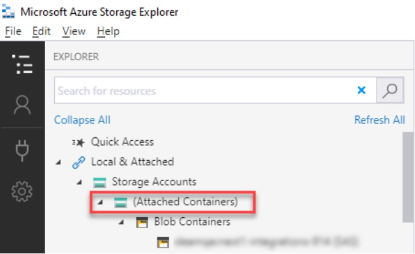

---  
 
title: "Azure Storage Container Connection Guide"  
draft: false 
type: KB Article
 
---

## Overview

Aptean EAM utilizes the Azure storage container as a common storage location, to store files as
blobs for EAM integration Jobs. Users need to connect to the storage container to drop/pickup files from EAM Integration jobs.

## Scope of the Document

The scope of the document is to describe the procedure to connect the storage containers, to
drop/pick up files from the storage containers.

### Intended Audience
The intended audience for this document is the Aptean EAM customer who needs to connect to
the Azure storage containers. You can get the SAS URL and Query string from the Aptean
support team.

### Prerequisites

1. Azure Storage Explorer application

    > [!Note]  
    > Azure Storage Explorer application is a desktop utility used to connect to various storage services. You can download and install the Azure Storage Explorer application from the
[Microsoft site](https://azure.microsoft.com/en-in/products/storage/storage-explorer/).

2. SAS URL and Query string
    > [!Note]  
    > You can get the SAS URL and Query string from the Aptean support team.

## Storage Container Connection

### Connecting Storage Container

To connect to a storage container, perform the following steps:

1. Launch the Azure Storage Explorer application.

    

2. From the left menu, click .  

    

    The Select Resource screen appears.

    

3. Click the **Blob container** option. The **Select Connection Method** screen appears.

    

4. Select the **Shared access signature URL (SAS)** option and click **Next**.  
The **Enter Connection Info** screen appears.

    

5. In the **Blob container SAS URL** text box, enter the SAS URL you received from the Aptean
support team and click **Next**.The **Summary** screen appears.
6. Verify the details in the **Summary** screen and click Connect to establish the connection.  
Once the connection is successfully established. You will see your containers under the
**Attached container** section in the **EXPLORER** screen.

    

    Now you will be able to drop/pick up files from the Azure storage container.

