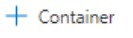
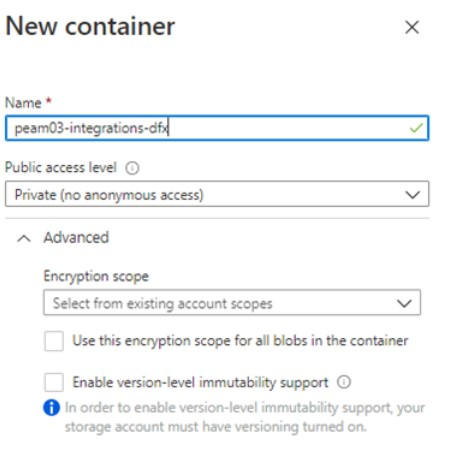
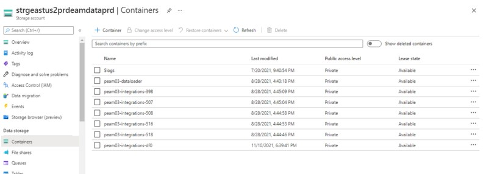
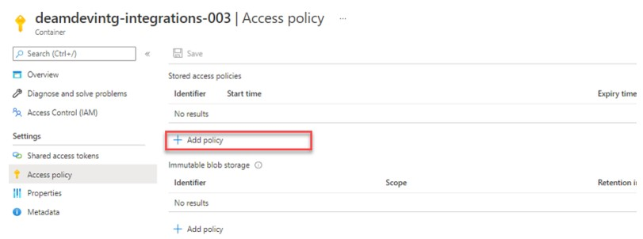
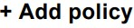
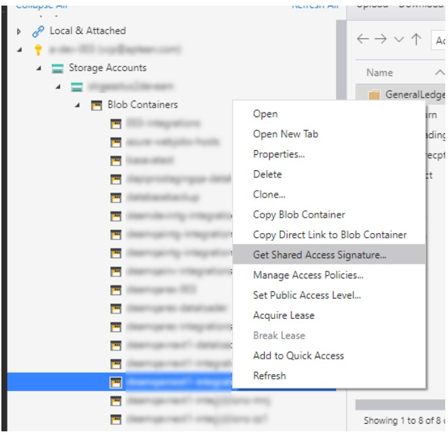
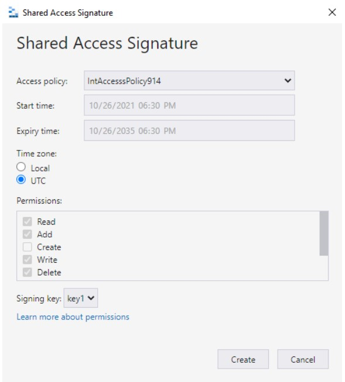

---  
 
title: "Azure Storage Container Setup Guide"  
draft: false 
type: KB Article
 
---
## Overview

Aptean EAM utilizes the Azure storage container as a common storage location, to store files as
blobs for EAM integration Jobs. It is also used to drop output files generated from EAM Integration
jobs.

## Scope of the Document

The scope of the document is to describe the procedure to create containers, setup an access
policy, and generate SAS URL to share containers with customers. 

## Intended Audience 

The intended audiences for this document are Aptean Administrators and Aptean SRE group
users.

## Prerequisite

Azure Storage Explorer application
> [!Note]  
> Azure Storage Explorer application is a desktop utility used to connect to various storage
services. You can download and install the Azure Storage Explorer application from the [Microsoft site](https://azure.microsoft.com/en-in/products/storage/storage-explorer/).

## Azure Storage Container Setup

### Setting up Storage Container

Setting up a storage container for a customer includes the following steps:
1. [Creating a storage container](Azure_Storage_Container_Setup_Guide.md#creating-storage-container)

2. [Adding an access policy](Azure_Storage_Container_Setup_Guide.md#adding-access-policy)

 3. [Generating SAS URL](Azure_Storage_Container_Setup_Guide.md#generate-sas-url)

> [!Note]  
> EAM Integration architecture is designed to provide only one container per plant. All
integration files for the plant will reside in their respective containers.

### Creating Storage Container

To create a container, perform the following steps:
1. In the Azure portal, navigate to the storage account where the customer data is hosted.

    > [!Note]  
    > For the production environment, the storage account name is
    *strgeastus2prdeamdataprd*.   
    For the test environment, the storage account name is *strgeastus2prdeamdatatst*.

2. Open the storage account and navigate to the Containers section.
3. From the header menu, click 
.

4. In the Name field, enter the container name.

    > [!Note]  
    > The naming convention to be followed while creating containers is:
    `<DBName>`-integrations-`<PlantCode>`
    All names must be in lower case.
    Example: Production container - **peam03-integrations-df0**. Test container name -
    **team03-integrations-df0**.

5. From the **Public access level** drop-down list, select **Private (no anonymous access)**.

    

6. Click **OK**. Now the container is created.

### Adding Access Policy

After creating the container, you have to add an access policy before sharing it with the
customers. This helps users to securely access the storage containers.
To add an access policy to the containers, perform the following steps:
1. In the Azure portal, navigate to the storage account where the customer data is hosted.

    > [!Note]  
    > For the production environment, the storage account name is
    *strgeastus2prdeamdataprd*.  
    For the test environment, the storage account name is *strgeastus2prdeamdatatst*.

2. Open the storage account and navigate to the Containers section.

    

3. From the Names column, click on the container name you want to share with the customer.

4. From the left pane, click Access policy. The options for the Access policy appear in the
right pane.

    

5. From the right pane, click .

    

6. In the **Add policy** screen, Enter a name for the policy.

    > [!Note]   
    > The naming convention to be followed for access policy is:  
    int\<dbname\>\<plantcode\>\<5RandomCharactersOfNumeralsAndAlphabets\>  
    Example: **intteam03914a879d**.

7. Select the permissions required and select the start date and end date.
8. Click **Save**. The policy is created.

### Generate SAS URL

After creating a policy for the storage container, you have to generate the SAS URL to share it
with the customer.  
To create the SAS URL, perform the following steps:
1. Launch Azure Storage Explorer application.

2. Connect to the required storage account and navigate to the container.
3. Right-click on the container and click **Get Shared Access Signature**.

    

4. From the **Access policy** drop-down list, select the required access policy.
5. In the Time zone section, select UTC.

    

6. Click **Create**. The SAS URL and Query string will be created.

    > [!Note]   
    > Save the SAS URL and Query string value in a centralized location for future reference. You
    can share this SAS URL and Query string with the customers.

    > [!Caution]  
    > Advise the customers to secure the shared container name, SAS URL, and
    Query string. Any data leak of this information could lead to data compromise.

