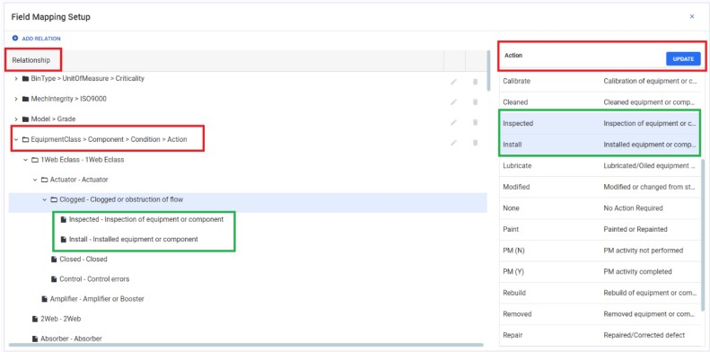

---  
 
title: "CCA Codes behavior during WO Completion"  
draft: false 
type: KB Article
 
---
## CCA (Components, Conditions, and Actions) Codes

In EAM, for an equipment class, the terms Components, Conditions, and Actions are often
associated with a rules-based or logic-driven approach to manage and control the behavior of an
equipment.

**Components**: Refer to the various physical elements that make up the system. These could
include sensors, actuators, controllers, filters etc.

**Conditions**: Refers to state of the components. For example: Clogged, Burnt, New, Seized, etc.

**Actions**: Actions represent the tasks or operations that the system performs in response to
specific conditions. These could involve activating or deactivating components, adjusting settings,
or triggering alarms.

## FAQs

### 1. Does the option (old and new relationships) control the behavior in both EAM and Mobile apps?

**Answer**: Yes, both new (Field Mapping Setup) and old relationships (Validation Code) are
effective in both EAM and Mobile apps.

### 2. Does the option (old and new relationships) control the behavior in both EAM and Webapps (Old web solution for technician or Technician app)?

**Answer**: No, the new relationship (Field Mapping Setup) works exclusively for EAM, while old
relationships function seamlessly in both EAM and Webapps. To ensure compatibility with
Webapps, customers who are using both EAM and Webapps should opt for the old relationship.

### 3. If a customer intends to use Technician or Webapps, is it necessary to use the equipment class option for CCA code, since Technician cannot use field mappings?

**Answer**: Yes, the customer should utilize the old relationship since the new relationship feature
(Field Mapping Setup) doesn’t exist in Technicians or Webapps.

## CCA code behavior during WO completion

Users have the flexibility to define values for Components, Conditions, and Actions (CCA)
associated with an equipment class through two distinct approaches: the new relationship
method via Field Mapping Setup or the old relationship method through Validation Code
under the Setup section.

### New Relationship (Field Mapping Setup)

In this method (generic for all fields and provides more options), users can establish CCA code
values by navigating to the Field Mapping Setup. This dynamic approach allows users for
creating a fresh relationship hierarchy, providing a tailored configuration for **Components**,
**Conditions**, and **Actions** based on specific equipment class requirements. Additionally, **Field
Mapping Setup** provides flexibility, enabling users to define hierarchies between any fields, such
as Area> Department> Account etc.

### Old Relationship (Validation Code)

Alternatively, users can opt for the old relationship approach using the **Validation Code** within the
**Setup** section. This method provides a standardized way of associating CCA values with an
equipment class. However, users are limited to creating hierarchies for specific fields within an equipment serial class. By default, the system displays values from the **new relationship** on the **Work Order Completion** tab.

## To switch between new and old relationships

1. Choose **Setup**>**Setup Options** in the navigation pane. The Setup Options window opens
in a new tab.

2. In the **Setup Options** grid result, expand the **EAM Option** by clicking the down arrow.
Further, expand Mobile Technician.
3. Choose **Select CCA code mapping to use on Work Order Completion**, and click **Details**
icon in the contextual panel, this action opens the CCAMapping source grid.
4. By default, the system is set to the **New Relationship**.
5. To switch to the old relationship, from the Plant Override dropdown menu choose the old
relationship option.
    * New Relationship - Use the new relationship that is configured in Field Mapping screen.
    * Old relationship - Use the old relationship that is configured from setup screen.

        

        > [!Note]:  
        > Depending on the selected relationship (old or new), the Work Order Completion tab under the Analysis code card will display the configured CCA values.

        

## Steps to configure Old Relationship

Follow these steps to configure values for components, conditions, and actions for an equipment
class through validation codes:
1. Choose **Setup** > **Validation Codes** > **Equipment Serial Class** > Select Required
**Equipment**.

2. In the contextual panel, click on the Completion Codes icon, and a **Completion Codes** By
Equipment Class window opens.
3. To add a code type and its corresponding value, click the **New** button. This action expands
the Add completion code mapping to the grid.
4. Select the Code type (**Action**, **Component**, or **Condition**) from the Code Type dropdown
menu. Choose the desired value from the Valid Value Assigned dropdown and click Add.
The selected Code type will be added to the Completion Codes By Equipment Class grid.

5. To add another code type, click the **Add Another** button and repeat the process.

    

## Steps to configure New Relationship

Follow this method for configuring the CCA code for an equipment class through the field mapping
setup section:
1. Choose **Setup** > **Field Mapping Setup** > **Add Relation**.
2. Relation pop-up opens, it consists of two columns: **Fields** and **Field Hierarchy**.

3. To create a hierarchy or relationship for the fields such as **Components**, **Condition**, and
**Action** for an equipment class, select the respective field in a specific order (Equipment
Class>Components >Condition> Action) from the Fields column and drag and drop them
under the **Field Hierarchy** column.

    

4. Click **Save Relation**. The newly created relation or hierarchy will be added to the
Relationship grid, structured as Equipment Class>Component>Condition>Action. Here,
Equipment Class is the parent field, Component is the child field, Condition is its grandchild
field, and so on.

    

5. By default, all available values for the parent field (Equipment Class) will be listed under the
hierarchy. To view click the down arrow from a relationship.
6. To set a list of values for each child field (**Component**) in the relationship, expand the
hierarchy by clicking the down arrow from a relationship.

7. Select a desired **Equipment Class** (e.g., 1Web Eclass), and all the available values for the
child field (Component) will be displayed in a grid on the right. Choose the desired values
(e.g., **Actuator and Amplifier**) and click **Update**. Only the selected components will be
added to the Equipment Class 1Web Eclass.

    

8. To set values for each grandchild field (**Condition**) in the relationship, select a desired
**Component** (e.g., **Actuator**), and the available values for the grandchild field (**Condition**)
will be displayed in a grid on the right. Choose the desired values (e.g., **Clogged**, **Closed**,
and **Control**) and click Update. Only the selected conditions will be added to the
component **Actuator**.

    

9. To set values for the field **Action** in the relationship, select a desired **Condition** (e.g.,
Clogged), and the available values for the field action will be displayed in a grid on the right.

    

    Choose the desired values (e.g., **Inspected and Install**) and click **Update**. Only the
selected actions will be added to the condition **Clogged**.

    > [!Note]:  
    > Only the selected Values will be displayed for the respective parent, child, or
    grandchild field on the Work Order Completion tab under the Analysis code section. For
    records where no mapping is defined, then by default, all values available for the specified
    record will be displayed. For example, for Amplifier if there are 50 available values and
    users have not mapped any of these for the field Condition, then all 50 values will be
    displayed under the Condition field.

    