---  
 
title: "Cloud Printing Account Setup and Agent Configuration Guide"  
draft: false 
type: KB Article
 
---
## Overview

This document provides the information on how to create cloud printing account, configure cloud
printing, install and active bartender software, and enable cloud printing in agent computer.

## Create Cloud Printing Account

To create a cloud printing account, perform the following steps:
1. Go to Account Services page in production environment, or to the Swagger UI page for
Aptean Cloud Print Services.

    1. For Account Services page in production environment, go to
    https://print.api.apteancloud.com/swagger-ui.html%23/account-services in a browser.
    The browser prompts for username and password.  
    Enter the **AccountId** and **APIkey** of the master account as **Username** and **Password**,
    and click **Sign In**.

        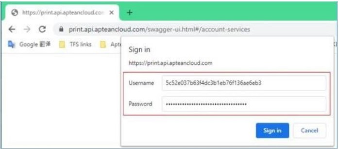

    2. For Swagger UI page, go to https://print.api.apteancloud.com/swagger-ui.html#/ in a
    browser.
    It requires UserName and Password to login. Use the following details as username
    and password.
        * accountId: 4572cfbc37e545acb3cb54d023b0714d
        * apiKey: API337ff2199f0d4676b44461aecfb5ebff

    > [!Note]  
    > Do not share the above account details to customer.

2. Generate the child accounts for each customer.

    > [!Note]  
    > Each tenant or customer requires a separate account as the account isolates
    the customers’ agents, printers, and jobs from other users of the service.

3. Under **Account Services**, click the **POST** request, and then click the **Try it out** button.

    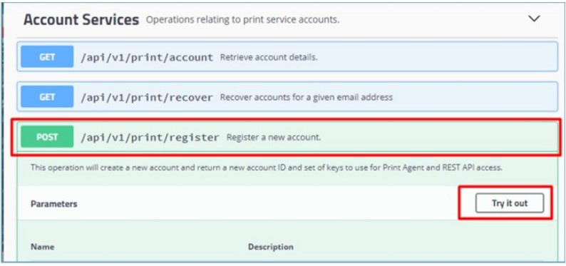

4. Update the strings of the registerRequest parameter as follows:
    * **company** - A free form text that is the company name of the customer. There is no limit
    on size.
    * **contact** - A free form text that is the contact name or address of the customer. There is
    no limit on size.
    * **email** - Enter the (for example) test@aptean.com email address. This field is critical as
    it is used by the /recover API to get back the account details through email if the users
    lose their account information.
    * **group** - An optional field, free form again, however, this is the group to which the user
    belongs.
    * Refer the below image for a sample:

        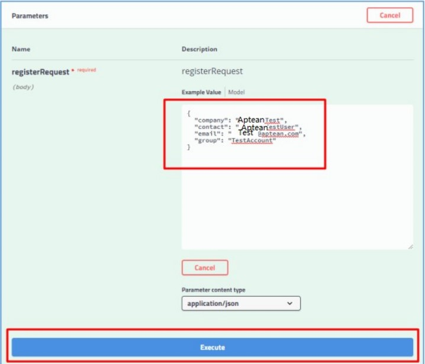

5. After updating the strings, click the Execute button.
6. Wait for few minutes, an account will be generated in the Response body. This is the
account generated for a customer which contains AccountID, APIKey, and AgentKey.
7. Click the Download button to save the account information in a .JSON file.
8. You can provide the following details to the customer (for Production mode)
    * Account ID
    * API Key
    * Agent Key

    > [!Note]  
    > For Staging mode, please confirm the Print Agent Host URL with the Cloud Printing
    team.

The customers can use the Account ID and API Key in the Cloud Printing Maintenance screen in
OneEAM to set cloud printing, and use the Account ID and Agent Key when installing the Cloud
Printing Agent.

## Configure Cloud Printing in Agent Computer

Configuring cloud printing in agent computer includes:
* Downloading Cloud Printing Agent
* Installing Cloud Printing Agent
* Configuring Agent Computer for Label Printing

### Download Cloud Printing Agent

To download cloud printing agent, perform the following steps:
1. Go to the Production environment home page (https://print.api.apteancloud.com/) in a
browser.

    > [!Note]:  
    > If it prompts for a username and password, enter the Account ID and API Key to
    login.

     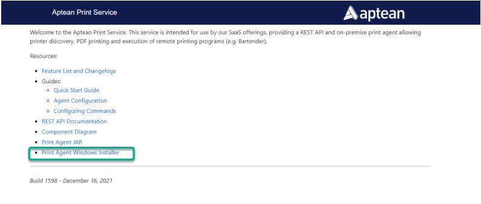

2. In the Aptean Print Service page, click the Print Agent Windows Installer link to
download the ApteanPrintAgentSetup.exe file.

### Install Cloud Printing Agent

The Cloud Printing Agent must be installed locally on the Agent Computer, at the user side, which
is used to receive printing jobs. The print jobs are directed from Cloud Printing Service to the local
printers through the Print Agent.  
To install the cloud printing agent, perform the following steps:

1. Double-click ApteanPrintAgentSetup.exe file that you downloaded from the Production
environment home page <https://print.api.apteancloud.com/>.  
The welcome page appears.

    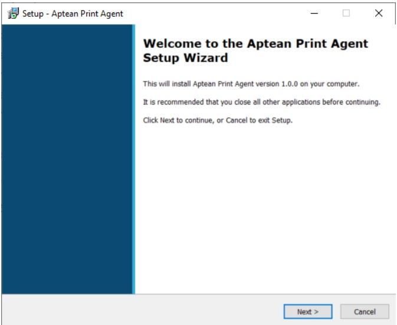

2. Click Next.
3. In the Select Destination Location screen, select the default folder or a folder in a
location of your choice to install the Aptean Print Agent, and then click Next.

    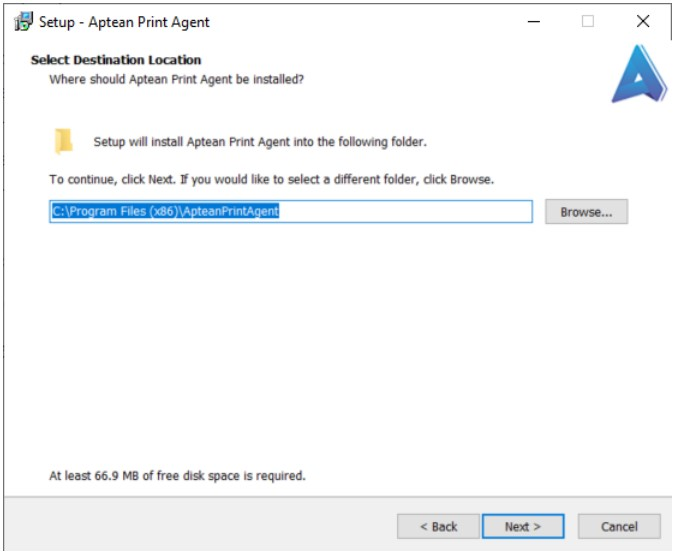

4. In the Print Service Authentication Details screen, enter the Account ID and Agent Key,
and then select Production.

    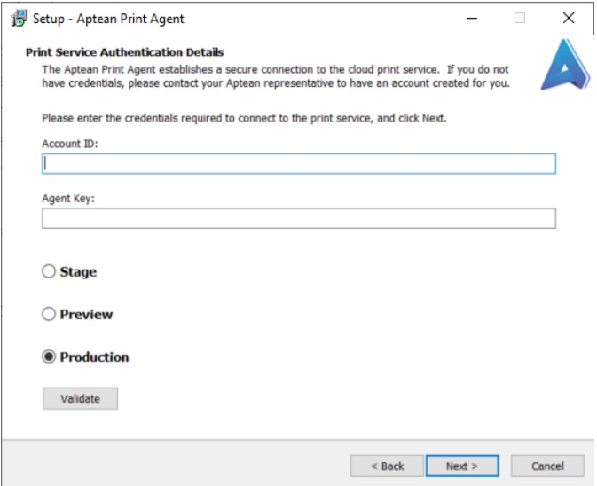

    > [!Note]:  
    > If you want to validate the account entered, click the Validate button. If the
    account ID and Agent Key are correct, the Credential validation successful message
    appears.

    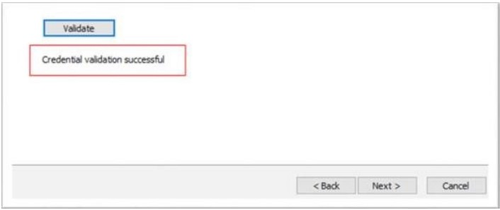

5. Click **Next**.

6. In the Ready to Install page, click the Install button.

    

    Wait until the installation is completed.

### Configure Agent Computer for Label Printing

To configure the agent computer for label printing, perform the following steps:

1. Download the **EAMLabelPrintIntegration.rar** from the SharePoint.
2. Unzip the download RAR file and copy the entire folder to directory C:\Program
Files\Aptean on Agent computer, as shown below:

    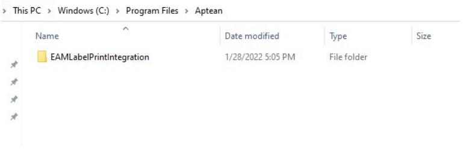

3. Go to the ApteanPrintAgent folder, and open the application.yaml file for edit.

    > [!Note]  
    > Normally, you can see the ApteanPrintAgent folder at C:\Program Files(x86).

    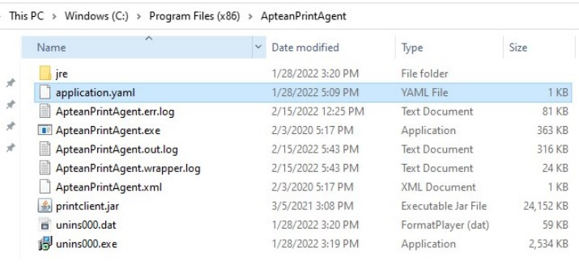

    Copy the below information to the file and update the values highlighted in blue (no need to
    change other config information).    

            computerName: APT05-XXXXXXX  
            commands:  
            -name: LabelPrinter  
            command: C:\Program Files\Aptean\EAMLabelPrintIntegration\EAMLabelPrintIntegration.exe  
            working-dir: c:\tmp  
            arguments: [ "--file", "$(FILENAME)" ]  
            drop-dir: c:\tmp  
            delete-file: false  
            -name: Local Drop  
            drop-dir: C:\tmp\tmp

    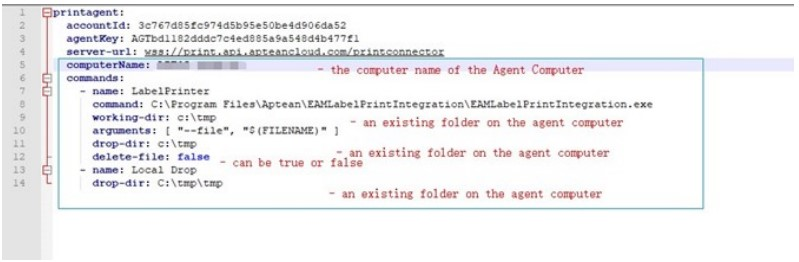

    > [!Note]  
    >  Do not change any format in above commands, even the spaces before each line.
    Otherwise, the Agent service may not be started.  
    The updated file cannot be directly saved in this folder to replace the original one. Save it on
    another place first, for example, on the desktop, then copy it to this folder to replace the
    original one.

## Install and Activate Bartender software in Agent Computer

To install and activate the latest Bartender software in Agent Computer, perform the following
steps:
1. Download the latest Bartender installation file from the BarTender download page and
install it on the agent.

    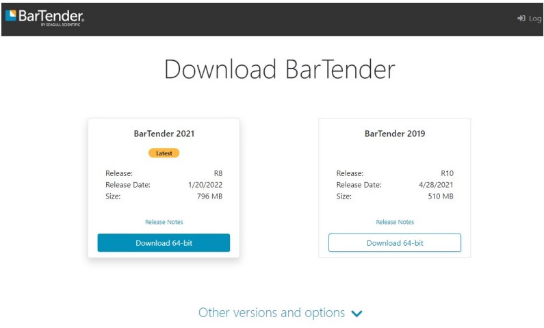

2. For the company, you can purchase the official license key to activate it.
3. For the internal testing, you can apply for a 30-Day Trial in through following URL:
Download 30-Day Trial | BarTender (seagullscientific.com)

    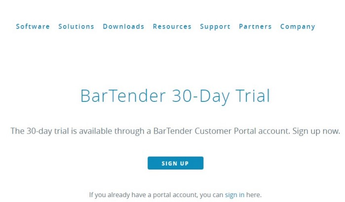

4. After installing the BarTender software, enable the Cloud Printing option in OneEAM, and fill in
the account information.

## Enable Cloud Printing in OneEAM

To enable cloud printing in OneEAM, perform the following steps:
1. From the left panel, navigate to Setup > Setup Options.

2. In the Setup Options panel, click Cloud Printing.

    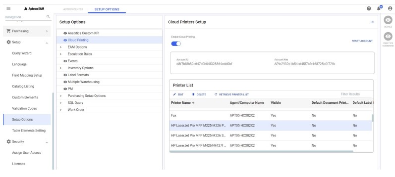

3. From the right panel, turn on the Enable cloud Printing toggle button.
4. In the AccountId field, enter the account id.
5. In the Account Key field, enter the API key.
6. Click the SETUP ACCOUNT button. All the available physical printers installed on the agent
computer will be displayed in the Printer List section.

> [!Note]  
> The Cloud Printing option will be enabled for Work Management, Requisition ,
Purchasing, Picklist, and Cycle Count modules.
The Print Labels option will also be enabled for Inventory module.
You can reset the account configured using the RESET ACCOUNT button.

