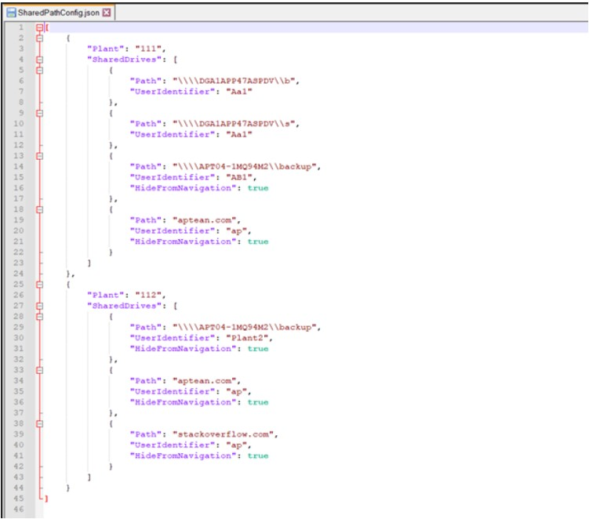
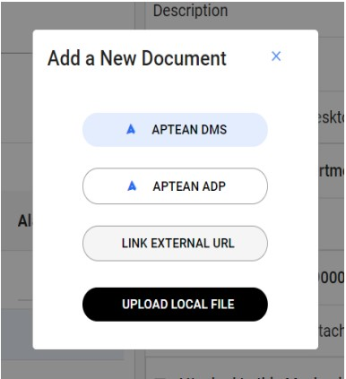
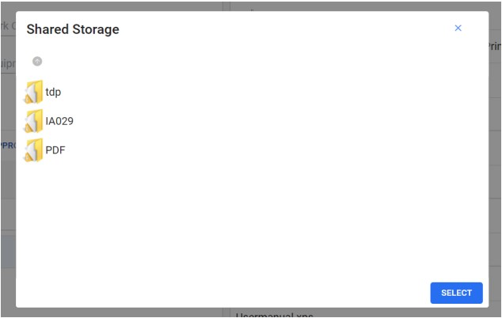
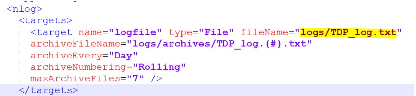

---  
 
title: "Document Provider Setup Guide"  
draft: false 
type: KB Article
 
---
## Overview

Aptean Document Provider (ADP) is an application that provides:
* an interface in Aptean EAM to view and browse documents in Aptean EAM modules like
Work Order and Equipment documents that are stored in a hosted environment outside of
Aptean EAM.
* a mechanism to provide Aptean EAM with web access to files stored in the customer’s net-
work as Windows UNC paths.

This document describes how the IT System Administrators or the IT Infrastructure team can host
the ADP application under a hosted server.

## Hardware and Software Requirements

### Hardware Requirements

* RAM: Minimum 8 GB.
* A network location where the documents are stored.
* Network Accessible Storage Drive: A storage drive from where the documents would be
accessed by Aptean EAM users.

### Software Requirements

* Operating System: Windows Server 2016 or later version.
* Internet Information Services must be enabled in Windows server.
* IIS Manager to deploy ADP.
* A public IP under which the ADP application is deployed.
* Microsoft .Net 4.5 framework or later.
* Latest ASP.NET installed via windows features.

> [!Caution]  
> IT administrators must ensure to secure the web site if it is publicly exposed.

## Installing and Deploying ADP

### Installing and Running ADP as an Application

The following procedure describes how to install and run ADP as an application under IIS:
1. Download the ADP application package:
    1. Go to your Aptean Connect Support site.
    2. Navigate to the **Downloads** section.
    3. Select, **Product Line: Aptean EAM**.
    4. Select, **Product Name: Aptean Document Provider (ADP)**.
    5. Download the required version of the package.
2. Unzip the package.

3. Locate the `Web.config` file in the unzipped folder. The likely location is the root folder.
4. Edit the `web.config` file using any text editor.
5. Configure the `appSettings` section keys:
    1. Find the following key:  
    `PlantSharedFilesConfigPath`
    2. Enter a new value or replace the existing value with the path:  
`<downloaded package>\SharedDriveConfigs \SharedPathConfig.json`
    3. The following image shows an example PlantSharedFilesConfigPath key with
value:

        

6. Populate `secureAppSettings`.
ADP is built to operate on a DMZ zone. It has the ability to connect to the shared paths using a pre-configured user credentials. These user credentials should be specified under section
`secureAppSettings`.

7. Web.config comes with an an example configuration as shown below. Modify the settings by
providing a unique key value `[referred as UserIdentifier in
SharedPathConfig.json]` and the user details to connect to the shared drive while
retrieving file(s).  
Value attribute should include the domain, userid and password as
specified in the below example:  

        <secureAppSettings>  
        <!-- ADP connection string for domain accounts -->  
        <!-- Key should match with SharedPathConfig entries-->    
        <add key="Br" value="domain=eam;userid=bbrad;password=*****;"/>  
        <add key="Ss" value="domain=eam;userid=ssam;password=*****;"/>  
        </secureAppSettings>

8. After specifying the credentials to retrieve the files from the shared location, you must
secure the credentials so that it iss not available for plain sight. This can be achieved by
running the below command:  
`aspnet_regiis.exe -pef secureAppSettings <Path of the Folder containing the Web.Config file> -prov DataPro-
tectionConfigurationProvider`
9. To decrypt the already encrypted string for any modifications run the below command:  
`aspnet_regiis.exe -pdf secureAppSettings < Path of the Folder containing the Web.Config file>`
10. Save and close the `Web.config` file.
11. Update the **TabWareOnlineBaseURL** with the correct value. For example,
<https://webappsprod.eam.apteancloud.com> 
12. Configure `SharedPathConfig.json` file.
    1. Locate the **SharedPathConfig.json** file.
    2. Edit the SharedPathConfig.json file using any text editor.
    3. Enter or replace the Plant values and SharedDrives values as required.
    4. The structure of the json is as below:  

            [  
            {  
            "Plant": "EnterPlantCode",  
            "SharedDrives": [  
            {  
            "Path": "EnterUNCPath(\ to be escaped by \\\\)"   
            "UserIdentifier": "Identifier specified in web.config is used to connect to the UNC path"  
            "hideFromNavigation": "If you want to hide this path on the browser then set the value to true, else set to false`  
            }   
                ]  
                }  
                ]

    5. The following text shows an example **SharedPathConfig.json** file for the **Plant 001** and
**002** respectively.  

            [  
            {   
                "Plant": "001",  
                "SharedDrives": [  
                {  
                "Path": "\\\\\\\\ServerName1\\\\b"    
                "UserIdentifier": "Br"  
                "hideFromNavigation": true    
                },  
                {  
                "Path": "\\\\\\\\ServerName2\\\\s",  
                "UserIdentifier": "ss",,  
                "hideFromNavigation": false    
                ` 
                } 
                ]  
                },  
                {    
                "Plant": "002",    
                "SharedDrives": [  
                    {  
                    "Path": "\\\\\\\\ServerName3\\\\b"    
                    "UserIdentifier": "Br"   
                    },  
                    {    
                    "Path": "\\\\\\\\ServerName4\\\\s"    
                    "UserIdentifier": "ss"    
                    }  
                    ]    
                    }    
            ]

    6. The following image shows an example *SharedPathConfig.json* file for the **Plant 111** and **112** respectively.

        

> [!Note]     
> Ensure that:
> * The root directory starts with four back slashes:\\\\\\\\
> * Each sub-directory starts with two backslashes:\\\\
> * All *Plants* values are updated as required and any other values already stored are
removed
> * If the folder need not be shown in UI for browsing then **HideFromNavigation** value
should be set to true. The default value is false.
> * The user **UserIdentifier** is mandatory and it should be the Key name that is adding
web.config containing user credential details that need to be used when accessing the
path.
> * Path value in case of web URLs should be the domain name of the URL. For example,
if the url to be printed via adp is <https://www.aptean.com/en-US/insights/blog/eam-systems-save-time-money-productivity> then the path value should be aptean.com and
HideFromNavigation set to true.
> * All *SharedDrives* values are updated with the required network shared path in ADP
environment and any other values already stored are removed
> * JSON is validated. You can validate JSON by installing any chrome extension like
JSON Viewer, using notepad++ JSON formatter extension, or by using any online
JSON validator <https://codebeautify.org/jsonvalidator>.
> * Aptean EAM users have necessary permissions to browse these directories.

13. In IIS, create a new application pool named:  
*ADPAppPool*

    > [!Note]:  
    > The ADPAppPool identity must have the required privileges and permissions to access Shared Storage. See, Shared Storage window .

14. If already not created, create a new application in IIS named:  
*ApteanEAM-ADP*
15. While creating the application, system prompts for the following:
    * **Alias**: Enter the Alias as required.
    * **Application Pool**: Enter ADPAppPool as application pool.
    * **Physical path**: Provide the path where you placed the folder that you downloaded and
unzipped.
16. Restart *ADPAppPool*.

17. After the public endpoint is setup, contact Aptean Support to configure newly provisioned
ADP public endpoint in the Aptean EAM application.

### Application Configuration

To establish a connection between ADP and Aptean EAM:

> [!Note]  
> This configuration module might not be available for some early release versions of the
ADP. Raise a request with Aptean Support to change the configuration settings according to
your requirements.

1. Login to the Aptean EAM Setup application.
2. Go to **TabWareOptions**.
3. Go to the **Documents** section.
4. Find the label:  
*Api for network shared document application*
5. Replace any values present with the public URL where ADP is hosted.

    > [!Note]  
    > Ensure that the URL does not end with a back slash (\\), for example:  
    *http://< servername>/< virtualdirectoryname>/api*

### Validate ADP Hosting

Once ADP deployment is completed, Aptean EAM users must be able to browse documents in
Aptean EAM modules like the Work Order and Equipment documents that are stored in a hosted
environment outside of Aptean EAM.  
To ensure that ADP is deployed successfully:
1. Go to any screen in Aptean EAM that has the option to add a document.
2. Click **New** to add a document.
3. **Add a New Document** window appears. If the window has the APTEAN ADP listed, it
means that the ADP application is successfully deployed.  
The following image shows a Add a New Document window with the ADP option.

    

4. Click **APTEAN ADP**.

5. The **Shared Storage** window appears showing directories configured in SharedDrivesof the SharedConfig.json file.  
The following image shows Shared Storage window that establishes that ADP is deployed
successfully.

    

## Troubleshooting

### Troubleshooting Tips

The following list provides tips that could help you troubleshoot any deployment issues:

* When the server does not return any files in Shared Storage:
    * Ensure that *PlantSharedFilesConfigPath* value defined in the `web.config` file
    is pointing to the correct path w here *SharedPathConfig.json* is located. Shared Storage paths are configured in SharedPathConfig.json per plant. See, web.-config settings.
    * Ensure that the *ADPAppPool* identity has the required privileges and permissions to
access the shared storage required to be listed in ADP. See, Shared Storage.

* If the ADP site is not reachable, check if the server hosting the ADP is publicly available.

* ADP application logs are available in the location defined in the ADP configuration file. The
following image shows an example definition of the log file along with the path.

    

## FAQ

This section provides answers to frequently asked questions.

**What happens if EAM application doesn’t have a software to open a file type?**

When a file is linked in the EAM application and if the application doesn’t have its associated
software to view the file, then the file will be just downloaded with no efforts being made to open it.

