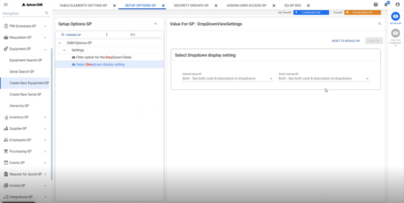

---  
 
title: "Drop-down Configurations"  
draft: false 
type: KB Article
 
---

This article provides instructions on configuring drop-down table elements within plant code
settings and covers the required permissions.

## Overview

Aptean Administrators can perform the following actions based on customer requirements:

1. **Edit Presentation Format**
    * Modify the presentation format of a field as either a drop-down list or an in-screen
search for a designated window within a plant code.
2. **Drop-down Display Mode**
    * Specify whether a drop-down list on a particular window should display the Code, Description, or Both, overriding system-wide settings.
3. **Custom SQL Queries**
    * Configure custom SQL queries on behalf of customers to retrieve customized data
sets for specific table elements or windows.

### Performing Drop-Down Configurations

Follow these steps to configure drop-down settings:
1. In the navigation pane, navigate to **Setup** > **Table Element Setting**. The **Table Element
Setting** tab will open in the top bar.
2. Expand the **Table Element setting - Window/Screen** specific drop-down section.
    * Select the desired table from the grid.
    * Click the **Details** icon in the contextual panel. This action opens the **Window Element**
tab on the right-side panel.
3. To override the default setting:
    * Click Edit.
    * Click the **Override Delivery Setting** button.
    * The **Override Settings** card expands below the grid.
4. Configure the following options:
    * **Element Type**: Choose either **Drop-down** or **ISS** (in-screen search).
    * **Drop-down Display Mode**: Select **Code**, **Description**, or **Both**.  

        

        If no option is specified in the **Drop-down Display Mode** field, the system
        will automatically use the value from the EAM options screen with the
        option ID **DropDownViewSettings**.

        

 
### Custom SQL Queries 

Aptean administrators can set up custom SQL queries for customers. These queries allow
retrieval of tailored datasets for specific table elements or windows.  
If a customer needs to override a specific value displayed in a dropdown field:
1. Define it in the **zz_plant_value_search** table.

2. Request the Aptean administrator to add this customized value to the table.  

This customization ensures that a specific data set is retrieved for the designated table element or
a specific window’s table element.