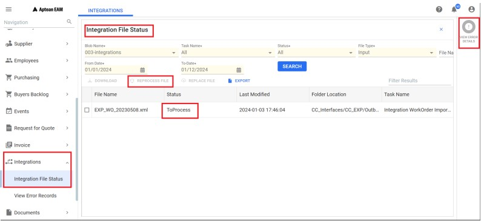
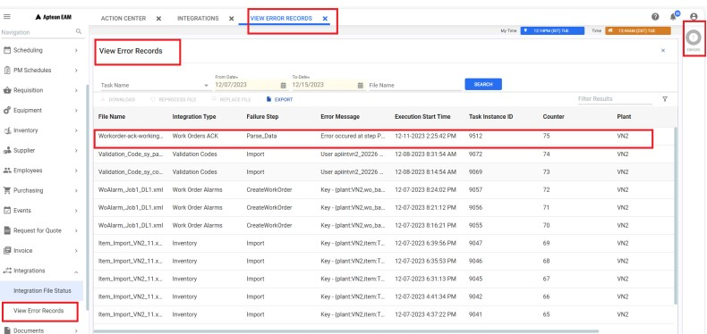
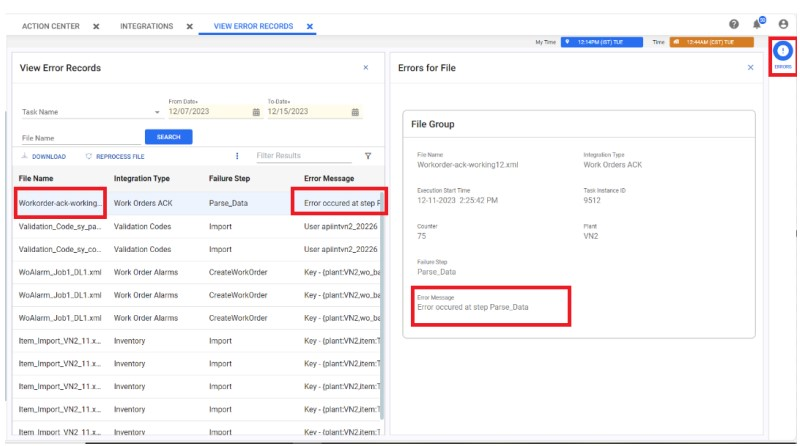
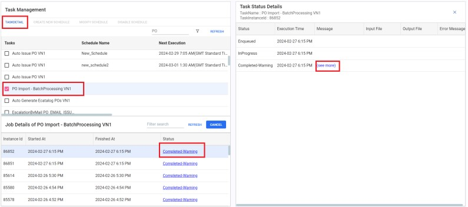
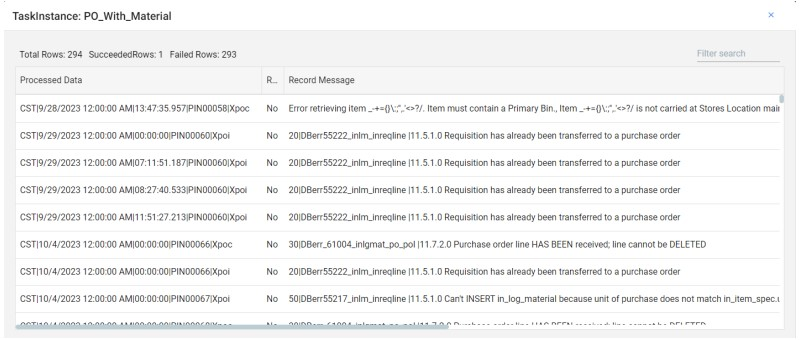
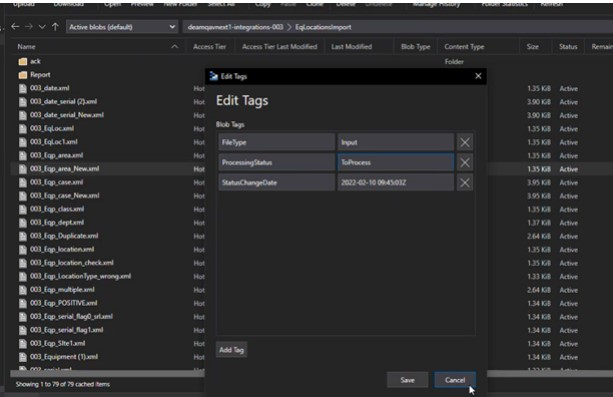

---  
 
title: "EAM Integration File processing"  
draft: false 
type: KB Article
 
---
## Introduction

EAM integration enables the processing of files when they are placed in an Azure Blob Storage
folder. Azure Blob Storage is an online storage environment that can contain the files accessible
both to the EAM application and to the customers. The storage is partitioned by the customer
plant, and the access keys are issued to enable the customers to place and retrieve files for
Integration processing. The files can be placed manually using Microsoft Azure Storage Explorer
or can be moved using scripting APIs from PowerShell, whereas the SFTP access is now in
Preview.

## File Processing in Blob Storage

This section outlines the process of assigning tags to files and the description of the tags used in
file processing. It also contains the details on setting up the environment and retention policies.

### Blob Tags

Following are the three different types of Blob tags are applied to a file:
* FileType
* ProcessingStatus
* StatusChangeDate

#### FileType

This tag indicates the type of the file available for EAM integration. The files will be processed
based on the values assigned to it. The possible values assigned to **FileType** tag are **Input**,
**Output**, and **Error**.

**Input**:  
Assigned when a user uploads a file for processing. Mostly will have source file for input
job and ack import file for export job.

**Output**:  
Designates files generated from integration jobs, such as export jobs.

**Error**:  
Indicates files generated due to unhandled errors, containing relevant error details.

### ProcessingStatus

This tag indicates the current state of the file. The possible values assigned to ProcessingStatus
tag are:
* **ToProcess**: This value is assigned when the file is waiting to be picked up and processed.

* **InProgress**: This value is assigned when the file is under process.
* **Completed**: This value is assigned when the File has completed the processing.
* **Failed**: This value is assigned when the File has failed the processing.

### StatusChangeDate

This tag indicates when the particular status was assigned to the file. It captures the time for the
most recent status change in UTC time in ISO format.

## File Processing

This section provides you the information on the complete course of file processing. The process
starts when a file is uploaded to the storage for processing:
1. When a file is uploaded to the blob storage. The azure function will be triggered, and the file
will be automatically assigned with the following three types of tags.
    * **ProcessingStatus** is set to **ToProcess**.
    * **StatusChangeDate** picks the current UTC time and converts it to a standard format.
    * **FileType** is set to Input.

> [!Note]  
> The Azure Function and the trigger must be configured to the particular Blob
storage.

2. When an integration job is executed, it will pick the files with the **ProcessingStatus** set as
**ToProcess** and the **FileType** set as **Input**.

3. As soon as the job is executed to download the file and parse into the memory, the
ProcessingStatus will be set to InProgress and the StatusChangeDate will be updated
correspondingly.
4. If the job is executed successfully, then the ProcessingStatus is set to Completed.
5. If a file fails schema checks or if the execution aborted in the middle of the process due to an
exception, the ProcessingStatus is set to Failed and an error file will be generated. The error
file contains the error logs.

> [!Note]  
> If the task failed due to wrong data or business error, it will not be considered as
process failure, and the ProcessingStatus will be set to Completed.

## Setting up Environment

The SRE team configures the following implementation.  
Once an environment is created, create a matching storage account in the following format and
perform the below.  
**Format**: strg (*storage*) + Azure region ( *in lower case with only alphanumeric*) +
environment name.   
Example: **strg-eastus2-deveam**.
1. Setup event triggers in a storage container, to ensure file created triggers are raised when a
file is dropped.
2. Create a database.  
Create a plant in the database with the following items:

    1. A Storage Container in the following format:  
    **Format**: **Database name** (*in lower case with only alphanumeric*) + -**integrations**- +*plant*  
    Example: deamqares-integrations-003
    2. Template folder structure
    
    3. TM Jobs in database (occurs automatically via the sp_new_plant_setup)
    4. Integration folder Tree in Blob Storage
    5. Access Key to be delivered to customer for the folder tree.

The customers are allowed to perform the following permissions:

| **Permissions** | **Description** |
|--------|---------|
|Read|This permission lets the user access and copy any blob's content, properties,and metadata in a container or directory.
|Add|This permission allows the user to add a block to an append blob. Append blobs support append (add-on) operations.|
|Create|This permission involves writing a new blob, creating a read-only copy of a blob at a specific point in time (snapshotting), or copying a blob to a new blob.|
|Write|This permission lets the user create content, properties, metadata, blocklists, snapshots, or lease the blob (page blob only). Use the blob as the destination of a copy operation.|
|Delete|This permission lets the user to deletes a blob starting from version 2017-07-29 and can also break a lease on a blob.|
|List| This permission allows the user to list blobs in a non-recursive way (that doesn't repeat itself while it's running). In other words, it allows the user to retrieve a list of blobs within a container or directory without including blobs from subdirectories.|
|Find| This permission allows the users to search blobs based on index tags. It allows users to locate blobs that have specific tags associated with them to facilitate efficient retrieval of relevant data.| 
|Tags| This permission allows the user to read or write or modify tags associated with a blob.
|Move| This permission allows the user to move a blob or a directory and its contents to a new location. It can be restricted to the owner of the child blob, directory, or parent directory by including the appropriate parameter on the SAS token and setting the sticky bit on the parent directory. This operation is useful for organizing and managing data within storage containers or directories.|

## Retention

Usually, retention will be specified at a container level, and since a container is created for each
plant, retention is therefore set at a plant level. Regardless of source, all files will have the same
retention policy within a container.  
Our default retention time is 90 days. After 90 days, all files that are in failed and completed status
will be deleted. The Aptean cloud team will set this up when the container is created.

## Integrations

An HTML document describing the integration process will be created and stored in the Reports folder. It is subject to the retention policy.

## View processing status and data

In the event of data discrepancies during file processing, an error message is generated. Users
can access processing status and error records directly through the EAM application and Task
management. Here's how:

### Integration File Status

1. Navigate to **Integration** > **Integration File Status** in the navigation pane. The **Integration**
tab will open in the top bar.
2. Filter the desired file by entering data in fields like **Blob Name**, **Task Name**, **Status**, **File
type**, and **Date**.

3. The grid displays search results with information including **File name**, **Status**, **Last
modified**, **Folder location**, and **Task name**.

    

### Download File

Users can select a file from the search result grid and click the **DOWNLOAD** button to download
the selected file to the local storage.

> [!Note]  
> If the file is not present in the storage container, an error will be displayed.

### Reprocess File

When a user makes changes to the application to resolve an issue encountered in a file, or if a file
is in the ***Toprocess** status but remains unprocessed, they will need the option to reprocess the
file. This can be done by selecting the file from the search result grid and clicking the
**REPROCESS FILE** button. This action will change the status in the backend to **ToProcess**,
ensuring the file is reprocessed in the next scheduled run. Additionally, users have the option to
run the task manually. It's important to note that the reprocessing of a successful/failed file is
dependent on the specific job file being considered.

### Replace File

If there are errors in the file and the user wants to correct the data and upload the file again, they
can utilize this option. The user can choose to upload either all records or only the corrected
records. The system will always process all the records present in the uploaded file.  
To use this option:
1. Select a file from the search result grid and click the **REPLACE FILE** button. This action will
prompt a popup where the user can add a file from their local computer.
2. Select the desired file and click the Open button. The file will be replaced in the next
scheduled run. Additionally, the user can also manually run the task.

    > [!Note]  
    > The file name must be the same in order to replace the file.

    > [!Note]  
    > If users encounter minor errors, they have the option to utilize the EAM application to upload files for reprocessing. Alternatively, if they need to upload a large number of records, they can store them in the blob storage, where they will undergo processing.

### Export
 
The export option enables the user to download the search result grid data.

#### To View Error Records:

1. Navigate to **Integration** > **View Error Records** in the navigation pane. The **View Error
Record** tab will open in the top bar.

2. Filter the desired file by entering data in fields such as **Task Name**, **Date**, and **File name**.
3. The grid displays search results with information including **File name**, **Integration type**,
**Failure step**, **Error Message**, **Execution start time**, **Task instance ID**, **Counter**, and
**Plant**.

4. Select the desired record and click the **Errors** icon in the contextual panel to open the **Error
for Files** tab on the right-side panel.
5. The **Error Message** field in the card file group will display the error message.

    

     

#### Viewing Processing Status and Error Records from Task Management:

1. Select the desired task from the grid.
2. Click **Task details** on the toolbar.

3. The **Job Details** panel expands below; it displays information like **Instance ID**, **Started
date**, **Finished dat**,and **Status**.
4. The **Status** field is hyperlinked; when clicked, the **Task Status Details** panel opens on the
right side.

5. Task status details contain information like **Status**, **Execution time**, **Message**, **Input file**,
**Output file**, and **Error message**.

    

6. Click **See More** for the Error Message. A pop-up opens, and the error message will be
displayed under the column **Record Message**.

    

## FAQ

**Q1. Does the user have to add/remove tags for any reason for the process to work?**

**Solution**:   
No. files are generally auto-picked at defined intervals, if for some reason, it doesn't, or
user needs to process these files on a priority basis, then the user can manually check and
change the tag status to Toprocess. To do this:
1. Navigate to **Azure Blob Storage** folder > **Desired Blob Container**.

2. Right-click the desired file, select Edit Tags, and edit the processing status to Toprocess.

      

    Alternatively, users can reprocess the file using the EAM application. Refer to the [Reprocess File](EAM_Integration_File_Processing.md#reprocess-file)
    for details.

