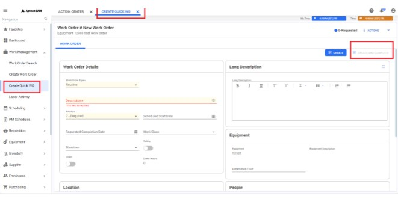
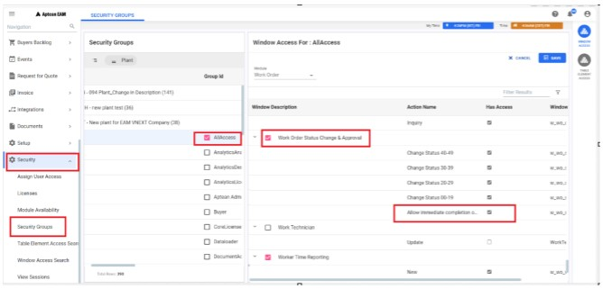
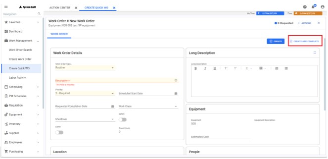

---  
 
title: "Enable Create and Complete Button for Quick Work Order"  
draft: false 
type: KB Article
 
---
## FAQ’s

**Q1. Create and Complete button is not available on quick work order?**

**Answer**:  
The Create and Complete buttons on the Quick Work Order may remain disabled
unless the following configuration is set:
* **Enable**: Allow immediate completion of Routine Work Orders.
* **Disable**: Utilize the Work Order Approval Process.

It's important to note that the work order approval feature may not be applicable to all users. For
instance, if a company employs the Mobile approval feature, this option is automatically disabled
by default. Conversely, if the Mobile approval feature is not in use, the work order approval
process can be configured within the security group sections. Refer to the steps outlined below.

[To disable the Use the Work Order Approval Process, follow these steps](Enable_Create_and_Complete_button_for_Quick_Work_Order.md#to-disable-the-use-the-work-order-approval-process-follow-these-steps)

 

There are two types of work orders: **Routine** and **Emergency**.
* For **Routine Work Orders**, the **Create** and **Complete** button will be enabled only when the
option **Use the Work Order Approval Process** under **Security Groups** section is disabled.
* For **Emergency Work Orders**, the **Create** and **Complete** button will be enabled even when
the option Use the Work Order Approval Process under **Security Groups** section is
enabled.

### To enable the Allow immediate completion of Routine WO, follow these steps

1. Navigate to **Security** > **Security Groups** in the navigation pane. The **Security** **Groups** tab
will open in the top bar.

2. Select the desired Plant and enable the **All Access** checkbox.
3. Click the **Window Access** icon in the contextual panel; this action will open the Window
**Access For: All Access** window on the right-side panel.

4. Click the Edit button and choose Work Order from the Module drop-down.
5. In the grid, search for and select Work Order Status Change and Approval.
6. Enable the **Allow immediate completion of Routine WO** checkbox and click Save.

    

### To disable the Use the Work Order Approval Process, follow these steps

1. Navigate to **Setup** > **Setup** **Options** in the navigation pane. The **Setup Options** tab will
open in the top bar.

2. In the grid, search for and select Work Order > General.
3. Click the **Details** icon in the contextual panel; this action will open the General window on
the right-side panel.
4. Click the Edit button, turn off the Use the Work Order Approval Process toggle button,
and click Save.

    

    The **Create** and **Completion** button will be enabled in the **Quick Work Order** section after
    completing these steps.

    
