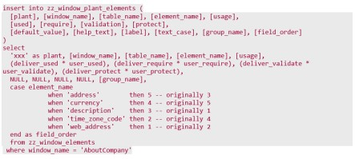

---  
 
title: "Form configuration changes in the backend"  
draft: false 
type: KB Article
 
---

This article documents the form configuration changes that can be made in the back end.

**Q1. How do I change the data type of a search look up field to a drop-down field and vice
versa?**

**Solution**:  
This is accomplished by updating the zz_window_plant_elements.element_type
column for the field on the window. To force a field to Drop-down List when it is an ISS, set this field to "DDL". To make it an ISS when it would normally be a DDL, set it to "ISS". When it is a DDL, the dropdown_display_mode column may be used to override the default behavior set by
the EAM Options value "DropDownViewSettings" by placing "Code", "Description" or "Both" here.

**Q2. How do I change the field order on a page in EAM?**

**Solution**:  
To change the field order, you have to make a copy of the ZZ_WINDOW_ELEMENTS
rows for a window_name in ZZ_WINDOW_PLANT_ELEMENTS for the plant you want to affect
and change the order field in each row to indicate the order in which you wish the fields to appear.
e.g.:

 

