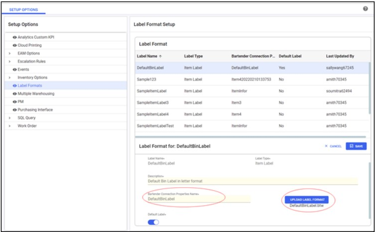
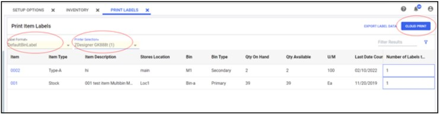

---  
 
title: "Label Printing Configuration and Instruction Guide"  
draft: false 
type: KB Article
 
---
## Overview

Aptean EAM enables the users to print labels directly to the label printers from the web client
through the cloud printing agent. To perform the label printing through cloud printing agent, you
need to:
* Configure the Agent computer.
* Upload and maintain the Label Format in EAM.


## Agent Computer Configuration

### Configuring Agent Computer

#### Prerequisite

You need to first download and install the following Agent program on the agent computer.

#### Downloading Cloud Printing Agent

To download the cloud printing agent, perform the following steps:
1. Open the link <https://print.api.apteancloud.com/> of Production environment home page in a
browser.

    > [!Note]:  
    > If the webpage prompts for account information and if you haven’t got the
account information, contact the EAM PM and then enter the Account ID and API key
to login.

2. Click on the **Print Agent Windows Installer** link to download the
**ApteanPrintAgentSetup.exe** file.

     


#### Installing Cloud Printing Agent

The Cloud Printing Agent must be installed locally on an Agent computer, which is used to receive
the printing jobs and perform the printing process. The printing jobs are directed from the Cloud
Printing Service to the local printers installed on this Agent computer.  
To install the cloud printing agent, perform the following steps:


1. Double-click **ApteanPrintAgentSetup.exe**. When the welcome page opens, click **Next**.

    

2. In the **Select Destination Location** page, select the default folder or a folder in a location of
your choice to install the Aptean Print Agent, and then click **Next**.

    

3. Enter the **Account ID** and the **Agent Key** to establish a connection to the Cloud Printing
Service, and then select **Production**.

    

4. If you want to validate the account entered, click the **Validate** button. If the account ID and
Agent Key are correct, the **Credential validation successful** message appears.

    

5. Click **Next**.
6. In the **Ready to Install** page, click the **Install** button.

    

7. Wait until the installation is completed.

## Configuring Agent Computer for Label Printing

To configure the agent computer, perform the following steps:
1. Download *EAMLabelPrintIntegration.rar* from the [share point location](https://apteanonline-my.sharepoint.com/personal/swang_aptean_com/_layouts/15/onedrive.aspx?id=%2Fpersonal%2Fswang%5Faptean%5Fcom%2FDocuments%2FCloudPrinting%2FEAMLabelPrintIntegration%2Erar&parent=%2Fpersonal%2Fswang%5Faptean%5Fcom%2FDocuments%2FCloudPrinting&ga=1).

2. Unzip it and put the entire folder in directory C:\Program Files\Aptean on Agent computer, as shown below:

    

3. Go to the folder for **ApteanPrintAgent**, and find the file **application.yaml**.

    

4. Open this configuration file to edit. Add the information marked in blue square.

    


    ```computerName: **APT05-XXXXXXX**  
    commands:  
    -name: LabelPrinter  
    command: C:\Program 
    Files\Aptean\EAMLabelPrintIntegration\EAMLabelPrintIntegration.exe  
    working-dir: **c:\tmp**  
    arguments: [ "--file", "$(FILENAME)" ] 
    drop-dir: **c:\tmp**  
    delete-file: **false**  
    -name: Local Drop  
    drop-dir: **C:\tmp\tmp  **
 

Just copy above information to the file and update the values in bold (no need to change
other config information).

> [!Note]  
> Do not change any format in above commands, even the spaces before each line. Otherwise, the Agent service may not be started.  
The updated file cannot be directly saved in this folder to replace the original one.   
Save it on other place first, like on the desktop, then, copy it to this folder to replace the
original one.

## Installing and Activating Bartender software

To install the latest Bartender software and activate it, perform the following steps:
1. Download the latest Bartender installation file from [BarTender - Seagull Scientific URL](https://portal.seagullscientific.com/downloads/bartender) and install it on the agent computer.

    

2. For the company, you can purchase the official license key to activate it.
3. For the internal testing, you can apply for a 30-Day Trial through following URL:  
[Download 30-Day Trial | BarTender (seagullscientific.com)](https://www.seagullscientific.com/30-day-trial/).

    

## Uploading and Maintaining Label Format

To print an item label from EAM, you need to create an item label format and upload it into EAM
first.

### Setting up Label Format

To upload a label format, perform the following:
1. Navigate to **Setup** > **Setup** **Options**.
2. In the **Setup Options** pane, click **Label Formats**.

    

3. From the right pane, click the **New** button to create a new label.

    > [!Note]  
    > To create a label format record in the system, you need a BTW file locally for
    uploading.

4. Click the **UPLOAD LABEL FORMAT** button and select the local BTW file. For example,
*DefaultBinLabel.btw*.
5. The Label Name will be auto populated. Enter a Description for the label.
6. Enter the name of the Bartender Connection Properties Name which will be used as the
label data source. For example, *DefaultBinLabel*.

    > [!Note]:   
    > It is the name of the XML file which is used to map the data to the related
    BTW file to form the label. To review the data on this file locally, from the Inventory
    page select the item and click EXPORT XML to download the XML file.

7. You can turn on the **Default Label** toggle button to make this label format as a default label
format.
8. Click **ADD**. The label format will be added to the Label Format list.
Once a label format is added, you can edit, delete, and download the label format.

### Cloud Printing Item Label

To cloud print an item label, perform the following:
1. Navigate to the **Inventory** page (navigate from Search Item menu), choose one existing
query, for example, *DefaultBinLabel*, and select the items in the results for which the label
will be printed.

    

2. Click the **PRINT LABELS** option. The Print Item Labels page opens. The columns in this
new screen are same as the ones in existing query *DefaultBinLabel*.

> [!Note]  
> The PRINT LABELS option will be enabled only if the Cloud Print option is
enabled.

3. From the **Label Format** drop-down menu, select the required label format.

    

4. From the **Printer Selection** drop-down menu, select the required printer.
5. If default printer and/or default label format is setup, then the respective one will be auto
selected.
6. You also have an option to print multiple copies of labels. In the **Number of Labels to Print**
field enter the number of copies required to print.
7. Click **CLOUD PRINT**. The label will be printed.
8. Once the print is completed/failed, you will get a notification.

> [!Note]   
> You can use the **EXPORT LABEL DATA** button to export the label data into a XML file.

