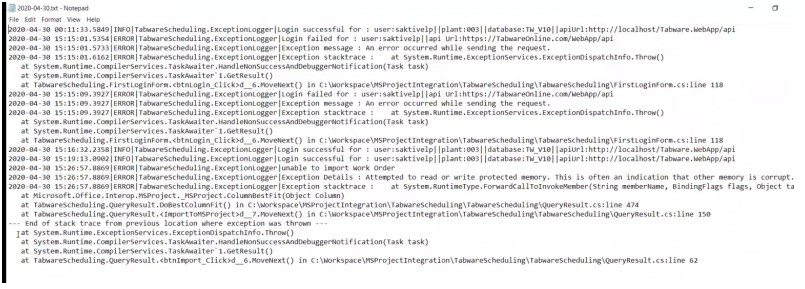

---  
 
title: "Microsoft Project Plan Interface"  
draft: false 
type: KB Article
 
---
## Overview

EAM provides an interface to the Microsoft Project Plan (MPP), also called as Microsoft Project or
Project in this help file. This interface allows you to transfer information about work orders maintained in
EAM comprising planned labor, other planned costs, and so on into Microsoft Project for detailed
planning and analysis. Once the work orders are updated in the Project file, the updated data is
synchronized with the EAM Database.

The EAM interface is a desktop based application and uses a plug-in to interact with the EAM Database.
The plug-in allows information to flow both ways between EAM Database and Microsoft Project. The
shared data is updated or added either through EAM or Microsoft Project.

> [!Note]  
> Users must install the plug-in to start a EAM Microsoft Project. Once the installation is
complete, the EAM Scheduling tab is displayed on the Microsoft Project file.

## Installation

This section provides you the information on EAM Scheduling plug-in installation.

## System Requirements

* Microsoft .NET Framework 4.7.2 and Visual Studio Runtime must be installed for the plug-
in.
* Windows 10 (April 2018 update) operating system includes the .NET Framework 4.7.2 as a
default OS component.
* EAM supports Microsoft Project 2013, 2016 and 2019.

## Install EAM Scheduling Plug-in

To install the EAM Scheduling plug-in, follow the steps below:
1. Download the EAM Scheduling plug-in.

    > [!Note]  
    > You can obtain the download link from the support team.

2. Unzip the downloaded zip file.
    > [!Note]  
    > Before installing the plug-in, make sure that any previous version is uninstalled. If it is already installed, uninstall the plug-in. Also, verify that the **EAM Scheduling** tab is not available in MS Project.

3. Double-click on the **EAM_MSProject_Setup_xx** file to initiate the plug-in installation.
4. Allow the installation process to complete.
5. Open MS Project to confirm the successful installation. If the installation was successful,
you will see the EAM Scheduling tab in MS Project.

    > [!Note]:  
    > After the plug-in installation, no additional configuration is required as all the necessary settings are pre-configured within the application.

## Introduction

This document helps you to perform the following actions while working on the EAM-Microsoft
Project:
* [Create an Empty Project](Microsoft_Project_Plan_Interface.md#create-an-empty-project): Users must save Microsoft Project before logging in.
* [Logging in](Microsoft_Project_Plan_Interface.md#login-to-microsoft-project): Process of logging in.
* [Template](Microsoft_Project_Plan_Interface.md#template): Create a standard template for all new projects and use it.
* [Settings](Microsoft_Project_Plan_Interface.md#settings): View or update the configuration options for each project.
* [Importing Work Orders](Microsoft_Project_Plan_Interface.md#importing-work-orders): Import data from EAM Database to the Microsoft Project file.
* [Updating Work Orders](Microsoft_Project_Plan_Interface.md#updating-work-orders): Update Work Orders in the project sheet.
* [Synchronizing Data](Microsoft_Project_Plan_Interface.md#synchronizing-data): Update data from the Microsoft Project file to the EAM Database.

## Create an Empty Project

In Microsoft Project, the project file must be saved before logging in. Create an empty project and
save it.
1. Select **File** > **Save** from the Microsoft Project menu or by using the **Ctrl+S** shortcut key.
2. In the **Save As** dialog box, enter a file name and click **Save**, to save as file type .mpp.

## Login to Microsoft Project

The first time log in procedure is a two-step authentication process, where you enter the user
name and password in the first step and select the database and plant in the second step. The
plant selection list changes based on the database selection. The plant and databases a re
populated based on the user's security. 

### To log in to a New Project

1. Open Microsoft Project file, the **EAM Scheduling** tab is displayed. Click **Login**.  
The **Login** window opens.
2. If the file is not saved, a prompt to save the file appears, click **OK**.
3. In the **Save File** dialog box, enter a file name and make sure the file type is .mpp.
4. Click **Save** to save as file type .mpp. The **File saved successfully!** message appears.
5. Click **OK** to close the pop-up message.   
The Login pop-up window appears.

6. Select the Environment from the drop down menu, and click **Proceed**.  
The **Sign in Aptean EAM** login screen appears.
7. Enter a valid email address and click NEXT.
8. Enter the password and click **SIGN IN**.  
A **Login** pop-up appears with the list of database and plant available for the signed in
account.
9. Select the **Database** and the Plant, and then click Done.  
The **Login Successful** message appears.

### To log in for an Existing Project

1. Open an existing Microsoft Project file and click **Login**.  
The **Sign in Aptean EAM** login screen appears.
2. Enter a valid email address and click **NEXT**.
3. Enter the password and click **SIGN IN**.  
A **Login** pop-up appears with the Environment, Api Url, Database, and Plant details selected
in the previous login.
4. Click **Proceed**.

5. The **Login Successful!** message appears, click OK.

> [!Note]  
> In an existing project, a Database or Plant can be changed depending on the
user’s access; if they have access to two different databases or multiple plants, they will
receive a prompt to select the specific DB and the plant they want to launch. If users need to
switch to a different environment, they must create a new file and map it to the desired
database.

## Settings

This section provides you information on the project settings you can make based on your
requirements.

### Project Settings

In the Microsoft Project file, use the **Project Settings** window to configure options to define the
behavior of the interface. You can also define each individual project with unique configuration
options.  
Perform the following procedure to view or update the configuration options:

1. Open the Microsoft Project file, on the **EAM Scheduling tab**, click the Settings ribbon but-
ton.  
The Project Settings window opens.

    

2. The Project Settings window displays the default configuration options for the plant. Perform one of the following actions:
    * If you want to retain the default configuration options, close the window.
    * If you want to change the configuration options, select the required check boxes and radio
buttons. For more information, see the [Appendix B: Configuration Options for Setting Up Project Configuration Options for Setting up Project](Microsoft_Project_Plan_Interface.md#appendix-b-configuration-options-for-project) section.  
Then click **Update** to save your
changes.

## Importing Work Orders

The Microsoft Project interface allows you to import data from EAM Database into Project file
through **Work Orders**. The data is imported by executing a query in the Work Orders module.

> [!Note]  
> Currently, the EAM-Microsoft Project Interface only supports and lists the **Non-Ask
at Execution** queries.

Perform the following procedure to import data:
1. Log in to the Microsoft Project file, and click **Work Orders**.  
The Query Result window opens.
2. Select the work order or work orders as follows:
    * To select work orders using a query, select the required query from the drop-down in the **Queries** field, and then click **Execute**.  
    All the work orders related to the query are displayed.
    * To search for the required work order, enter the work order number in the **Search Work Order #** field.
3. The search result displays the required work order. Then click **Import**.
4. The data is imported from EAM Database to the Project file. Click **Close**.  
The data is displayed in the Project file sheet.  
The interface allows multiple imports to the project file.

During import, if the data is changed in EAM Database, the Microsoft Project updates this data
based on the settings mentioned in the Project Setting options.

### EAM-Microsoft Project Column Mapping

The following table explains the terms used in EAM and the corresponding terms used in
Microsoft Project. T he third column explains resolutions for any discrepancies when importing
work orders.

| **EAM** | **Microsoft Project** | **Resolution If Values Differ** |
|----|-----|------|
|Sequence Number|ID|Updates Microsoft Project with Schedule data|
|Work Order Short Description| Name|Updates Microsoft Project with EAM’s Work Order Short Description|
|Schedule Start Date|Start|Dependent on the setup option chosen. Refer to the [Start Date Options](Microsoft_Project_Plan_Interface.md#start-date-options) section|
|Schedule Start Time|Start (time portion)|
|Work Order Number|Text1|EAM’s Work Order Number always downloads into Project’s task-level field Text1. If the interface setup option labeled Update Task Text….using Work Order Values is checked, then Project’s task-level Text2 through Text9 fields are set equal to EAM’s equipment number,area, etc.|
|Equipment|Text2| |
|Area|Text3||
|Department|Text4||
|Supervisor|Text5||
|Shop|Text6||
|Planner|Text7||
|Project|Text8||
|Work Class|Text9||
|Shutdown Code |Text10||
|WO Status|Text11||
|Status Description|Text12||
|WO Priority|Text13||
|Criticality |Text14||
|Assigned To |Text15||
|Employee_ID_1 |Text16||
|Employee_ID_2 |Text17||
|Employee_ID_3 |Text18||
|Employee_ID_4 |Text19||
|Employee_ID_5 |Text20||
|Employee_ID_6 |Text21||
|Requested Completion Date|Date1| If the interface setup option labeled Update Task Text…using Work Order Values is checked, then Project’s task-level Date1 is always set equal to EAM’s Requested Completion Date.|
|Craft + Occurrence|Resource Name|The Craft and Occurrence fields in EAM are Mapped to one fieldResource Name- in Microsoft Project. Contact your admin with the log file for resolution of issues, if any.|
|Craft Planned Rate|Resource Standard Rate|The Craft Planned Rate field in EAM is mapped to the Resource Standard Rate field in Microsoft Project. Contact your admin with the log file for resolution of issues,if any.|
|Craft Workers|Resource Units|Dependent on the setup option  chosen. Refer to the [Resource  Assignment Update Options](Microsoft_Project_Plan_Interface.md#resource-assignment-update-options) section.|
|Actual Hours |Actual Work|Refer to the [Update Task Actual Work Using Work Order Actual Hours](Microsoft_Project_Plan_Interface) section.|
|Remaining Hours  |Remaining Work |Refer to the [Remaining Work/Remaining Hours Options](Microsoft_Project_Plan_Interface.md#remaining-work-or-remaining-hours-options) section.| 
|WO Crafts -Lag |Text10|Refer to the below, titled Work Order Resources Lag and Assignment Delay section.|
|WO Crafts - Lag Units|Text10|Refer to the below, titled Work Order Resources Lag and Assignment Delay section.|
|Work Order Total Planned Hours|Number 1|If the interface setup option labeled Update Task value (Number1…) is checked then Project’s task level Number 1 is always set equal to the totally planned hours for the EAM work order.|
|Actual Non-Labor Costs (Material-I, Nonstock-C, Nonstock-I, Other-C, Other-I, Services-C, Tools-C, Tools-I)|Cost1|If the interface setup option labeled Update Task Cost1 value… is checked, then Project’s task-level Cost1 is always set equal to the total actual non-labor cost from EAM.|
|Planned NonLabor Costs (Material-I, Nonstock-C, Nonstock-I, Other-C, Other-I, Services-C, Tools-C, Tools-I) |Cost2|If the interface setup option labeled Update Task Cost2 value… is checked, then Project’s task-level Cost2 is always set equal to the total planned non-labor cost from EAM|
|Actual Non-Labor Costs (Material-I, Nonstock-C, Nonstock-I, Other-C, Other-I, Services-C, Tools-C, Tools-I) |Fixed Cost|If the interface setup option labeled Copy Cost1 into Fixed Cost is checked, then Project’s Fixed Cost field is always set equal to the total actual non-labor cost from EAM.  **Note:** If you are already using the Fixed Cost field within the Project application, then do not select the option **Copy Cost1 into Fixed Cost**.|

## Updating Work Orders

After importing the data from EAM to your Project file, you can edit, add, or delete the data in the
sheet.  
After updating the work orders in the Project sheet, you need to upload the updated data back to
the work orders in EAM Database. For more information, see [Synchronizing Data](Microsoft_Project_Plan_Interface.md#synchronizing-data).

## Synchronizing Data

After updating the Work Orders i n the Microsoft Project, you must synchronize the updated data to
the EAM Database.  
To upload the updated data from the Microsoft Project sheet to the EAM database, click the **Sync**
button in the ribbon of the Microsoft Project.  
The data is updated based on the project settings.
|EAM’s Field Names|Microsoft Project’s Field Names|Project Setting Configuration Selected|EAM’s Field Updated|Microsoft Project’s Field Updated|
|-|-|-|-|-|
|Sequence Number|ID|NA|NA|Updates Microsoft Project with Schedule data.|
|Work Order Short Description|Name|NA|NA Updates Microsoft Project with EAM’s Work Order Short Description.|
|Schedule StartDate|Start|Do not Update Start Date, Time|Does not update EAM’s Schedule Start Date|Does not update MS Project’s Start.|
|Schedule StartDate|Start|Update Task Start Date, Start Time with Schedule Start Date, Time|NA |Updates Microsoft Project with the start dates from the EAM’s Work Order schedule.|
|Schedule StartDate|Start|Update Schedule Start Date, Time using Task Start Date|Updates EAM work orders using Microsoft Project's Start date.|NA|
|Schedule Start Time|Start(time portion)|Do not Update Start Date, Time|Does not Update EAM's Schedule Start Time|Does not Update MS Project's Start(time portion)|
|Schedule Start Time|Start(time portion)|Update Task Start Date, Start Time with Schedule Start Date, Time|NA|Updates Microsoft Project with the start times from EAM's Work Order Schedule|
|Schedule Start Time|Start(time portion)|Update Schedule Start Date, Time using Task Start Date|Updates EAM work orders using Microsoft Project's Start Time|NA|
|Work Order Number|Text1|Update task Text2, Text3,Text4,... (used for Equip#, Area, Department...) using Work Order values|NA|EAM’s Work Order Number always downloads into Project’s field Text1.|
|Equipment|Text2|Update task Text2, Text3,Text4,... (used for Equip#, Area, Department...) using Work Order values|NA|EAM’s Equipment’s Field Value downloads into Project’s Text2 field.|
|Area|Text3|Update task Text2, Text3,Text4,... (used for Equip#, Area, Department...) using Work Order values|NA|EAM’s Area’s Field Value downloads into Project’s Text3 field.|
|Department|Text4|Update task Text2, Text3,Text4,... (used for Equip#, Area, Department...) using Work Order values|NA|EAM’s Department’s Field Value downloads into Project’s Text4 field.|
|Supervisor|Text5|Update task Text2, Text3,Text4,... (used for Equip#, Area, Department...) using Work Order values|NA|EAM’s Supervisor’s Field Value downloads into Project’s Text5 field.|
|Shop|Text6|Update task Text2, Text3,Text4,... (used for Equip#, Area, Department...) using Work Order values|NA|EAM’s Shop’s Field Value downloads into Project’s Text6 field.|
|Planner|Text7|Update task Text2, Text3,Text4,... (used for Equip#, Area, Department...) using Work Order values|NA|EAM’s Planner’s Field Value downloads into Project’s Text7 field.|
|Project|Text8|Update task Text2, Text3,Text4,... (used for Equip#, Area, Department...) using Work Order values|NA|EAM’s Project’s Field Value downloads into Project’s Text8 field|
|Work Class|Text9|Update task Text2, Text3,Text4,... (used for Equip#, Area, Department...) using Work Order values|NA|EAM’s Work Class’s Field Value downloads into Project’s Text9 field.|
|Shutdown Code |Text10|Update task Text2, Text3,Text4,... (used for Equip#, Area, Department...) using Work Order values|NA|EAM’s Shutdown Code’s Field Value downloads into Project’s Text10 field|
|WO Status|Text11|Update task Text2, Text3,Text4,... (used for Equip#, Area, Department...) using Work Order values|NA|EAM’s WO Status’s Field Value downloads into Project’s Text11 field.|
|Status Description |Text12|Update task Text2, Text3,Text4,... (used for Equip#, Area, Department...) using Work Order values|NA|EAM’s Status Description’s Field Value downloads into Project’s Text12 field.|
|WO Priority |Text13|Update task Text2, Text3,Text4,... (used for Equip#, Area, Department...) using Work Order values|NA|EAM’s WO Priority’s Field Value down loads into Project’s Text13 field.|
|Criticality |Text14|Update task Text2, Text3,Text4,... (used for Equip#, Area, Department...) using Work Order values|NA|EAM’s Criticality’s Field Value downloads into Project’s Text14 field.|
|Assigned To |Text15|Update task Text2, Text3,Text4,... (used for Equip#, Area, Department...) using Work Order values|NA|EAM’s Assigned To Field Value downloads into Project’s Text15 field. |
|Employee_ID_1|Text16|Update task Text2, Text3,Text4,... (used for Equip#, Area, Department...) using Work Order values|NA|EAM’s Employee_ ID_1’s Field Value downloads into Project’s Text16 field.|
|Employee_ID_2|Text17|Update task Text2, Text3,Text4,... (used for Equip#, Area, Department...) using Work Order values|NA|EAM’s Employee_ID_2’s Field Value downloads into Project’s Text17 field.|
|Employee_ID_3|Text18|Update task Text2, Text3,Text4,... (used for Equip#, Area, Department...) using Work Order values|NA|EAM’s Employee_ID_3’s Field Value downloads into Project’s Text18 field. |
|Employee_ID_4|Text19|Update task Text2, Text3,Text4,... (used for Equip#, Area, Department...) using Work Order values|NA|EAM’s Employee_ID_4’s Field Value downloads into Project’s Text19 field.|
|Employee_ID_5|Text20|Update task Text2, Text3,Text4,... (used for Equip#, Area, Department...) using Work Order values|NA|EAM’s Employee_ID_5’s Field Value downloads into Project’s Text20 field|
|Employee_ID_6|Text21|Update task Text2, Text3,Text4,... (used for Equip#, Area, Department...) using Work Order values|NA|EAM’s Employee_ID_6’s Field Value downloads into Project’s Text21 field.|
|Requested Completion Date|Date1|Updates MS Project’s Date1 field with EAM’s Requested Completion Date|NA|Updates MS Project’s Date1 field with EAM’s Requested Completion Date|
|Craft + Occurrence|Resource Name |NA|NA MS Project’s Resource Name is mapped with EAM’s Craft and Occurrence field.|
|Craft Planned Rate|Resource Standard Rate|NA|NA|MS Project’s Resource Standard Rate is mapped with the EAM’s Craft Planned Rate field.|
|Craft Workers|Resource Units|Do not update Task Assigned Resources or Work Order Crafts|Does not update EAM’s Work Order Crafts|Does not update MS Project’s task assignments.|
|||Update Task Assigned Resources using Work Order Crafts|The Units field in Microsoft Project maps to Workers in EAM| The following EAM fields are downloaded into the Microsoft Project: Craft Code, Occurrence, Workers.   EAM's Craft Code and Occurrence are used to create the Resource Name in the Microsoft Project|
|||Update Work Order Crafts using Task Assigned Resources|Task assignment created in the Microsoft Project is used to update EAM Work Order. For this the Resource Code must already exist as a Craft Code in EAM.|NA|
|Actual Hours|Actual Work|Update Task Actual Work Using Work Order Actual Hours|NA|Microsoft Project’s Actual Work field will be mapped to the EAM’s Actual Hours field.   The field titled Work in Microsoft Project is also updated.|
|Remaining Hours|Remaining Work|Do not update Remaining Work or Remaining Hours |Does not update EAM’s Remaining Hours|Does not update Project's Remaining Work.|
|||Update Task Remaining Work using Work Order Remaining Hours|NA|Microsoft Project's Remaining Work field is mapped with EAM's Remaining Hours field.|
|Work Order Total Planned Hours|Number 1|Update Task value Number1 (used for Planned Work) using Work Order Planned Hours|NA|Updates the Project’s titled Number 1 field with the total planned hours from the Work Order|
|Actual NonLabor Costs (Material-I, Nonstock-C, Nonstock-I, Other-C, Other- I, Services-C, ToolsC, Tools-I)|Cost1 |Update Task Cost 1 value (used for Actual Non-Labor Cost) with Work Order Planned Non-Labor costs|NA|Updates the project's Cost1 field with the sum of Actual NonLabor costs from the Work Order.|
|Planned NonLabor Costs (Material-I, Nonstock-C, Nonstock-I, Other-C, Other- I, Services-C, ToolsC, Tools-I) |Cost2|Update Task Cost2 value (used for Planned NonLabor Cost) with Work Order Planned NonLabor costs|NA|Update Project’s Cost2 with the sum of Planned Non-Labor costs from the Work Order.|
|Actual NonLabor Costs (Material-I, Nonstock-C, Nonstock-I, Other-C, Other- I, Services-C, ToolsC, Tools-I)|Fixed Cost|Copy Task Cost1 value (Actual Non-Labor Cost) into Task Fixed Cost|NA |Project’s Fixed Cost field is mapped with the total actual non-labor cost from EAM.|

 
### Resolution of Synchronization Errors

If an error occurs during synchronization, then an error message appears on the status window as
follows:  
**Contact the System Administrator with the logs - stored in the location:**  
`C:\Users\<username>\AppData\Roaming\Aptean\EAMProjectScheduling\logs`  
A sample log file is shown in the following image.

 

## Appendix A: Template

### Template

A best practice to avoid re-work is to create a Microsoft Project template. You can use this
template for all new EAM projects and avoid adding and re-arranging columns each time you start
a new project.  
Perform the following procedure to create a Microsoft Project template:
1. Open a new empty project in Microsoft Project. For more information, see [Create an Empty Project](Microsoft_Project_Plan_Interface.md#create-an-empty-project).
2. Add the required columns and re-arrange the columns in the required order.
3. Save the changes and then click **File** > **Save As** to save this project with a name, for
example, `<Name>Template` in a location of your choice.

To use the saved `<Name>Template` when you download a new EAM schedule into a Microsoft
Project, perform the following procedure:
1. Open an empty project file in Microsoft Project.
2. Click **File** > **Open** to browse and open the `<Name>Template`.  
The template opens.
3. Next, click **File** > **Save As** to save a copy of the `<Name>Template` with a name of your
choice and ensure that the file type is .mpp, for example, `<Name>.mpp`.
4. Next, either continue working on the `<Name>.mpp` file or close the file and later open the
newly saved `<Name>.mpp` file, log in with your EAM user credentials and start working on
the Work Orders.

## Appendix B: Configuration Options for Project

### Configuration Options for Project

A detailed explanation on the configuration options available in the Project Settings window of the
Microsoft Project are as follows:
* **Create task in Project if none exists for a Work Order in the Schedule**:  
If a Work Order exists in the EAM schedule, but does have a corresponding task in Project, select
this option to have the interface create a corresponding task in Project.

* **Create Resource in Project if they do not exist and are assigned on a Scheduled Work Order**:  
If a Craft Code is planned on a scheduled Work Order but does not exist in Project, select this
option to have the interface create a corresponding resource in Project. This would work in
conjunction with the Resource Assignment Update Options described below.

If a resource exists in Project but does not exist as a Craft Code in EAM, the interface does not
create the craft code in EAM. For more information, see [EAM MPP Column Mapping](Microsoft_Project_Plan_Interface.md#eam-microsoft-project-column-mapping).

#### Resource Assignment Update Options

Select one of the following options to update the resource data:
* **Do not update Task Assigned Resources or Work Order Crafts** - If this option is selected, the interface does not update EAM’s Work Order Crafts or MS Project’s task assignments.

* **Update Task Assigned Resources using Work Order Crafts**- If this option is selected, each craft code planned on the EAM work order is added as a Resource Name in MS Project
and assigned to the task created from the work order. This option controls the downloading
of the following EAM fields into the Microsoft Project: Craft Code, Occurrence, Workers.
Other options described below control the downloading of Actual Hours and Remaining
Hours.

* EAM's Craft Code and Occurrence are used to create the Resource Name in the Microsoft
Project.

* EAM's Workers maps to Units in the Microsoft Project. For more information about setting
the units as decimals, see [Set Units as DecimalsAppendix C: Set Units as Decimals](Microsoft_Project_Plan_Interface.md#appendix-c-set-units-as-decimals).

* **Update Work Order Crafts using Task Assigned Resources** - If this option is selected,
each task assignment created in the Microsoft Project is used to update EAM. However, the
Resource Code must already exist as a Craft Code in EAM; also, new Craft Codes cannot
be created in EAM through the interface. If any task assignment is created in the Microsoft
Project using a Resource Name that has not been previously defined in EAM, then it is
ignored.  
For example, if the Craft Code **ELEC** exists in EAM, then the Microsoft Project user can
create a task assignment in Project with Resource Name equal to **ELEC**, **ELEC-1** or **ELEC-2**. In the first two tasks/cases, the EAM Work Order Notebook will be updated with the
following planned information: c raft = ELEC, occurrence = 1. In the third task/case, the Work
Order Notebook will be updated with the following information: c raft = ELEC, occurrence = 2.
This option controls the uploading of the following EAM fields from the Microsoft Project:
Craft Code, Occurrence, Workers. (The Units field in Microsoft Project maps to Workers in
EAM.) Other options described below control the downloading of Actual Hours and
Remaining Hours.

* **Update Task Actual Work Using Work Order Actual Hours**: If this check box is selected, Microsoft Project’s Actual Work field will be set equal to the EAM’s
Actual Hours field.  
When this check box is selected, the field titled **Work** in Microsoft Project is also updated. I n
Project, the **Work** field must always equal the sum of **Actual Work** plus Remaining Work.
Therefore, when the interface updates **Actual Work**, the interface must also update Work.

#### Remaining Work or Remaining Hours Options

Select one of the following options to update the remaining work:

* **Do not update Remaining Work or Remaining Hours** - The interface will not synchronize
the values of EAM's Remaining Hours and the Project's Remaining Work.

* **Update Task Remaining Work using Work Order Remaining Hours** - Microsoft Project's Remaining Work field is set equal to EAM's Remaining Hours field.

Microsoft Project's **Work** field is also updated. In the Project, the Work field must always equal
the sum of **Actual Work** plus **Remaining Work**. Therefore, when the interface updates
Remaining Work, the interface must also update **Work**.

* **Update Work Order Remaining Hours using Task Remaining Work**:  
EAM’s Remaining
Hours field will be set equal to Microsoft Project’s Remaining Work field.

* **Update Task value Number 1 (used for Planned Work) using Work Order Planned
Hours**:  
This option updates the Task Number 1 field with the total planned hours from the Work Order.

* **Update Task Cost 1 value (used for Actual Non-Labor Cost) with Work Order
Planned Non-Labor costs**:  
This option updates the Task Cost1 field with the sum of Actual Non-Labor costs from the Work
Order.  
If the value of Actual Non-Labor Costs in EAM is zero, the value of Task Cost 1 in MS Project will not be overwritten by the value in EAM.

* **Update Task Cost 2 value (used for Planned Non-Labor Cost) with Work Order
Planned Non-Labor costs**:    
Select this option to update Task Cost2 w ith the sum of Planned Non-Labor costs from the Work
Order.

* **Copy Task Cost1 value (Actual Non-Labor Cost) into Task Fixed Cost**:  
This option allows MS Project users to have the EAM actual non-labor costs values stored in
Project's Fixed Cost field.

#### Start Date Options

Select one of the following three options for updating start date:
* **Do not Update Start Date, Time** - performs no synchronization of start dates between
Microsoft Project and EAM.

* **Update Task Start Date, Start Time with Schedule Start Date, Time** - updates Microsoft
Project with the start dates and times from the EAM work order schedule.

* **Update Schedule Start Date, Time using Task Start Date** - updates EAM work orders
using Microsoft Project's Task Start date and time.

When a EAM work order is initially downloaded into Microsoft Project, the Task Constraint is set to
either **As Soon As Possible** or Must Start On. If the Scheduled Start Date in EAM is blank, the
Task Constraint is set to **As Soon As Possible**. If a Scheduled Start Date has been entered in
EAM, the Task Constraint is set to **Must Start On MM/DD/YYYY**. When you open the project in
Microsoft Project, the Project application performs certain calculations that may alter the
constraint to another type, such as **Finish No Earlier Than**.

* **Update task Text2, Text3, Text4,...(used for Equip#, Area, Department...) using Work
Order values**:  
Select this option to have the interface copy information from EAM's Work Order into the Project's
text fields. You have the option to either insert all this date or none of it. For more information of
EAM fields that are copied into the Project's Text (and Date) fields, see [EAM MPP Column Mapping](Microsoft_Project_Plan_Interface.md#eam-microsoft-project-column-mapping).

* **Update Project Work Hours per day using Schedule Work Hours per day**:   
The settings for this option is made in Calendar Options in Microsoft Project, and cannot be
synchronized with EAM. For more information, see [Calendar Options Appendix D: Calendar Options](Microsoft_Project_Plan_Interface.md#appendix-d-calendar-options). After setting the Calendar Options, select this option to use the Work Hours per day in
the Microsoft Project.

## Appendix C: Set Units as Decimals

### Set Units as Decimals

The Microsoft Project displays units as a percentage in the Units field by default. However, you
can set this field to show values in decimals rather than as a percentage.

To set the value of the Units field in decimals:
1. Open the Microsoft Project and go to **File** > **Options**.  
The Project Options window opens.
2. Click **Schedule**.  
The **Change options related to scheduling, calendars, and calculations** page opens.
3. In the **Schedule** section, modify the value for the Show Assignment Units As field from
the drop-down as required, and then click **OK**.

## Appendix D: Calendar Options

### Calendar Options

The Microsoft Project allows you to set the work hours per day in its calendar options. Before
working on the work orders, the schedulers can use the calendar options to set the work hours per
day as required.

> [!Note]  
> This setting is optional, and cannot be synchronized with EAM.

**To set the work hours per day**:
1. Open the Microsoft Project and go to **File** > **Options**.  
The Project Options window opens.
2. Click **Schedule**.  
The **Change options related to scheduling, calendars, and calculations** page opens.
3. In the **Calendar options for this project** section, modify the value for the **Hours per day**
field from the drop-down as required, and then click **OK**.

