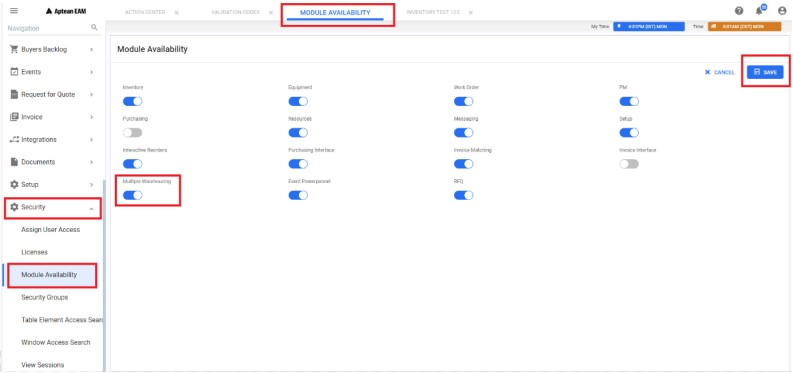

---  
 
title: "Multi Warehousing Configuration for a Plant"  
draft: false 
type: KB Article
 
---
## FAQs

#### Q1.How to configure a plant for multi-warehousing? Or How to configure a plant to add multiple store locations?

**Answer**:   
By default, a plant with a single warehouse will have **Main** as an option in the **Store
Location** field, and it won't force the user to select a store location while creating **requisitions**,
adding **PO lines**, creating items, etc. If a plant has **multiple warehouses**, the Store Location
field will offer various options in the drop-down menu, provided those locations are already
configured.

**Store Location: Main**

 

**Store Location: With Multiple option in the drop-down menu.**

Follow these instructions to configure a plant for multi-warehousing: 
1. Navigate to **Security** > **Module Availability** in the navigation pane. The **Module Availability**
tab opens in the **Top bar**.

2. Click the **Edit** button, enable the **Multiple Warehousing** toggle button, and then click **Save**.

    

3. The **Store Location** field will now be enabled, allowing users to select options from an
existing configured list.

#### Q2. How do we create a new store location/warehouse?

**Answer**:   
The initial step for users is to configure multi-warehousing to activate the buttons in the
store location header. Multi-warehousing can be configured under the Module Availability
section (refer to [How to configure a plant for multi-warehousing?](Multi-Warehousing_Configuration_for_a_Plant.md#q1how-to-configure-a-plant-for-multi-warehousing-or-how-to-configure-a-plant-to-add-multiple-store-locations)). Once multi-warehousing is
enabled under module availability, users can create the required store locations to be used in all
modules.  

Follow these instructions to create a new store location:
1. Navigate to **Setup** > **Validation** **Codes** in the navigation pane. The **Validation Codes** tab
opens in the **Top bar**.
2. Click on **Store Location** in the grid and then click the **Details** icon in the contextual panel.
3. The Store Location window will open in the right-side panel; click the **New** button in the
header.
4. **New Code For**: **Store Location** grid expands below, fill in the following fields:
    * Store Location: Enter the name of the location.
    * Job Function: Choose the desired option from the drop-down.
    * Spares Holding Location: Enter the required details.
    * Delivery Areas: Choose the desired option from the drop-down.
5. Click **Add**; the added store location will display in the **Store Location** grid.

6. Click **Add Another** to add another store location without clicking on the **New** button again.

    

