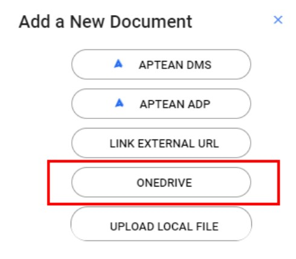
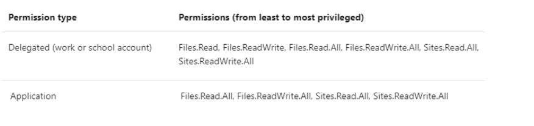

---  
 
title: "OneDrive Configuration and FAQ Guide"  
draft: false 
type: KB Article
 
---

This configuration guide is to understand the OneDrive feature integration with EAM application.

This guide is intended for customer administrators and the Aptean Cloud Team who are responsible for configuring OneDrive with the EAM application. The table below outlines the tasks
involved in this configuration.

| **Tasks Involved In Configuration** | **Ownership** |
|-|-|
|[Setting up the prerequisite](OneDrive_Configuration_and_FAQ_Guide.md#prerequisite): Create Service Principal in Azure and sharing the ClientID, Secret, and Tenant ID with Aptean Cloud Team.|Customer Administrator|
|[Configuration in EAM](OneDrive_Configuration_and_FAQ_Guide.md#configuration-in-eam)| Aptean Cloud Team|

 
## Introduction

Microsoft OneDrive is a file hosting and synchronization service operated by Microsoft as part of
its web version of Office.

Now, the SharePoint connector (OneDrive) is integrated with the EAM application document
management system (DMS), which will perform the following:
* Authenticate to the SharePoint server.
* Retrieve a document from the server through SharePoint APIs that would allow the user to
navigate the site.
* Store the document in EAM such that it can be retrieved.
* Retrieve the document from EAM when requested by the user, including printing it with a work order.

    

## Configuration

Users with sufficient security access can configure document management options, including
OneDrive, in the EAM application. Only the configured options will be visible in the EAM
Documents module. To configure DMS options, follow procedure in this section.

### Prerequisite

> [!Note]  
> This section is intended for Customer Administrator who is responsible for
creating Service Principal and sharing ClientID, Secret, and Tenant ID with the Aptean Cloud Team.

To integrate OneDrive with EAM, the customer administrator needs to create a Service Principal
in azure (Application). This Service Principal needs to be given permissions to access Customers
OneDrive files. Also this Service Principal with its secret needs to be configured in EAM
application.

Perform the following to create Service Principal in Azure:
* Navigate to **App Registrations** under Azure Portal and click on **New Registrations**.
* Provide a name for the App being created.
* Under the supported account type, select **Account in any Organizational Directory**.
* Under redirect URLs, provide the respective URL:
    * To enable access to production instance of the application, enter <https://prod.eam.apteancloud.com/onedrivefilepicker.html>.

    * To enable access to test instance of the application, enter <https://test.eam.apteancloud.com/onedrivefilepicker.html>.

* Under section **Implicit grant and hybrid flows**, select check-boxes Access Token and ID
Token.
* Click on save.
* Open the newly created Application in azure portal.
* Note the client ID of the Application which is newly registered. This will be under Overview
page of the Application newly registered. This ClientID will be used later to configure EAM
and OneDrive.
* Navigate to **Certificates and Secrets** section.
* Click on **New Client Secret**. Give a Name and select expiration. Click on Add button. Note
the generated Secret.
* Navigate to **API Permissions**. Click on **Add a Permission**. Below permissions need to be
provided for Delegated and Application permission types respectively.

    

* Click on **Grant Admin Consent**.

After creating the Service Principal in Azure, provide the captured ClientID (Application ID),
Secret, and Tenant ID to Aptean representative to configure it in EAM.

### Configuration in EAM

> [!Note]  
> This section is intended for Aptean Cloud Team who is responsible for
configuration in EAM.

Consider the following table in which you can configure the required options:  
**Table name**: sy_document_providers  
**Script to check the Data**: select * from sy_document_providers
| **Table Columns**| **Description** |
|-|-|
|Plant|The plant for which the settings need to implemented.|
|Provider ID|This value will be auto generated as part of primary key. No need to insert any value.|
|Name| The name/text which will show in the EAM application Documents panel UI.|
|Enabled|You can update the required value and that will be displayed in the UI. The flag to indicate if the particular option is enabled or not. Only enabled options will be visible in the EAM application Documents panel UI.|
|Type|The document option types which can not be updated/changed by the users. The types can be Aptean DMS, Aptean ADP, Link External URL and Microsoft OneDrive.|
|Url|The url which will be hit when users click on DMS/ADP. This is not applicable if the option is Microsoft One Drive.|
|Application_id| The application ID provided from a hosted application of Azure. This is applicable only if the option is Microsoft One Drive.|
|Secret| The application secret key. This is applicable only if the option is Microsoft OneDrive.|

If the user changes the above parameters or they are updated via SQL, the next call to that
document management system uses the updated parameters in the UI.

## Frequently Asked Questions

Consider the following FAQs t o understand OneDrive feature more appropriately:

**Q1. Can I limit the folders in my corporate OneDrive which are accessible by EAM?**  
No, All the folders which users have access shall be listed, it is up-to the user who is
uploading document to decide what needs to be uploaded. Once the file is uploaded from
OneDrive, it will be accessible by all the users.

**Q2. Can all EAM users access a linked document from our OneDrive location?**  
Yes. They should have the access to Documents in our EAM application.

**Q3. How can I prevent sensitive OneDrive folders, like our HR folder, from being accessed by
EAM?**  
Based on point #1, it is completely based on the User’s access in OneDrive. EAM does not
have any control to restrict the sensitive data in OneDrive.

**Q4. Do I have to assign special security in OneDrive to the EAM users who need to access the
OneDrive documents to link/attach them to EAM objects (such as a work order object)?**  
No special security is needed in OneDrive. To access OneDrive, users should just have a
valid account in OneDrive.

**Q5. If we have an EAM user who does not have an account in our OneDrive system, will he be
able to access our OneDrive documents that are linked to objects in EAM?**  
No. They need to have their authenticated OneDrive account.

**Q6. Is the user required to authenticate to OneDrive before linking, or viewing, a OneDrive linked
document?**  
Yes. The user needs to complete standard authentication procedures of OneDrive.

**Q7. What information about our OneDrive configuration is stored in EAM?**  
The application ID hosted in Azure and Secret Key.

**Q8. Are any OneDrive user account IDs or passwords for OneDrive access stored in EAM?**  
No. User details are not stored in the EAM system.

**Q9. Do I have to use Aptean's Customer User Authentication IDP SSO solution to use the
OneDrive document connector in EAM?**  
No, this would work with both Aptean IDP and customer own's IDP, provided they have valid
OneDrive credentials to access the configured OneDrive.

**Q10. Is there any limitation on type of document that could be linked from Onedrive?**  
Yes. Only the types excel, pdf, doc, docx, ppt, pptx, png, jpeg, bmp and txt will be supported
in OneDrive.

**Q11. Is there any document size limitation while linking it from OneDrive?**  
No. There is no document size limitation for linking the document from OneDrive. Only the
document link will be shared to EAM application upon selecting any document from
OneDrive.

**Q12. Can Aptean EAM integrate with my SharePoint documents?**  
Yes, if your solution for SharePoint is based on Microsoft 365's SharePoint. Aptean's
OneDrive integration will seamlessly work with those documents.  
If your SharePoint is not on the Microsoft 365 platform, Aptean does not have a standard
integration to the SharePoint platform. Each customer's on-premise SharePoint platform is
implemented differently, and Aptean EAM's Professional Services team can build an
integration specific to your SharePoint configuration.

