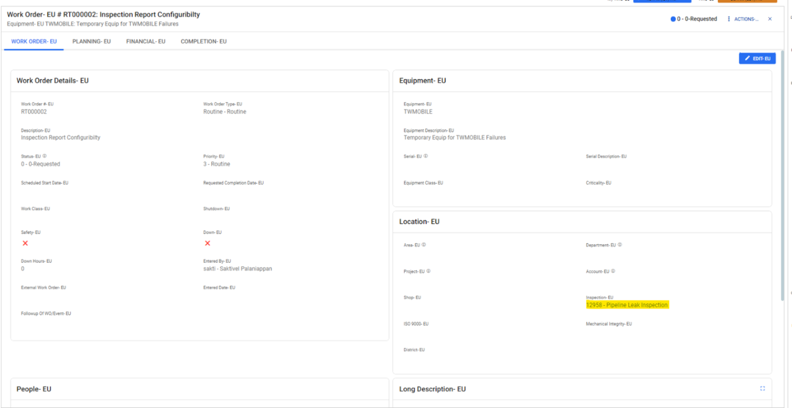
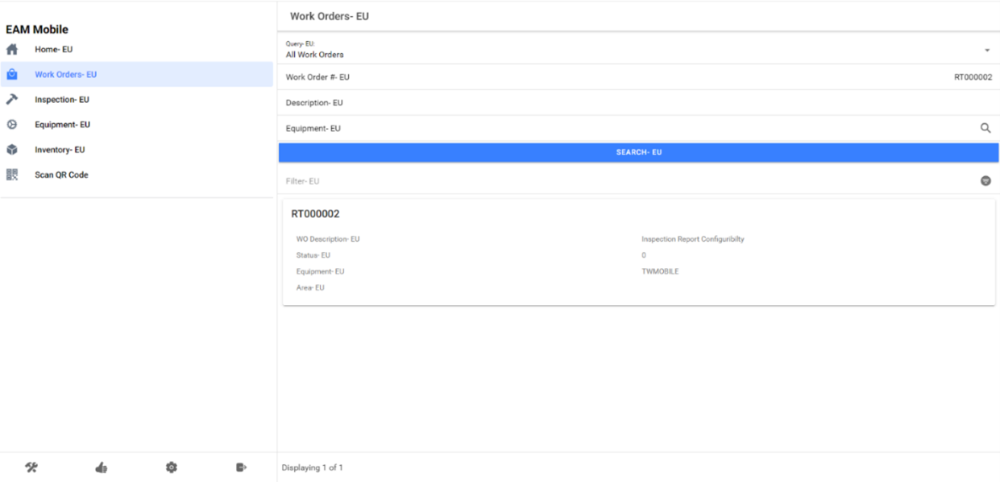
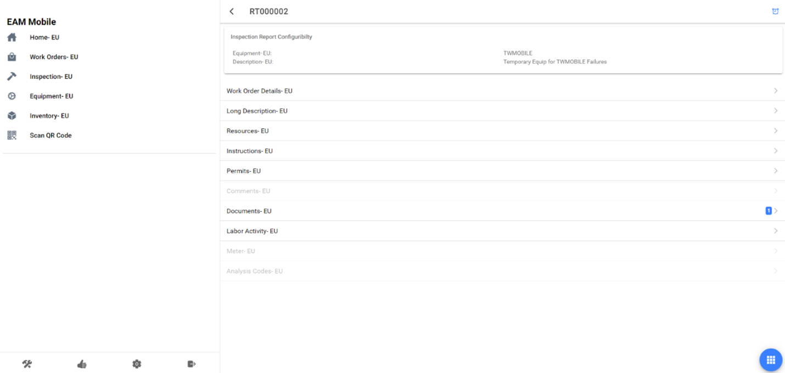
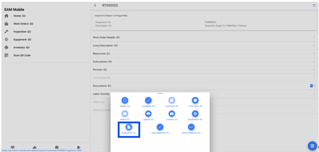
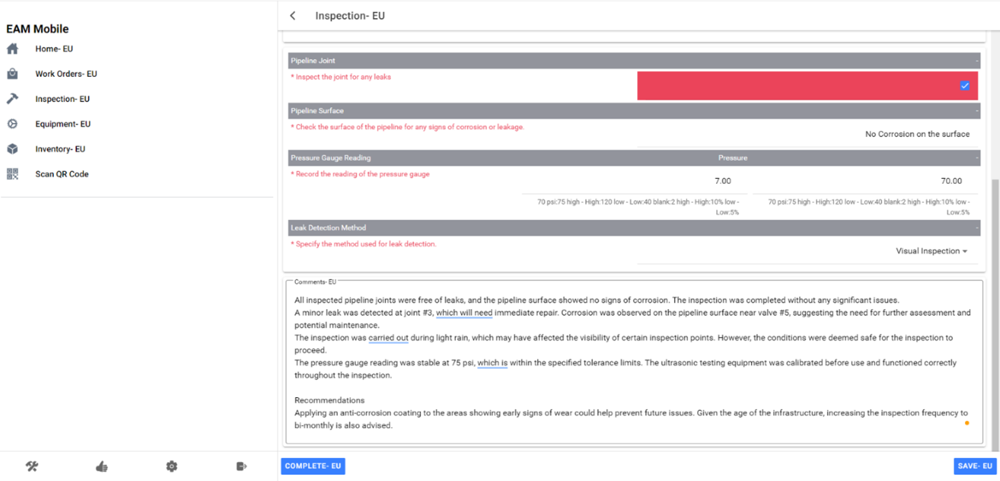
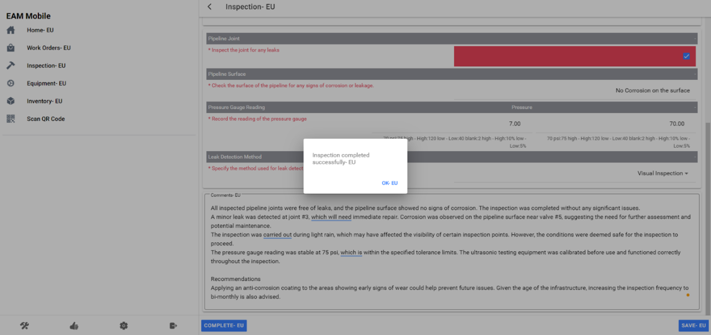
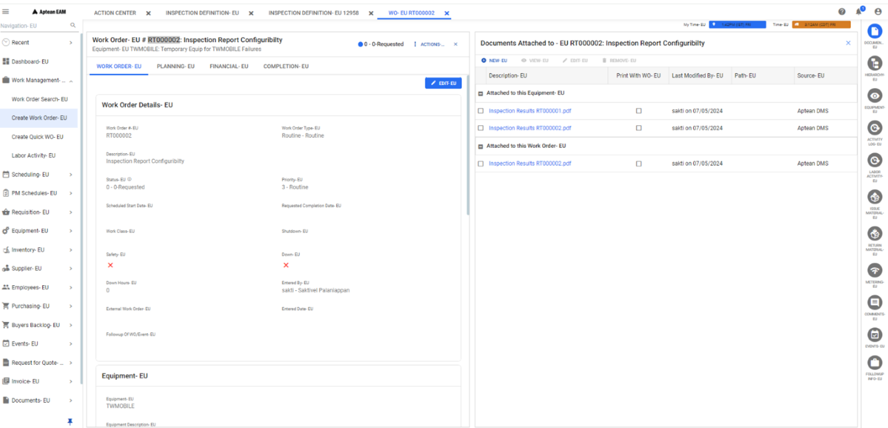
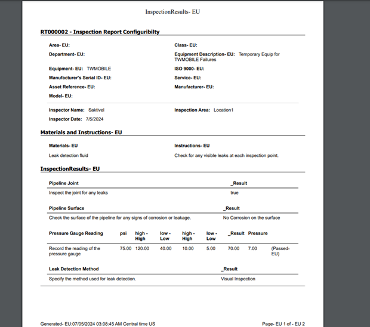
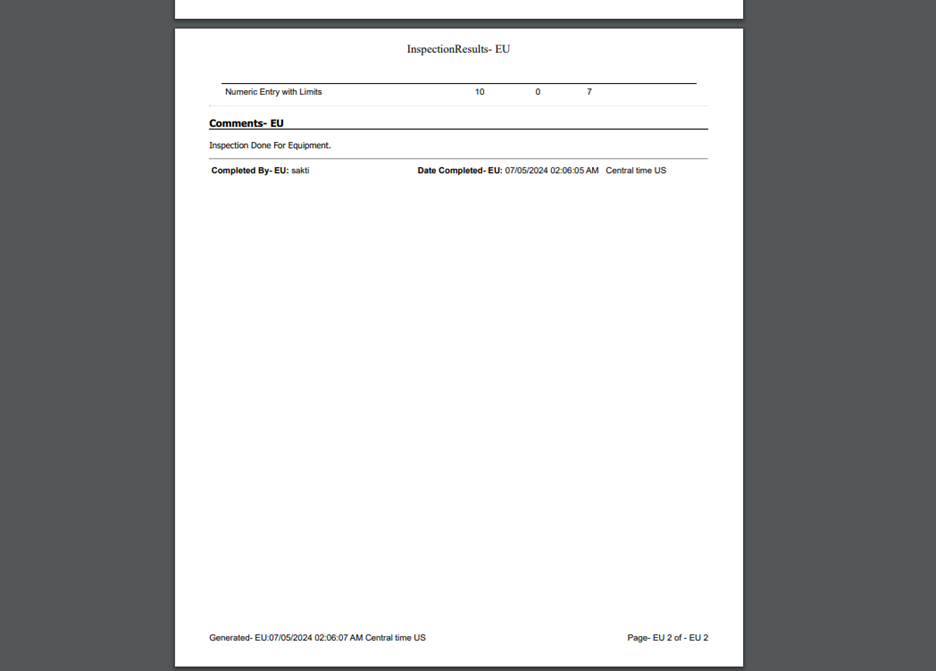

---  
 
title: "Performing Inspection and Report Generation"  
draft: false 
type: KB Article
 
---

EAM Inspection Checklist Forms and Printed reports are highly configurable by the user. The user
can configure the Inspection collection items, format and validation of the collected data, ordering
of collection items on the form, and required and failed rules. Tools and calibration instruments
can optionally be configured for an Inspection. The printed inspection form is not customizable by
the user outside of the flexibility in the form design which is subsequently printed in the inspection
report. If you need customization beyond this, Aptean can customize the form as part of a
*Professional Services engagement*.

Users can refer to [Inspection Definition and Inspection Results](https://webappsprod.eam.apteancloud.com/OnLineHelp/Aptean_EAM.html#GuideTopics/Setup/Inspection%20Definition.htm?TocPath=User%2520Guide%257CSetup%257CInspection%2520Definition%257C_____0), on how to set up Inspection
definitions, configure collection items, format, and validation rules, and organize the inspection
checklist.

This document provides details to configure the inspection reports in Aptean EAM - **How to
perform an Inspection and Generating Inspection Reports**.

## How to perform an Inspection

1. Attach the Inspection created to a Workorder.

    

2. Once an Inspection is attached, inspection activity can be done via Mobile/ Webapps in
ApteanEAM.  The below example provides step by step instructions on how an Inspection can be done via mobile.
    1. Query and select the Workorder to inspect.

        

    2. Click the Workorder.

        

    3. Choose "Inspection" from the options.   
    
        

        On clicking Inspection, an Inspection Screen is launched containing all the fields set by the user on the Inspection definition.

        

    4. Enter the inspection details and click Complete to complete the inspection.

        

Once inspection is completed, a report is generated and attached to the Workorder documents.    
This report has all the fields that were configured by the user in a predefined template. Any
fields configured by the user in **Inspection definition** is reflected in the reports.

## Generating Inspection Reports

**Inspection Reports**:  
The results are generated based on the configured inspection points and
data collected during the inspection.

**Sample Inspection Report Layout**:  
* **Header**: Includes basic information like Inspection ID, Description, Type.
* **Points**: Lists all the inspection points with their respective labels, descriptions, and collected
values.
* **Footer**: Contains completion details like date, completed by, and any comments.

### Sample of Report

Below are the images of the Inspection Report generated.

