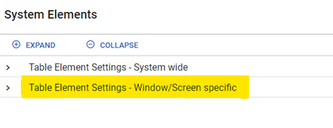
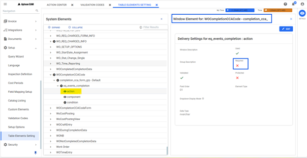
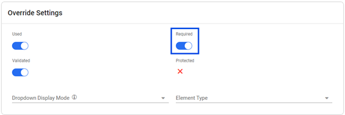
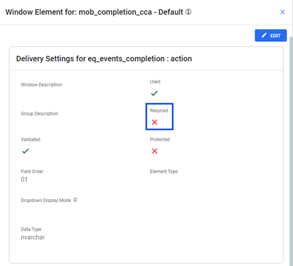

---  
 
title: "Require Failure codes on Workorder completion"  
draft: false 
type: KB Article
 
---

**Q1. Can user Require failure codes to be entered on a Workorder? or Can user complete
Workorder without CCA codes?**  
Failure codes (also known as Component, Condition, and Action codes in EAM) can be set as
Required or not Required, at Workorder completion by modifying the Window settings.

To set the CCA codes as Required, the steps are as follows:
1. In the Navigation pane, under Setup Module, click **Table Element Settings** option.
2. Choose the **Table Element Settings** – **Window/ Screen specific** option.

    

Each completion screen in EAM and Mobile can be configured to require the CCA codes at
completion, by overriding the **Required** field in the **Window/Screen Specific** Settings.

To make the Action code required in the Completion screen, the following must be configured:
* WOCompletionCCACode
    1. Click and expand **Table Element Settings – Window/ Screen specific** option.

    2. Choose *WOCompletionCCACode > completion_cca_for_grp-Default > eq_event_
completion* to open the options "action", "component", "condition".
    3. Select "action" and click Details from the contextual pane to open **Window Element for: WOCompletionCCACode - completion_cca_form_grp**.

        

    4. Click **Edit** and choose **OVERRIDE DELIVERY SETTINGS**, to open the Override Settings tab.

        

    5. Toggle the **Required** button to configure Action codes.
    6. Click **Save**.

* mob_completion_cca  
Path: Table Element Settings – *Window/ Screen specific > mob_completion_cca > Default-
Default > eq_event_completion* > action.

    
    1. Click **Edit** and choose **OVERRIDE DELIVERY SETTINGS**, to open the Override Settings tab.

    2. Toggle the **Required** button to configure Action codes.
    3. Click **Save**.

* WOCompletionCCACodeForm  
Path: Table Element Settings – *Window/ Screen specific > WOCompletionCCACodeForm >
completion_cca_form_grp-Default > eq_events_completion* > action.

    

    1. Click Edit and choose **OVERRIDE DELIVERY SETTINGS**, to open the Override Settings tab.

    2. Toggle the **Required** button to configure Action codes.
    3. Click **Save**.

