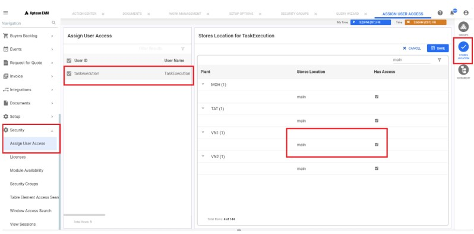

---  
 
title: "Resolving data Loader and Task Management error while executing a job"  
draft: false 
type: KB Article
 
---
## FAQ

**Q1. How to resolve when a data loader or task manager job gets the following error?**
* **StoresLocation code main is not found for plant 507**.
* **The StoresLocation value is not valid**.

**Solution**:  
When encountering the error message **StoresLocation code main is not found for
plant 507** or **The StoresLocation value is not valid** during Data Loader or Task Manager job
execution, the issue can be resolved by providing security access to the Store location for the
user **taskexecution**.  
Follow the steps outlined below:
1. Navigate to **Security** > **Assign User Access** in the navigation pane. The **Assign User
Access** tab will open in the top bar.
2. In the grid, search for and select taskexecution.
3. Click the **Store Location** icon in the contextual panel; this action will open the window
**Stores Location** for **TaskExecution** on the right-side panel.

4. Click the **Edit** button and search or filter for the Main store location in the grid.
5. Enable access to the **Main** store location for the desired plant and click **Save**.

    

By providing security access to the **Main** store location for user **Taskexecution**, the issue causing
the error in Data Loader or Task Manager jobs will be resolved.

**Q2. What is 'taskexecution' user and why it needs access?**

**Solution**:  
It is a service user used internally by task management applications to execute the selected functions.

