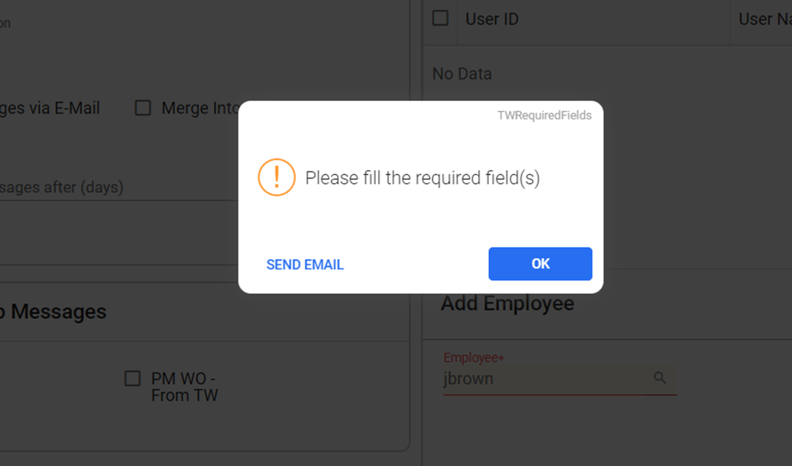

---  
 
title: "Resolving Error Message While Subscribing to Other User's Email Messages"  
draft: false 
type: KB Article
 
---
## FAQ

**Q1. Are you encountering a 'Missing required field' error when subscribing to another
user's email messages?**

**Solution**:  
To resolve this issue and enable subscription to other users' messages, ensure that the
Employees' Email ID is properly enrolled. Follow the steps below:
1. Navigate to **Employees** > **Employee Search** in the navigation pane. The **Employee tab**
will open in the top bar.
2. In the grid, search for and select the desired **Employee**.
3. Click the **Details** icon in the contextual panel; this action will open the desired Employee tab
on the right-side panel.
4. Select the **Main** tab and click **Edit**.

5. Under **Contacts** > **Addresses** > **Email Address**, enter the **Email ID** and click **Save**.

    

**Subscribing to Other Users' Messages:**
1. Navigate to the **Profile Setting Icon** in the top right corner.

2. Click **Notification**; this action will open the **Notification** tab on the right-side panel.
3. Click **Subscribe** from the **Subscribe to Users Messages** card. This action will expand the
**Add Employee** panel below the card.
4. Search or Enter the employee details in the **Employee** field and click **Add**.

5. The employee ID will be updated in the **Subscribe to Users Messages** grid. Click **Save**.

    

By following these steps, users can successfully enroll their Employee email ID and subscribe to
other users' messages without encountering the "missing required field" error.

