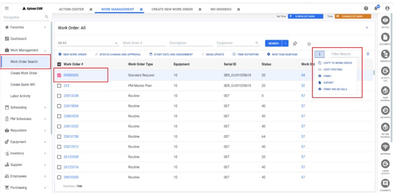
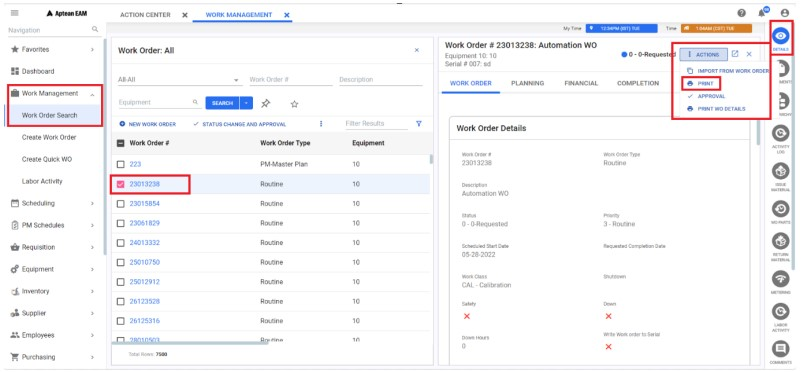
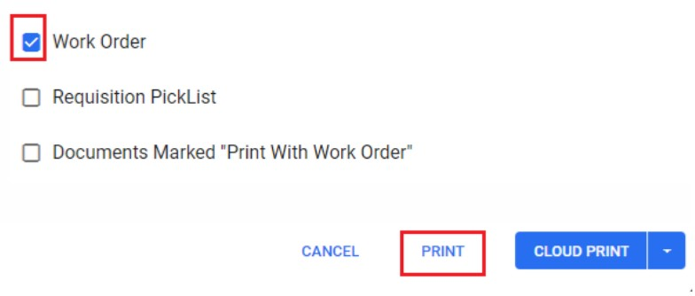
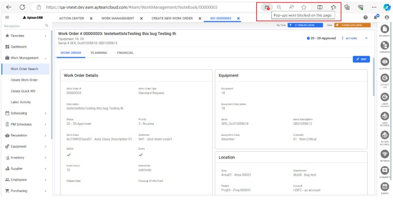
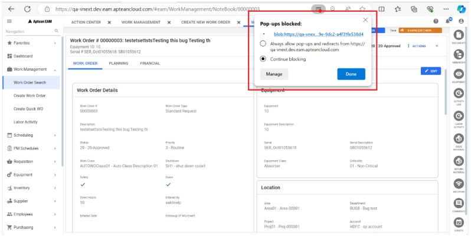
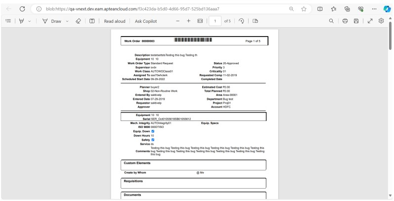

---  
 
title: "Work Order Print Trouble Shooting"  
draft: false 
type: KB Article
 
---

**Q1. A re there specific steps that need to be taken when Work Order Print is not working?**

**Answer**:  
Follow these instructions to print the work order:
1. Navigate to the **Work Management > Work Order Search** section in the navigation pane.
2. Search for and select the desired **Work Order** from the grid result.
3. Do one of the following:
    * Click the **More** drop-down menu and choose the **Print** option.

        

    * Click the **Details** icon in the Contextual Panel, the **Work Order** window will open in the
    right-side panel; click the **Action** drop-down in the header and then choose the **Print**
    option.

        

4. In the **Print Options** pop-up, select the **Work Order** checkbox and click the **Print** button.

    

5. A message will display on the screen stating, **Please wait while the print document is
generated.**
6. The **Work Order** print will open in a new tab in the browser.
7. If the work order print does not open, check for any pop-up blockers in the browser.

    

8. If found, click the provided link or select the option **Always allow pop-ups and redirects
from...,** and then click **Done**.

    

9. The **Work Order** print will now open in a new tab in the browser.

    

