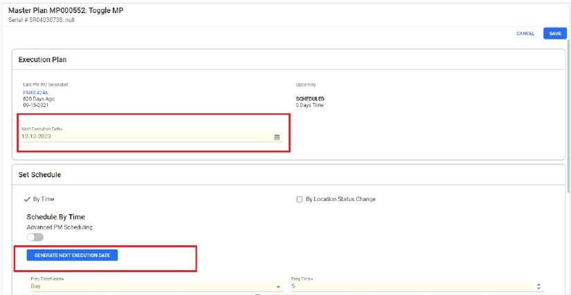
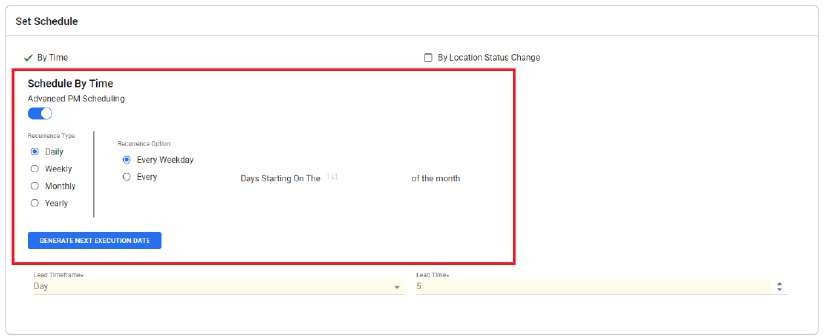
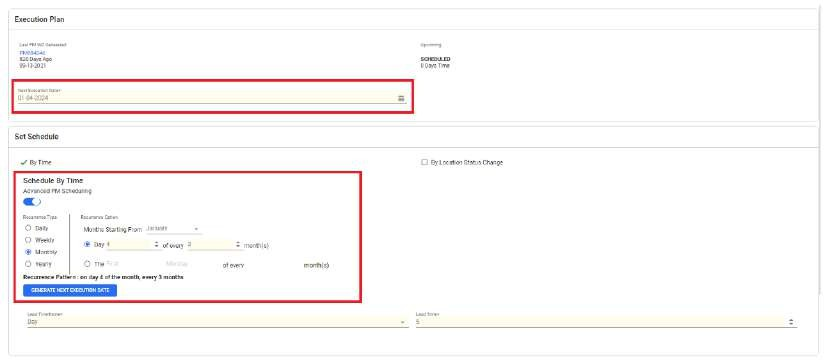
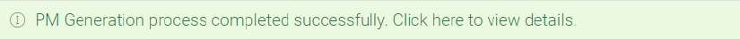
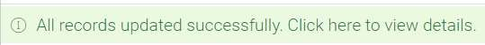
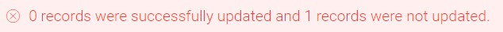
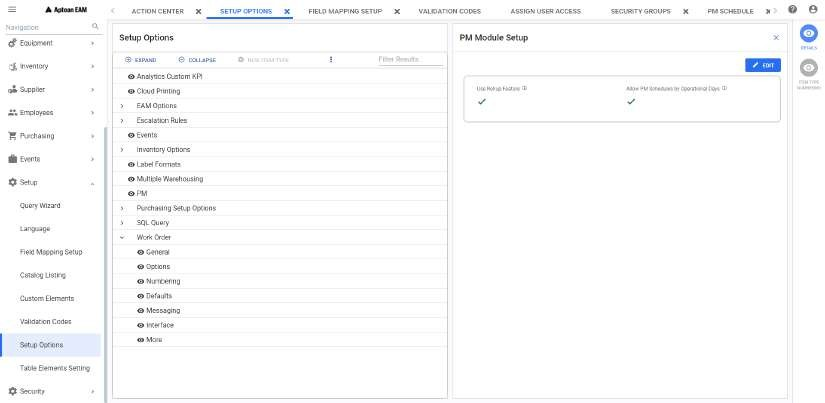

---  

title: "PM Schedules Search"  
draft: false 
type: Article

---

Using the **PM Schedules Search** , you can search for and display records
related to PM schedules.

The PM Schedules search window allows you to search by MP Base, Equipment,
Serial Id and Next Execution Date. you can enter a full or partial value for
these fields. The value you enter becomes an add-on to the selection criteria
built into the selected query. The more complete the description entered, the
narrower the resulting search will be. If you do not enter a value in these
fields, the search uses only the selection criteria of the selected query.

To perform a search:

  1. Select a **Query** from the drop-down list and click **Search**.
 It displays all the records for the selected query.

  2. To search for a specific PM Information, perform the following:
      1. Enter a full or partial value in the **MP Base** , **Equipment** , **Serial Id** or **Next Execution Date** fields. You can also search for specific values in each fields using the respective search icons.
      2. Click **Search**. 

A list displays showing PM information that matches the search criteria. See
and also.

## PM Schedules Search Screen Grid

In PM Schedules Search Screen, a list of records matching the selection
criteria will be displayed in grid. See for more details on grid.

## Action bar

In the **PM Schedules Search** window, you can select one or more of the
displayed records to enable the action bar located at the top of the window.
The PM Schedule Search window remains open when you jump to other windows
using the action buttons. The actions buttons are:

  * **PM Schedule** : Opens Set PM Schedule window to create a new PM Schedule. 
  * **Delete PM Schedule** : Deletes the selected PM Schedule.
  * **Generate PM Work Order(s)** : Enables users to generate both PM and advanced PM schedules for selected PM Work Orders.
  * **PM Schedule Mass Update** : Opens PM Schedule Mass Update section to update multiple PM schedules at once. 
  * **Export** : Exports the grid data to an excel sheet. The data will be downloaded in excel and you can open the excel to view the grid details.
  * **Run PM Generation For Plant** : Enables users to generate both PM and advanced PM Schedule for all the Work Orders that are due for a plant.

## Contextual Panel

In the **PM Schedules Search** window, you can select a record to enable the
Contextual Panel located at the right of the window. The PM Schedules Search
window remains open when you jump to other windows using the Contextual Panel.
The Contextual Panel consists of the following:

  * **Details**: Opens the detail of the selected PM Schedule. 
  * **Master Plan Module**: Opens the master plan module for the selected schedule. 
  * **Document**: Opens Document window which contains all the reference documents attached for the selected Master plan.
  * **Metering**: Opens Metering window which contains all the meters and their readings for the selected record's equipment/serial id.
 

## PM Schedule Details

You can select a PM schedule in **PM Schedule: \<Query Name>** screen and
select **Details** in contextual panel to view/edit the detail.

If selected, **Master Plan \<MP Base> \<Master Plan Description>** window
appears. The equipment and/or Serial ID and Descriptions will also be
displayed if they are defined for that selected PM schedule.

You can click on  to open the PM Schedule details page in a new separate tab.

You can click on **X** button to close the Details page.

The PM Schedule detail window consists of the following sections:  

  * Execution Plan

  * Set Schedule

  * PM Options

  * Work Order Values

### Execution Plan

This section provides the details on the execution plan and last executed work
order details.

You can see the following:

  1. **Last PM WO Generated**: This shows **Last PM WO Generated date**, **time duration and number.** Users can click on the work order number hyperlink to open the work order module in a separate tab.

  2. **Upcoming Scheduled** : This shows the number of days remaining for the upcoming schedule. It will show 0 days time if the **Next Execution Date** field value is past date from Today.
  3. **Next Execution Date*** : This shows the date and time (Local time) for the next schedule. It may be past or future dates. While editing, users can enter the required date in the user defined format. Users can auto generate the next execution date by clicking the **Generate Next Execution Date** button in the **Set Schedule** section for both **By Time** and **Advanced PM Scheduling** features.

### Set Schedule

In this section, users can manage and customize schedules based on time. Users
have the option to **set schedules by time** using either **basic or advanced
scheduling** methods. Additionally, schedules can be configured based on
**meter readings** or **changes in location status**.

**Set Schedule by Time** : Users can set schedules using either basic or
advanced scheduling features.

#### Set Schedule by Time using Basic PM Scheduling

  1. Select the **By Time** checkbox. The fields for **Schedule By Time** will be displayed. Time option is checked by default.

  2. Enter the required values in the **Freq Time*** and **Lead Time*** fields.

  3. Select values from the drop-down menu in the **Frequency Timeframe*** and **Lead Timeframe*** fields.

  4. Click **Generate Next Execution Date**. The next execution date will be calculated based on the entered data and displayed in the **Next Execution Date** field under the **Execution Plan** section.

      

  5. Click Create to save the schedule.

>[!NOTE]
>When users update the **Basic PM schedule** fields and **Generate the Next
Execution Date** , the calculation incorporates the **addition of Scheduled last execution date plus Frequency time.**

#### Set Schedule by Time using Advanced PM Scheduling

  1. Enable the Advanced PM Scheduling toggle button. Set the Recurrence type and Recurrence option. Refer to the table below to set the recurrence pattern.

      

      Recurrence type | Recurrence option  | Description  
      ---|---|---  
      Daily  | Every Weekday | Set a recurrence pattern for every weekday, excluding weekends. Example: Every Weekdays (Mon-Fri)  
      || Every | Set recurrence patterns for specific intervals and specify the starting day of the month. Example: Every 3 days, starting on day 1 of the month.  
      Weekly  | Select Days of the week  | Set a recurrence pattern every week only for the selected days of the week. Example: Every Week only on Monday and Wednesday.  
      Monthly  |  Select Days of the Month  | Set a recurrence pattern for specific intervals (Every 2 months), starting on the specified day of the month with the pattern commencing from a specified starting month (January). Example: Every 3 months, starting on day 3 of the month. (starting from January)  
      || Select Days of the Week | Set a recurrence pattern for specific intervals (every 2 months), on the specified day of the week, with the pattern starting from a specified month. Example: 2nd Wednesday of every 2 months (starting from January)  
      Yearly  | Select Days of the Month | Set a recurrence pattern for every year, on the specified day of the month. Example: On day 4th of the Month, only in March.   
      || Select Days of the Week  | Set a yearly recurrence pattern, specified on the day (first Monday) of the month. Example: On the first Monday of the month, only in March.  
  
  1. Select values from the drop-down menus in the **Lead Timeframe** * and **Lead Time** * fields.

  2. Click **Generate Next Execution Date**. Based on the data entered in the **Recurrence type** and **Recurrence Option** , the next execution date is calculated and displayed in the **Next Execution Date** field under the **Execution Plan** section. Click **Create**.

      

>[!NOTE]
>The **Next Execution Date** is calculated by adding the **current day to the
time until the next occurrence based on the specified schedule.**

>[!NOTE]
>After the user selects the recurrence type and recurrence option, the
recurrence pattern is calculated and presented in words above the Generate
Next Execution Date button.

>[!NOTE]
>Users can also search PM Schedules set using advanced scheduling from the
**Query Wizard.** To the desired query, add the Frequency Cron column.
Navigate to PM Schedule search window and click Search. The grid results will
display PM schedules based on the entered date. The recurrence pattern can be
viewed under the Frequency Cron column.

#### Set Schedule by Meter

If **By Meter** check box is selected, **Schedule By Meter** panel appears. In
the panel, you can enter the required values in Freq Units* and Lead time*
fields. You can select the value from drop down in Lead Time Units* field.

#### Set Schedule By Location Status Change

If **By Location Status Change** check box is selected, **Scheduled Location
Status Change** panel appears. In the panel, You can select the values from
drop down in From Location Status* and To Location Status* fields. You can
click on **Remove** button to remove the From Location Status* and To Location
Status* fields.

You can click on **Add New Location Status Change To Monitor** if required to
add the new location status change. You can enter the new values in From
Location Status* and To Location Status* fields.

### PM Options

You can enable various flags to add more control to the selected master plan.
The flag toggle buttons are disabled by default. You can enable them if
required. For flag details, see **PM Options**.

### Work Order Values

You can view/edit **Planner** , **Supervisor** and **Shop** fields if
required. When generating work orders, the system uses any values shown on
Work Order Values to override corresponding values shown on the Work Order tab
for a Master Plan.

### Editing the PM Schedule Details

You can click **Edit** button on top to open the PM Schedule in edit mode. You
can update all the required/ mandatory fields (The fields marked with *) and
perform all the necessary functions in all the sections explained above.

See Edit for more details.

>[!IMPORTANT]
>The fields marked * above in each section represent the mandatory fields
during **Set PM Schedule** operation.

## Master Plan Module

The Master Plan Module is used to view the details of the selected Master
Plan. The module resembles the Work Order Module but has a different purpose.

The PM Master Plan servers as a template from which the system creates work
orders when a scheduled inspection is due.

You can perform the following to open Master Plan Module:

  1. Select a record the grid in **PM Schedule: \<Query Name>** screen. 
  2. Click **Master Plan** in the contextual panel. You can also double click on any grid record or click on **MP Base** hyperlink to open that Master Plan Module in a separate tab.
  3. **Work Order # \<MP Base> \<Master Plan Description>** page appears. The equipment and/or Serial ID and Descriptions will also be displayed if they are defined for that selected work order. See for more details.

## Generate PM Work Order(s)

You can generate PM/Advanced PMWork Orders by creating work orders via the
**PM Schedule Search** Menu and using **Create PM Work Order**.

To generate **PM/Advanced PMWork Order(s)** , you can perform the following:

  1. Select one or more schedules for which PM WO needs to be created from the grid in **PM Schedule: \<Query Name>** screen. 
  2. Click **Generate PM Work Order(s)** in the action bar. **PM Work Order Generation** pop up appears with **Recalculate Next Execution Date** check box. You can select the check box if required and you can also read the details provided if the check box is selected. You can click on **X** to close the pop up.

  3. Click **Generate**. The PM Work Orders are generated, for advanced PM schedules the next execution dates are calculated based on the next occurrence of a scheduled work order. An **Alert** prompt appears with the warning message. You can read the message and click on any of the following:
  4. **OK** : The success or failure toast message appears. Clicking on the success message will navigate to **PM Generation Report** window in a separate tab.

      

  5. **Cancel** : This will exit the alert prompt.

  6. **Send Email** : This will send an email to your supervisor to understand what needs to be done.

  7. In **PM Generation Report** window, **Succeeded PM Generations** grid displays with PM Master Plan, Equipment/Serial ID and Last PM WO Generated columns. If there is any failed record, you can see **Failed PM Generations** grid with PM Master Plan, Equipment/Serial ID and Error columns.
  8. You can click on **Print Work Order(s)** button to view/print the Master Plan and other work order related details. The details will be displayed in **.pdf** format in a separate tab. You can print it if required.
  9. You can click on **X** to close the window.

## Delete PM Schedule

You can delete a schedule from the grid in **PM Schedule: \<Query Name>**
screen.

To delete a PM Schedule, you can perform the following:

  1. In the grid, select a PM Schedule to delete. 
  2. Click **Delete PM Schedule** from the action bar.  
A message prompt appears **Are you sure you want to delete this PM Schedule?
This action cannot be undone.** with the following buttons:

      1. **Delete** : You can select this to delete the selected PM Schedule. If deleted successfully, the **Successfully Deleted Schedule** notification appears. 

      2. **Cancel** : You can select this to exit the message prompt without deletion.
      3. **Send Email** : You can select this to send an email to your supervisor to understand what needs to be done.

## PM Schedule Mass Update

The PM Schedule Mass Update option in the action bar allows you to update
values for multiple PMs at the same time without the necessity to open each
PM. When the update is successful, the table shows a right tick in the column.
In case of any failure, the error message would be shown against the
individual failed record.

You can update the following sections in PM Schedule Mass Update window.

### Schedule by Time

You can enter the required values in **Freq Time** and **Lead Units** fields.
You can select the values from drop down in **Frequency Timeframe** and **Lead
Timeframe** fields.

>[!NOTE]
>For time based PM generation, you must enter both **Freq Time** and
**Frequency Timeframe** fields.

### Schedule by Meter

You can enter the required values in **Freq Units** and **Lead time** fields.
You can select the value from drop down in **Lead Time Units** field.

### PM Options

Under the PM Options, you can select **Yes** or **No** from the drop down
depending on how you want the inspection to occur. By default, **No Change**
is selected.

**Delay Scheduling until Work Complete**: allows you to generate the next
inspection based on the completion date of a previous PM work order. The
**Base Schedule on Work Completion** check-box can be used for meter-based
PMs. At work order completion, the Next Execution Meter Reading is reset to
the Current Meter Reading plus the Frequency .

**Only allow one active PM**: PM generation can be configured to not generate
additional PMs if an open PM exists for a Master Plan/Equipment combination.

**Link Tasks to Equipment**: allows you copy the equipment number from a
task(s) to the PM when creating a route. The check box displays if one or more
tasks exist for the Master Plan used on the PM schedule.

**Ignore Rollup**: This flag is used to disable the rollup feature. This
would work only if the setup option is set to use the Rollup feature.

For more information on the Rollup feature, see PM Setup Options section.

**Use Operational Days**: Allows to generate a PM Schedule based on
operational days. Only works when the setup is done to use **Allow PM Schedules by Operational Days** from PM Setup Options .

**On hold**: This directs the system to bypass that schedule when generating
PM work orders through Task Management Portal . No PM work order will be
generated and Next and Last Execution Dates will not be updated.

>[!NOTE]
>If you make Delay Scheduling until Work Complete as **Yes** , then Use
Operational Days will become **No** and vice-versa.

>[!NOTE]
>When setting/editing the PM Schedule, you will not be able to select both
**Only allow one active PM or Use Operational Days** and **Base Schedule on
Work Completion** check-boxes together.

### Next Execution

You can enter **Next Execution Date** and **Next Execution Unit** under this
section. The same dates will be visible in PM Schedule **Details** in
contextual panel.

### Work Order Values

You can enter **Planner** and **Supervisor** fields and you can select
**Shop** value from the drop down. The Planner, Supervisor and Shop fields
appear on the Set PM Schedule window as well as the PM Master Plan. When
generating work orders, the system uses any values shown on the Set PM
Schedule window to override corresponding values shown on the Work Order tab
for a Master Plan.

### Mass Update Window Operations

You can select **Save** button to update the changes and success or error
toast messages will be displayed accordingly.

Example:

You can click on the message to view Work Order, Description, Status, Result and Result (Successful = , Failure/Error = ) and Result Message details in a separate tab (**Mass Update Report**).

You can click **Clear All** to remove all updated values. You can click on
**X** to close the window.

## Run PM Generation For Plant

Enables users to generate PM/Advanced PM Schedule for all the Work Orders that
are due in a plant. This functionality allows users to generate work orders
for all PM/Advanced PM schedules associated with the plant they are currently
logged into.

You can perform the following to run PM generation for Plant:

  1. Click on **Run PM Generation For Plant** in the action bar.
  2. **Run PM Generation For Plant** pop up appears. In the pop up you can read the message details and click on **Generate** to generate the run. You can click on **Cancel** to exit the pop up. 
  3. If **Generate** is selected, The success toast message appears. Clicking on the message will navigate to **PM Generation Report** window in a separate tab. If there is any error, that will be displayed in pop up and you can click **OK** to eliminate that pop up.
  4. In the **PM Generation Report** window, **Succeeded PM Generations** grid displays with PM Master Plan, Equipment/Serial ID and Last PM WO Generated columns. 
  
  5. You can click on **Print Work Order(s)** button to view/print the Master Plan and other work order related details. The details will be displayed in **.pdf** format in a separate tab. You can print it if required.
  6. You can click on **X** to close the window.

## PM Setup Options

This section explains how the setup options allows to manage the PM Schedules.
You can find the PM Setup options in **Setup > Setup Options > PM** Menupath.

### Use Rollup Feature

The **Use Rollup Feature** allows the generation of major, less-frequent PMs
to suppress the generation of minor, less-frequent PMs. Suppose that you have
an annual, semi-annual, quarterly, and monthly PM defined for a given piece of
equipment. The Next Execution Date for all four PM schedules is February 1,
2020. Depending on the number of lead days, the system will generate four PM
work orders on or around February 1. If you prefer that the maintenance
workers have only one work order to deal with, you can use the rollup feature.
With this feature in force, only the annual PM would generate and the Next
Execution Date on all four PM schedules would move forward.

>[!NOTE]
>To use this feature, you will need to revise the planning information
(resources, materials, and instructions) on Master Plans that have already
been created.

With **Use Rollup Feature** selected on the PM Setup Options window, you will
see **Ignore Rollup** flag on the **Set PM Schedule** window.

### Allow PM Schedules by Operational Days

The **Allow PM Schedules by Operational Days** feature if checked, a time-
based PM Schedule can be defined for either Calendar Days or Operational Days.
The flag **Use Operational Days** will be shown in Set PM Schedule screen.

### Status

When the status of a parent location is changed from a non-operational status
to an operational status, the Next Execution Date is automatically updated for
all PM Schedules defined for Assets installed in the child Locations, as
follows:

  * If the original Location Status is not flagged as 'Suspend Operational Days', then Next Execution Date is recalculated by simply adding the Frequency to the current date.
  * If the original Location Status is flagged as 'Suspend Operational Days' on the Location Status Codes window, then Next Execution Date is recalculated taking into account the operating days tallied against the previously-generated PM.

