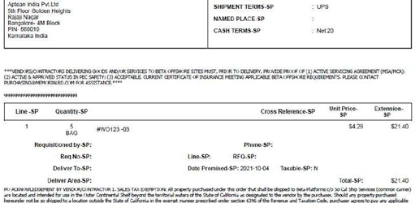
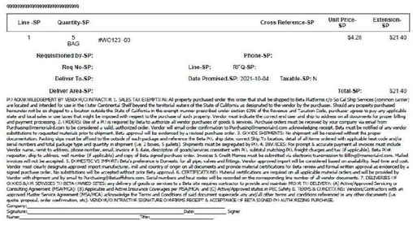

**Menu Path**: **Purchasing** > **Create New PO Text**

PO text is textual information that you want to include on a purchase order. This information may help suppliers to know details about service agreement instructions, show third-party contact data, or terms and conditions. The system stores all PO text that you create in the PO Text Library.

A PO text consists of:

-   Text ID that acts as its identifier.
-   Text description that shows a brief description of what that text ID contains.
-   Text content that shows the actual detailed information that’ll be added to the purchase order.
    

You may want the text content to appear in specific regions of the purchase order. Text content that appears above all lines in a purchase order is called the initial PO text.

Text content that appears below all lines in a purchase order is called the final PO text.

The system automatically adds all initial PO text and final PO text that you create to any new purchase order. To explicitly select a PO text, you need to denote the Text Type as **Other**.

### To create a new PO text:

1. In the **Basic Information** section, perform the following:
      1.  In the **Text ID** field, type any alphanumeric or alphabetic ID of your choice.
      
          - In the **Text Type** drop-down list, perform one of the following:

              - Select **Initial** to create an initial PO text.

              - Select **Final** to create a final PO text.

              - Select **Other** to create PO text that you can explicitly select and add to a new or an existing purchase order. After you select a PO text created as **Other**, you can denote it as initial or final PO text to decide its position on the purchase order. 

    2. In the **Text Description** field, type a brief explanation about your text ID.
    3.  Turn on the **Active** toggle to make the PO text active. The system, by default turns off this toggle.
2. In the **Text Content** section, type or paste your detailed content in the **Text Content** field. Use the formatting options in this field to format your content.

3. Click the **Create** button to create the PO text and add it to the PO Text Library.