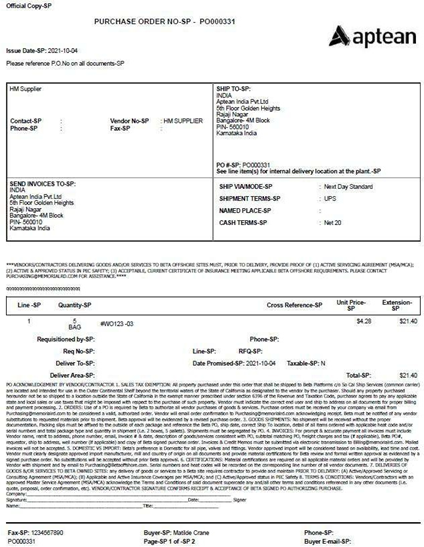
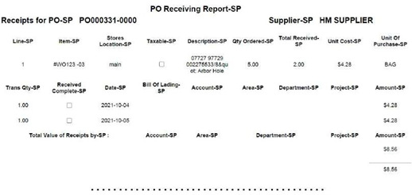

## Create a New Purchase Order

Menu Path: Purchasing > Create Purchase Order

The **Create Purchase Order** window allows you to add a new purchase order. To create a new purchase order:

1.  From the navigation menu, select **Purchasing** > **Create Purchase Order**

    Or

    In **[Purchase Order Search](Using-Purchasing-Search.md)** window, select **New Purchase Order** from the action bar. The **Create Purchase Order** window appears.

1.  In the **Purchase Order Type** section, type an alphanumeric ID of your choice for the pur- chase order or leave the field blank to have the system assign the ID.

    Or  
    To base your new purchase order on the data of an existing purchase order, in the **Copy Options** section search for a purchase order. You can also select the data of the existing purchase order to base the new purchase order by selecting the check boxes for **Copy Initial Text**, **Copy Final Text**, **Copy Custom Fields**, and **Copy Line Items**.

1.  Click the **Next** button.
1.  Click the **Add** button to create a new charge.
1.  Click the **Next** button. The purchase order module appears.
1.  In the **Terms** tab, enter the necessary details and click the **Create** button. For more details, see [Terms Tab](Using-the-Purchase-Order-Module.md#terms-tab) earlier in this chapter.

    The system generates a purchase order number and appends it to the purchase order’s title at the top of the window.

2.  Click the [Lines tab](Using-the-Purchase-Order-Module.md#lines-tab) and add a line. For more details, see Lines Tab earlier in this chapter.
1.  Repeat step 7 to add the required number of lines.
1.  Select the required line and use the line module to add all mandatory fields to the line. For more details, see [Using the Line Module](Using-the-Purchase-Order-Module.md#using-the-line-module) earlier in this chapter.
1.  Repeat step 9 for all lines.
1.  Click the **Create** button.
1.  Click the [Text tab](#text-tab), and if necessary, add any initial or final PO text, or select an initial or final PO text for the supplier. For more details, see the Text Tab earlier in this chapter.

    **Issue a Purchase Order**

A purchase order that you are creating or have created will show its status as **Open**.

Once the purchase order is created, it is prepared for procurement and must be sent to the supplier. After issuance, the purchase order is set to receive the designated items.To issue the purchase order, click the **Actions** button, and then click **Issue**.

A message appears: **Do You want to issue the purchase order \<purchase order number\> to the Supplier \<supplier name\>?** with the following buttons:

-   **Yes**: Click this to issue the purchase order to the supplier.
-   **No**: Click this to cancel the purchase order’s issuance to the supplier.

Once you issue the purchase order its status changes to **Issued**.

>[!Note] You cannot delete an issued purchase order, but you can close and reopen it.

### Receive Items

Once the supplier dispatches the items and you have received them, ensure to update the corresponding line in the purchase order to reflect their receipt, whether it is for a partial or complete delivery.
>[!Note] Only a purchase order with the status Issued can track the receipt of items.

To receive items against a line:

1.  In the purchase order, click the **Lines** tab.
1.  In the grid, select the required line.
1.  In the Contextual Panel, click **PO Receipts**.

The **PO Receipts** window appears.

1.  Click the cell under the **Qty Received** column and type the value of the quantity of received items.
2.  Click the **Save** button.

The value you’ve updated now reflects in the **Qty Received** column of the line in the **Lines** tab. If you go back to the **PO Receipts** window, the **Qty Remaining** column shows the new balance for the pending items.

In the **PO Receipts** window, in the action bar, click **Edit Receipt** to add more details about the received item. In the **Edit Receipt Details** section that appears, you can specify details in **Bill Of Lading**, **Carrier**, **Packing List**, **Date Received**, and **Employee** fields.

Click **Mark As Complete** to mark the line as complete; the **Qty Remaining** column’s value becomes zero.

### Print a Purchase Order

Use the **Print** option on the action bar or in the **Actions** button to print a purchase order at any stage of its life. You can print a purchase order before and after it’s issued, and view the items received for each row.

**Cloud Print:** To print the selected purchase order, utilize the **Cloud Print** option. For instructions on using Cloud Print refer to *Purchase Order Cloud Printing*, Setup Cloud Printing.
>[!Note] The Cloud Print button is enabled, only if the plant is setup to use cloud print.

A printed purchase order contains the following information in its various sections:

|**Document Section** |             **Contents**  | 
|-------------------------------|-----------------------------------------------------------------------------------------------------------------------------|                                         
|**Header**| <ul> <li>Status of the purchase order: If printed when the purchase order is in **Open** status, it shows **Working Copy**. If printed when the purchase order is in Issued status, it shows Official Copy.</li> <li>  Purchase order’s number.</li> <li>Company’s logo.</li></ul>|
|    Pre-body                   | <ul><li>Supplier’s name and contact details.</li>  <li>Ship To and Bill To addresses.</li>  <li>Shipping mode and terms.  Initial PO text. </li></ul> |
|    Main body                  |<ul><li> Item on a line showing requested quant- ity, unit price, tax, total price, delivery area, recipient name.</li>  <li> Final PO text. </li>   |
|  Footer                       |<ul><li> Purchase order’s number.</li>  <li>  Buyer’s name and contact details.   </li>  |

A close-up of a receipt Description automatically generated 

To print a purchase order:

1.  On the action bar, click **Print** button.

    Or

    Click  **Actions** button, and then from the list click **Print**. The **Print** dialog box appears.

2.  Perform one of the following:
-   Select the **Working Copy** check box, if the purchase order’s status is **Open**. This check box is unavailable if the purchase order’s status is **Issued**.
-   Select the **Official Copy** check box, if the purchase order’s status is **Issued**. This check box is unavailable if the purchase order’s status is **Open**.
-  Select the **Receiving Report** check box to show a report of all received items. This check box is unavailable if the purchase order’s status is **Open**.
3.  Click the **Print** button.

The printed purchase order or the receiving report for the purchase order appears in a new tab of your browser.

This report details all items received for each line, with dotted lines distinguishing the data for individual purchase order lines.  Some important data that the report shows is the line’s number, item and its description, ordered quantity, total received quantity, unit cost, date each item was received and the quantity of receipt.

A close-up of a receipt Description automatically generated

### View the Activity Log

The system logs activities that you perform on a purchase order in the **Activity Log : \<purchase order number\>** window. It also shows any errors that you encounter. These activities include:

-   Changing the status of a purchase order. For example, changing a purchase order's status to **Issued**, **Reopened**, **Closed**, or **Deleted**.
-   Printing a purchase order or a receiving report.
-   Sending an email.
-   Deleting a purchase order.

You can also add comments about specific activities like assembly and transmission of bid packages, vendor evaluation, and price waiting. Besides this, a buyer can also add comments about the purchase order.

The system shows each activity’s type, date and time of execution, name of the user, and comments.

To view activity logs and to add a comment about an activity:

1.  On the **[Purchase Order Search](Using-Purchasing-Search.md)** window, select the required purchase order’s record.
1.  In the Contextual Panel, click **Activity Log**.

The **Activity Log : \<purchase order number\>** window appears.

3.  Click **Add Line**.

    The **Add Activity** section appears.

1.  In the **Activity** drop-down list, select an activity.
1.  In the **Comments** field, type your comment.
1.  Click the **Save** button. The system now shows the activity with its comment in the section above the **Add Activity** section.