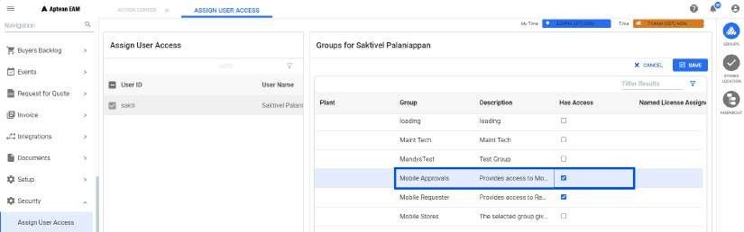
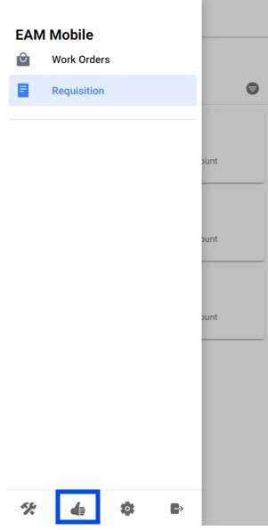
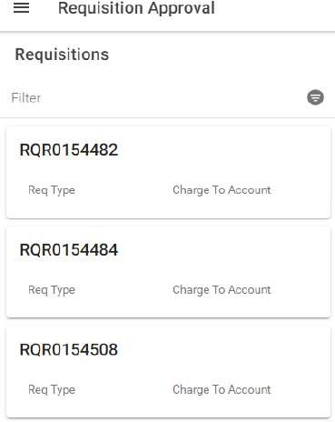
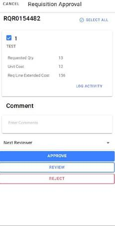

---  

title: "Approve/Review"  
draft: false 
type: Article

---

Using the Approve/Review under Requisition menu, you can process requisition
items through the review and approval process, including actions for approve,
review, reject, cancel approval and open the Requisition Module.

You can perform the following to approve, review, reject and cancel the
approval process:

  1. From the **Approve/Review** window under **Requisition** menu, select a query that displays the information you need. Optionally, you can enter values for **Requisition** number and **Item** number and click **Search** button to show a list of items available for approval **or** open **Requisition \<Query Name>** search window.

      If Inventory Setup Options has the **Setting Requisition lines cannot be
entered and approved by the same user** selected, then an approver will not be
allowed to approve any requisition line they entered.

  2. Select one or more rows and click **Approval/Review** button in the action bar. To open the Requisition module for the selected requisition, click on [Requisition Module](Requisition-Line-Details.md) button in the action bar.

  3. The **Requisition Approval/Review** window opens. You can select any of the following radio buttons:
  4. **Approve** : Select this to approve the selected requisition. You can enter your comments in **Comments** field.
  5. **Review** : Select this to assign the review for the selected requisition. By default, the current user name is displayed and you can enter a different value in **Next Reviewer** field. You can also search for a specific value using search icon. Optionally enter the comment in **Comments** field.
  6. **Reject** : Select this to reject the approval of the selected requisition. You can enter **Comments** to explain the reasons for rejection.
  7. **Cancel** : Select this to cancel the approval. You can cancel the requisition only if it is approved. By default, the current user name is displayed and you can enter a value in **Next Reviewer** field. You can also search for a specific value using search icon. Optionally enter the comment in **Comments** field.

  1. Click on **Save** to update the changes. You can click on **X** button to close the window.

## Mobile Approvals

The **Mobile Approval** process in Aptean EAM allows users to approve
requisitions anytime, anywhere, directly from their mobile devices. This
feature ensures that approvals can be executed swiftly and efficiently, even
when the user is not at their desk.

### Security Needed for a User For Mobile Approvals

**Path** : Security > Assign User Access > User ID > Groups > Plant > **Mobile Approvals**

#### Reviewing and Approving Requisition

After providing necessary Security permissions, follow the below steps for
mobile approvals:

  1. Navigate to the approval section within the app.

      

  2. Click the Requisition menu, to open Requisition Approval Screen.

      

  3. Select the Requisition lines to perform any of these actions: Approve/ Review the details/ Enter any necessary comments/ Select a reviewer if required.

      

  4. Choose the required action (Approve, Review, Reject) to complete the approval process.

