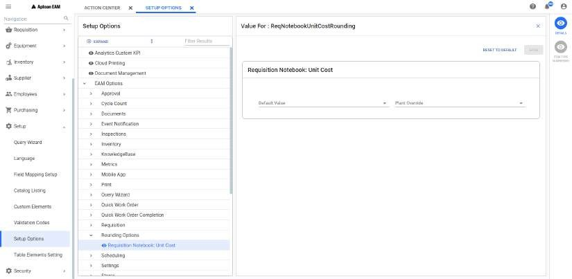

---  

title: "Requisition Line Details"   
draft: false 
type: Article

---
The Requisition line details window consists of the selected line details. The
fields are based on your access.

>[!note]
>You can not open the line details if the selected requisition will not have
any requisition lines.

You can select a record in **Requisition: \<Query Name>** grid or in
**Requisition Details** screen and click on **Details** in contextual panel to
open the requisition line details. If selected, **Requisition \<Requisition
Number> Line Item \<Req Line>** page appears.

You can click on **X** button to close the Requisition Module page.

The Requisition Module has the following sections:

  * [Main](Requisition-Line-Details.md#main)
  
  * [Charges](Requisition-Line-Details.md#charges)
  * [Purchase](Requisition-Line-Details.md#purchase)
  * [Delivery](Requisition-Line-Details.md#delivery)
  * [Approvals](Requisition-Line-Details.md#approvals)

Each sections is a hyperlink and you can click to navigate to that particular
section in the note book.

## Main

It has the following sub sections:

### Item Overview

The **Item Overview** panel allows you to view the item information of the
selected requisition line. You can see Item, Type, Description *, Requested
Quantity*, Units*, Unit Cost*, Stores Location and Package Quantity*.

**Item** field is protected if you are updating an existing line item.

  * When you enter a valid number recognized as **Permanent** by the Inventory module, the application automatically retrieves Type , Unit Cost , Unit of Purchase , and Description.
  * If you are requesting a non-permanent item, you have the option of creating a number or letting the application assign one for you (The application assigns a number when you skip the Item number field and choose an Item Type during the line creation). The number assigned by the application is **\<Requisition number- Sequential Integers starting from 01>**.
  * If you enter an item number defined as Temporary , a warning displays if the item number was previously entered on another requisition.

**Type** field is protected if you are updating an existing line item.

**Requested Quantity** value entered must be greater than zero.

>[!note]
>If **Multiple Warehousing** is being used at your location and the Inventory
Setup option **Perform Surplus Check if Item Unit Cost exceeds NNN** (where
NNN is the dollar limit that the item’s unit cost must exceed) is selected,
then the surplus edit will be performed. If other stores locations within your
plant have a surplus of that item, including the stores location on the
current requisition line, Aptean EAM displays a warning message. This edit is
performed at the time of line entry, requested quantity update, review, and
approval.

**Quantity Available** field is always protected and helps you in ordering.
For a Permanent item for which you are charging a work order or account, it
represents quantity on hand minus quantity reserved as shown by inventory
records.

**Unit Cost** value can be updated to the required value. If you are charging
a work order or account, a value can be entered/updated if the Item Type
definition table contains a **Yes** value for the parameter **Allow entry of
unit cost**. Under certain conditions, the field defaults to Last Price Paid
or Current Price.

  
>[!tip]
>*Regardless of the values of the Allow_entry_of_unit_cost and
Always_outside_purchase flags (1 or 0), you can modify the unit cost in the
Requisition. If the unit cost of an item is 0 in the inventory, then you can
go to the Requisition in create/edit mode, enter the unit cost as 0, and
successfully save the item without any warning messages. If the unit cost of
an item is a non-zero value in the inventory, then you can still go to the
Requisition and change the unit cost to 0.  
When the Allow_entry_of_unit_cost flag is set to 1, the unit cost can be
entered or modified in the Requisition, regardless of the value of the
Always_outside_purchase flag (1 or 0). If the unit cost of an item is 0 or
non-zero value in the inventory, you can go to the Requisition, and
enter/modify the unit cost in create/edit mode. If the unit cost is set to 0,
an informational message will be displayed to the user.  
When the Allow_entry_of_unit_cost flag is set to 0, then the unit cost cannot
be entered or modified in the Requisition, regardless of the value of the
Always_outside_purchase flag (1 or 0). If the unit cost of an item is 0 in the
inventory, the unit cost will be displayed as 0 and the field will be
disabled. You cannot enter/ modify the unit cost in the Requisition.*  

You can set the number of digits of rounding the decimals for unit cost in the
following field under**Setup > Setup Options > EAM Options > Rounding
Options** path. By default, decimal will be rounding to two decimal places.

**Unit** protected if you are updating an existing line item. You can update
this value when creating the new line.

**Stores Location** field is visible If Multiple Warehousing is being used at
your location. You are charging costs to a work order on which the associated
equipment has a default stores location defined, this value will also default
to the requisition. Otherwise, the stores location shown as your default in
User Setup appears here.

**Package Quantity** field only displays if the requisition type is Add to
Reorder ; the value is retrieved from inventory records.

**Optional** toggle button appears if you are charging a work order, entering
a Permanent item, and the item has not been defined as always outside
purchase. You can enable the toggle if you want to show that the item may be
needed as opposed. When classified as Optional, the items appear on printed
work orders as optional but do not appear on picklists, nor do they have any
effect on requirements used in the reorder formula.

**Abnormal Demand** toggle button appears if you are charging a work order and
entering a Permanent item. You can enable the toggle if you want to place a
special order for an item and do not want that quantity to reflect in the day-
to-day calculations of reorder.

**Specification** button will be displayed only if the line item type is
**Stock**. You can click this button to see Stores Specifications, Extended
Description, Purchasing Specifications if any for the selected item.

### **Custom Information**

You can see/edit the fields under Custom Information section that might be
required while entering a line item.

## Charges

When setting up the requisition, one option is to enter charge information
that defaults to all line items. If necessary, however, you can change the
charge information for a particular line item on the **Charges** section.

The **Charges** grid contains **Percent, Account, Amount, Area, Department** ,
and **Project** columns. The **Total Percentage** field shows the total
percentage value. The value should not exceed 100%. The **Total Charge** field
shows the total amount values.

See Grid Operations for more details.

You can click **Replace All** button if you want the displayed cost
distribution to apply to all line items on the requisition. When creating the
requisition, you were prompted for a single work order number. While you
cannot distribute costs to multiple work orders, you can create a distribution
that includes the default work order number plus one or more accounts, areas,
or departments.

If you are entering amounts, the total for all entries must balance with the
value in the Total **Extended Cost** (quantity requested times the unit cost)
field shown at the bottom of the grid.

## Purchase

### **PO Defaults**

Use this subsection to further describe the item being ordered. It is always
available to requisitions classified as **Add to reorder** and is also
available for other requisition types where the item is permanent and item
type has been defined as **always outside purchase** and **allow entry of
purchase descriptions**.

You can view/edit Stores Account, Tax, Inspection Level, Mechanical Integrity,
Hazard, Buyer, Date Required From Supplier (Date should not be earlier than
today) and Purchase Order fields.

### **Supplier**

This subsection can be used to include specific information such as a part
number or recommended supplier. It is always available to requisitions
classified as **Add to reorder**.

You can see/edit the **Recommended Supplier, Part Number and Manufacturer**
fields.

You can enable **No Substitutes** toggle to prevent adding the substitutes
other than default values.

The **Lead Days** field is read only and you can not update it as this comes
from the supplier information that is present for the selected supplier.

You can click on **Select Items From Supplier List** button to select a
supplier other than the one defaulted. **Supplier List** pop up appears and
you can see all the suppliers available (If not available, the message will be
displayed.) for the selected item. You can select the required supplier and
the above fields will be updated with the selected supplier values. You can
click on **X** to close the pop up.

### **Purchase Description**

Use this subsection to further describe the item being ordered. You can add
any additional description in **Extended Description** field.

### Purchasing System Info

This section will be visible only if you got the access to **Purchasing
Interface** module in **Security > Module Availability**.

This is a read only section and you can not update any fields.

You can see **Date Extracted into Purchasing** , **Purchasing System
Requisition** , **Purchasing Interface Number** fields and **Paid Complete**
toggle button.

Purchasing interface number will be generated during the data
processing(export/import) during the integration of our application with
various other applications.

You can also see . If this toggle is enabled, it indicates that the permanent
inventory items will have the last price paid and updated by a transaction
received through the interface. The last price paid can be found on the
Suppliers module in the Inventory.

## Delivery

Items covered by a requisition can be scheduled for delivery at various times
to various locations within the application using the **Delivery** section.

You can select delivery number from the **Delivery** drop down.

You can click on **Add Delivery Location** button to add the location other
than the default one. If selected, **Deliveries** pop up appears. In the pop
up, you can see a list of deliveries added before. You can click on **X**
button to close the pop up.

In the pop up, you can perform the following:

  1. **New** : Select this to add new delivery information. You can set the delivery information like Delivery ID (starting with 1 for each requisition), Delivery date, time, area, deliver to, and delivery comments. After updating, click on **Save** to update the new delivery. The new delivery item will be added to the list.
  2. **Delete** : Select a delivery record from the list to delete that record. A pop up appears with message **Are you sure you want to delete the selected delivery?** appears. You can perform any of the following operation:

      >[!note]
      >If you delete the delivery record which is linked to any requisition line,
      then that delivery information will be removed from that requisition line. You
      can update the new delivery information when you visit that line again.

      1. **Delete** : You can select this to delete the delivery. If deleted successfully, the **Delivery \<Delivery ID> Deleted Successfully** notification appears and that delivery id will be removed from the list.
      2. **Cancel** : You can select this to exit the pop up.
      3. **Send Email** : You can select this to send an email to your supervisor to understand what needs to be done.
      4. **Edit** : You can select any record in the list and update Delivery date, time, area, deliver to, and delivery comments information if required. After the update click **Save** to save the changes.
      5. **Select** : You can select the required delivery in the list and click on **Select** to update that delivery information to **Delivery** section.

>[!note]
>You can click the **Copy selected delivery to all requisition lines not yet
assigned to a delivery?** check box to copy the selected delivery information
to all the requisition lines if required.

## Approvals

The Approvals section contains review and approval information.

If the item is ready for review, enter the **Next Reviewer** field. You can
see the next reviewer of the logged in person in that field. You can also
search the required reviewer using the search icon to change the existing
value.

**Approver** is the protected field displays only if the line item has been
approved for purchase.

**Requester** field is automatically populated with the current user login;
however, the entry can be changed using the search icon.

**Ready for Review** toggle button is usually enabled. You can disable the
toggle to indicate the item is not ready for review. This toggle value can
also change based on Ready For Quote (RFQ) and Auto PO functionality as well.

**Rush Order** toggle is disabled by default. If this is a rush order, you can
enable the toggle to notify the next approver of the logged in user for
immediate attention.

You can add any additional comments in **Purch Comments** field if required.

You can see **Quote Only** toggle button only if you have the following set up
enabled under **Setup > Setup Options > EAM Options > Requisition > Enable
Quote Only Process** path.

**Quote Only**

You can turn on this toggle if you want the item to be quoted before a
decision is made to purchase the item . Once quoted and the decision is made
to purchase the item, you can disable the toggle to proceed with the purchase.

If your setup options allow unapproved items to be copied to an **RFQ (Request
For Quote)** , Items under **Ready for Quote Only** can have the following:

  * Requisition lines that are **Quote Only** , have not been approved and copied to an RFQ. 
  * Requisition lines that are not **Quote Only** , have not been approved, marked for outside purchase, and have not been copied to an RFQ.

If you setup options do not allow unapproved items to be copied to an RFQ,
items under **Ready for Quote Only** include **Quote Only** requisition lines
that have been approved but not copied to an RFQ.

**Auto PO**

This is the permanent order method and can not be deleted. Inventory items
with an Order Method of **Auto PO** are exempt from the requisition approval
process. Reorders for items of this type do not require approval.

## Editing the Requisition Line Details

You can click **Edit** button to open the requisition line details in edit
mode. You can update all the required/ mandatory fields (The fields marked
with *) and perform all the necessary functions in each sections.

>[!note]
>Edit is not allowed if the line is already approved.

>[!important]
>The fields marked * above in each tab represent the mandatory fields
during **New Requisition Creation**. If the new requisition is created by
copying the values from an existing requisition, the mandatory fields values
will be auto updated with copied values.

See Edit for more details.

