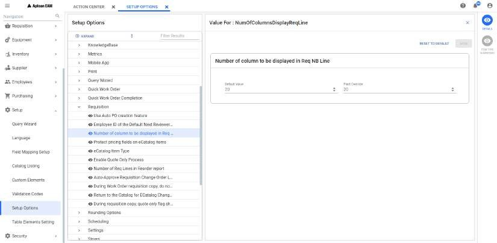
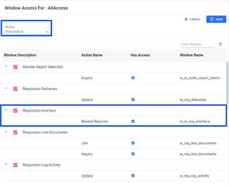
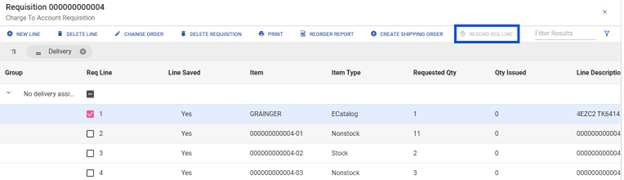
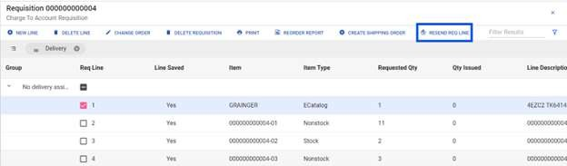
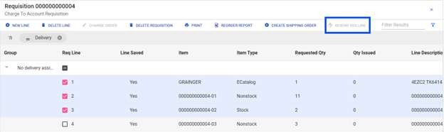
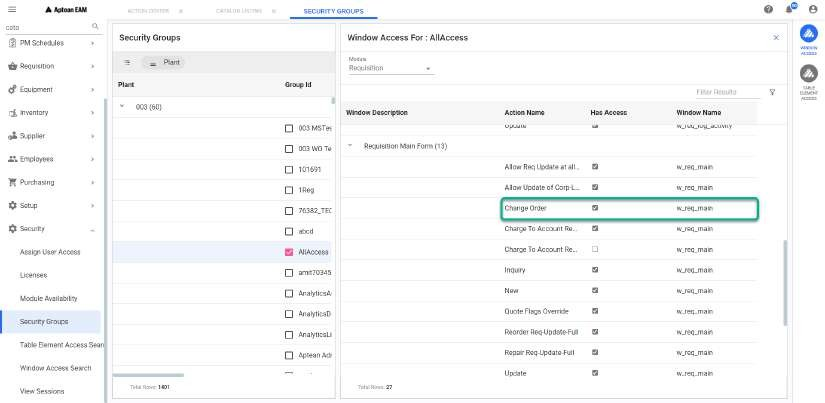

---  

title: "Using the Requisition Search"  
draft: false 
type: Article

---

The **Requisition Search** window enables you to select requisition records
based on any combination of conditions for data elements found in the
Requisitions table.

Menu path: **Requisition > Requisition Search**

The Requisition Search header consists of the following fields to find the
existing requisitions:

  1. **Requisition query:** Select the appropriate query and click Search icon. The system lists the Requisitions accordingly. 
 For more information on query wizard, see the Query wizard section.

  2. **Requisition:** Enter the requisition number.

  3. **Item:** Enter the item number.

You can click on **Search** to display all the requisitions based on the
search criteria. See Generic Components and Troubleshooting also.

Once Search is selected, **Ask at Execution** pop up will appear only when Ask
at execution feature is enabled during the creation of that selected query.
You can click on **Search** to proceed further or you can click on **Cancel**
to stay remain in the search screen.

## Requisition Search Screen Grid

In Requisition search screen, a list of requisitions matching the selection
criteria will be displayed in grid. See Grid Operations for more details on grid.

## Requisition Detail Window

In the requisition search screen grid, you can click on **Requisition**
**Number** hyperlink to open the selected requisition details. The requisition
type will also be displayed in the requisition details window. The requisition
detail window will be opened in separate tab in **Update/View** mode depending
upon the security.

You can set number of columns to be displayed in the grid in the following
setup available in **Requisition** section under **Setup > Setup Options > EAM
Options ** path.

In the requisition detail window, all action bar and contextual panel items
are similar as listed below: Additionally, you can see the following in the
action bar:

  * **[Change Order](Using-the-Requisition-Search.md#change-order-1)**: Allows you to perform change order for the selected requisition.
  * **[New Line Item](Using-the-Requisition-Search.md#new-line-item)**: Allows you to add the new line item to the requisition.

Additionally, you can see **Item Search** in contextual panel to add new item to the
requisition.

## Action Bar

In the **Requisition Search** window, you can select one or more of the
displayed records to enable the action bar located at the top of the window.
The Requisition Search window remains open when you jump to other windows
using the action buttons. The actions buttons are:

  * New Line: Allows you to create a new requisition.

  * [Delete Line](Using-the-Requisition-Search.md#delete-line): Allows you to delete the selected requisition line.
  * [Requisition Approval/Review](Approve-Review.md): Allows you to review and approve the selected requisition line.
  * [Delete Requisition](Using-the-Requisition-Search.md#delete-entire-requisition): Allows you to delete the entire requisition.
  * [Print](Using-the-Requisition-Search.md#print): Allows you to print the selected requisition line(s).
  * [Reorder Report](Reorder-Report.md): Allows you to generate the reorder report for the selected duration.
  * [Resend Req Line](Using-the-Requisition-Search.md#resend-req-line): A new button RESEND REQ LINE ' in the Req search action panel and 'Req Details' action panel. This is only useful for the plant that uses integration with ERP/other system that needs requisition data. If during integration, the record failed and didn’t get sent to the other system, this button can be used to resend the same record. If there is a business error, the user can unapprove the req to correct the data and once approved, it can be resent to the other system again. 
  * Export: Exports the grid data to an excel sheet. The data will be downloaded in excel and you can open the excel to view the grid details.

## Contextual Panel

In the **Requisition: \<Query Name>** window, you can select a record to enable
the Contextual Panel located at the right of the window. The Requisition
search window remains open when you jump to other windows using the Contextual
Panel. The Contextual Panel consists of the following:

  * Details ([Requisition Line Details](Requisition-Line-Details.md)): Opens a requisition line details for the selected requisition line.
  * Documents: Allows you to view the documents details for the selected requisition line.
  * Hierarchy: See Hierarchy and Action Bar. Allows you to open the hierarchy of the selected line. You can see this only in the Requisition Details screen.
  * Where Used: Allows you to see child-to-parent node relationships in the hierarchy.
  
  * [Catalog](Using-the-Requisition-Search.md#catalog): Allows you to view the catalog item for the selected requisition.
  * [Activity Log](Using-the-Requisition-Search.md#activity-log): Allows you to view all the activities performed on the selected requisition by different users.
  * Issue Material: Allows you to issue the material or items to the selected requisition.
  * Return Material: Allows you to return the access materials issued for the selected requisition.
  * [Item Required](Using-the-Requisition-Search.md#required): Allows you to view the outstanding requirements for the selected item(s).
  
  * **Shipping Order** : Opens the Shipping Order windows for the selected requisition. From LINES > contextual pane, you can view the shipping order details for each line.  
Note that you cannot delete a requisition when it is added to a shipping
order. In the contextual pane, the contextual icons will be available based on
the user’s security access.

## Create a New Requisition

This allows you to add a new item to the requisition through the Create New
Requisition window. For more information, see [Create New Requisition](Using-the-Requisition-Search.md#create-a-new-requisition).

## Edit Line

This allows you to edit an existing requisition line.

To edit a line:

  1. In the **Requisition Module** , select the requisition line and click **Details** from the action bar.  
  The **Requisition Line Item** window opens.

  2. Edit the required information in the tabs available.

  3. Click **Save**.

## Delete Line

This allows you to delete the selected requisition line.

>[!note]
>A user with limited security access cannot delete a line from a requisition
created by a user who has full access.

You will not be able to delete a line under the following conditions:

  * If the item is for outside purchase and is approved or is transferred to a purchase order.
  * If inventory issues have occurred.
  * If the item is on a shipping order and that shipping order is still in existence.
  * If the Quantity Issued minus the Quantity Returned is not equal to zero.

### To delete the selected line

  1. In the **Requisition \<Query>** window, select the requisition line to delete and click the **Delete Line** from the action bar.  
The **Message: Are you sure you want to delete selected line?** prompt opens.

  2. You can perform any of the following operation:
     * **Delete** : You can select this to delete a Requisition line. If deleted successfully, the **Requisition Line \<line number> Deleted Successfully** notification appears. 
     * **Cancel** : You can select this to cancel the requisition line deletion.
     * **Send Email** : You can select this to send an email to your supervisor to understand what needs to be done.

## Delete Entire Requisition

This allows you to delete an entire requisition. The restrictions described
for deleting a line also apply to delete an entire requisition. You cannot
delete the requisition if any one of the restrictions applies to any line item
in the requisition.

To delete the entire requisition:

  1. In the **Requisition \<Query Name>** window, click on **Delete Requisition** from the action bar.   
The **Message: Are you sure you want to delete entire requisition?** prompt
opens.

  1. You can perform any of the following operation:
     * **Delete** : You can select this to delete the selected Requisition. If deleted successfully, the **Requisition \<Requisition number> Deleted Successfully** notification appears. 
     * **Cancel** : You can select this to cancel the requisition deletion.

## Print

It allows you to print the header and line item information for the
requisitions selected.

The format and content of the printed output depend on the option selected
from the **Print** window:

  * **Print Picklist** : Select this option if you want to print a list of items in the standard picklist format. The items shown will be only those items available from internal storerooms.
  * **Print All Items** : Select this option to receive a list of all items shown in a special requisition format.
  * **Print Selected Lines** : Select this option to print information of selected lines only. 
  
  * **Print Outside Purchase Items Only** : Select this option if you want to receive a list, shown in the special requisition format, but limited to only those items being purchased from an outside supplier.

To Print the selected Requisition Information:

  1. From the **Requisition Search** window, select one or more rows from the displayed list and click **Print** from the action bar.

      Or

      Open the **Requisition Module** , select one or more lines and click
      **Print**.

      The **Print** window opens.

  2. Select one or all the print option(s) explained above in the **Print** window. 
  3. Click **Print** to print the requisition details. The detail will be displayed in a separate tab if no error. If any error, error pop up will be displayed.
  4. You can also click on **Cancel** to exit the pop up.

**Cloud Print:** To print the selected requisition order, utilize the Cloud
Print option. For instructions on using Cloud Print, refer to Requisition
Cloud Printing, .

>[!note]
>The **Cloud Print** button is enabled, only if the plant is setup to use cloud
print.

## Resend Req Line

To activate the RESEND REQ LINE button, the user must ensure the following
access are granted:

  1. Purchasing interface must be enabled (refer to Module Availability, to enable Purchasing Interface).

  2. In the navigation pane,

      1. Select **Security** >> **Security groups.**

      2. Choose the plant and check the **Allaccess** check box.

      3. In the contextual pane, click **Window Access** , to open the "Window Access For" tab.

      4. In the Module field, select Requisition, and click **EDIT**.

      5. Check the **Requisition Interface box** , to activate the Resend Req Line button.

          

      6. Click **Save**.

Resend Req Line button is disabled, when Purchasing Interface is disabled and
the Resend Req Line is activated, as shown below.

To enable the RESEND REQ LINE button:

  * The selected Req line must be approved.

  * Only one Req line must be selected.

  

When multiple Req Lines are selected / when no Req Line is selected, the
Resend Req Line button is disabled.

## Catalog

When planning materials for a requisition, you can connect through your
application to a supplier’s catalog website.

If the catalog is to be used strictly for either local or corporate purchases,
the user's setup should carry the item type with the correct designation.

You can perform the following to access the catalog:

  1. In the **Requisition \<Query>** / **Requisition Details** grid, select a requisition line and click on **Catalog** in the contextual panel.

  2. **Catalog List** page opens with the list of catalogs associated with the logged in plant. You can click on **X** button to close the page. 

      >[!note]
      >Catalogs set under **Define Catalog** section of **Setup > Catalog Listing**
      path will only be displayed in the list.

  1. You can see the **Company Name** and **URL** for each catalog. You can click on Company Name hyperlink and the supplier website will be opened in a pop up for further processing. After you checkout from supplier website, you get confirmation in the application to confirm ( to add those items as new requisition line) or cancel (to ignore the items being checked-out from supplier website).

  2. You can click on  to open the Catalog List in a separate tab.

## Issue Material

This allows you to issue planned and unplanned parts to a requisition. You
must have access to Issues and Returns to use these functions.

To issue material:

  1. From the **Requisition Search** window, select one or more rows from the displayed list and click **Issues** from the action bar. 
 Or
 Open the **Requisition Module** , select one or more lines and click **Issue
Material**.
 The **Issue Material** window opens.

  2. The **Issue To** , **Issue Date** , and **Store Location** will have default values. You can change the values from the drop-down list. 

  3. Select the required item to be issued from the displayed list.  To add unplanned parts, click **Search**  in the **Item List** field.
 The **Item Search** window opens.
 Perform any one of the following to search for the required item:   
      * Select the required query from drop-down list and click **Search**.
      * Enter the **Item ID** or **Item Description** and click **Search**.

4. If required update the **To be Issued** quantity. 

  5. Click **Issue**.  
  A successful pop-up message appears.

## Return Material

This allows you to return an item that is issued to the Requisition. If there
are no items issued when you click **Return Material** , a message is
displayed **There are no items available to be returned for requisition.**

To return material:

  1. From the **Requisition Search** window, select one or more rows from the displayed list and click **Issues** from the action bar. 
 Or  
Open the **Requisition Module** , select one or more lines and click **Issue
Material**.  
The **Return Material** window opens.

  2. The **Returned To** , **Returned Date** , and **Store Location** is displayed.   
  To return parts from a different location, click on the Store Location drop-
down to show a list of available locations.

  1. Select the required item to be returned.
  2. Click **Return**. 

A successful pop-up message appears. 

## Activity Log

As you process requisition items through the **Requisition Approval** window,
the application adds records to the requisition activity log. The log serves
as an audit trail for key events that occur for a requisition.

You can perform the following in the activity log window:

  1. From the **Requisition \<Query>** window, you can select the requisition and click **Activity Log** from the action bar. 
 The **Activity Log: Requisition-Req Line** window opens and all the activities
of that selected requisition are displayed in the grid. You can see **Activity
Type, Activity Date and Time, Activity User and Planned Reviewer** details in
the grid.

  2. You can click on  to open the Activity Log page in a separate tab.

  3. You can click on **X** to close the page.

  4. You can click on **Add Line** button to add a new activity. See [Add Activity](Using-the-Requisition-Search.md#add-activity) for more details.
  5. You can select the record in the grid to edit that activity. See [Edit Activity](Using-the-Requisition-Search.md#edit-activity) for more details.

### Add Activity

To add a new activity, you can perform the following:

  1. Click **Add Line** button. **Add Activity** section opens.

  2. In the **Add Activity** section, you can perform the following to add a new activity:  
    1. In the **Activity** field, you must select a value from the drop-down. The listed values are defined in the setup screen.  
    2. **Activity User** is the current logged in user and is for read only.  
    3. Enter text in the **Comments** field if required.

  1. Click **Save** and the new activity will be added to the activity log grid. you can click on **Cancel** to exit the section.

### Edit Activity

To edit the existing activity, you can perform the following:

  1. Select the activity in the activity log grid. **Add Activity** section opens with the values updated in each fields. 

  2. In the **Add Activity** section, you can not edit **Activity, Activity Date** and **Activity User** fields.
  3. You can update **Comments** field with required text.
  4. Click **Save** to update the changes and the changes will be reflected in the activity log grid. you can click on **Cancel** to exit the section.

## Required

You can view the information of the selected requisition line using
**Required** feature. You can perform the following to view requisition
information:

  1. In the **Requisition \<Query>** grid, select one or more requisition lines and click on **Required** button in the contextual panel.
  2. **View Requirements** page appears. You can click on **X** button to close the page.
  3. In the page, you can see **Item: \<Item> \<Description>** and **Stores Location: \<Stores Location>** of the selected line.
  4. In the information grid, you can see the list in which the selected requisition line is used. The message will be displayed if there is no required information for the selected requisition line. See Contextual Query for more details. 

## New Line Item

You can select this to add new item to the requisition. If selected, **Add
Line Item** section appears. You can click on **X** to close the section.

You can perform the following to add a new item:

For **Permanent** Items:

  * You can enter the item in **Item** field or search using search icon.

  * The **Type** value will be populated based on the item value.
  * You need to enter the **Requested Quantity** value greater than 0.
  * You can enable **Abnormal Demand** toggle if required. This is available only for Charge to Work Order type requisition.
  * Click **Add** to save the line item to the requisition. If the system fails to save the new line, the line item will be displayed with  symbol with line number 0. You can hover the cursor on that symbol to see what is missing in that line or what caused it to fail.
  * You can select the record and click on [Details](Requisition-Line-Details.md) to view the new line details and add the missing information. After completion, click on **Update** to save the new item line. 
  * If it gets successfully saved, then new line will be shown in the requisition grid. You can clear the values using **Clear** button.

For **Temporary** items:

  * You can select **Type** and click **Add**. The item number will be auto generated and added to the grid. You can clear the values using **Clear** button.

  * If the system fails to save the new line, the line item will be displayed with  symbol with line number 0. You can hover the cursor on that symbol to see what is missing in that line or what caused it to fail.

  * You can select the record and click on [Details](Requisition-Line-Details.md) to view the new line details and add the missing information. After completion, click on **Update** to save the new item line. 
  * If saved, the new item will appear without  symbol and **Req Line number** will be assigned. The number assigned by the application is **\<Sequential Integers starting from 01>**.

## Change Order

Creation of a change order usually occurs after a regular PO, blanket order,
or release has been issued to the supplier. It confirms the addition or
deletion of items or can modify previous agreements as to price, quantity, and
delivery date.

Any requisition line will become the change order line if the following
conditions are met:

  * Requisition line should have an approver
  * Purchase order should be attached to that line
  * For that line item type, outside purchase flag should be 1

You must have the following security to access change order feature in
**Requisition** module under **Security > Security Groups > Group Id > WINDOW
ACCESS** path.

If the line is not change order line, **Change Order** option in the action
bar will be disabled. If it is a change order line with all the above
conditions are satisfied, you can see that button enabled in the action bar.

You can perform the following to open the change order line details:

  1. Open the requisition in **Update** mode.

  2. Select the change order line from the list and click on **Change Order** in the action bar or select **Details** in contextual panel. Requisition Note book of that selected change order line will open. See [Requisition Module](Requisition-Line-Details.md) for more details.

  3. For change order line, you can see the breadcrumb below the line description in Requisition Module. You can see the breadcrumb only in **View** mode to understand from which parent lines, the change order line is created. This breadcrumb is a hyperlink and you can click on each parent lines to open that line details in a separate tab. You can also click on the hyperlink in the Requisition line header to navigate to the immediate parent.

>[!note]
>Once a Change order line is created, you can not perform the **edit** action
on the parent line item. The **Edit** button will not be visible if you open
the **Details** of those parent lines mentioned in the breadcrumb.

  4. Additionally, you can see Change Order section in the Requisition Module. Refer [Change Order](Using-the-Requisition-Search.md#change-order-1) for more details.

### Change Order

You can see the following in this section:

  * **Change** : This is the radio button selected by default to notify that you can generate a new change order line. If you edit the selected line details and saved them, a new requisition line will be created and added in the grid.
  * **Delete** : This is a radio button to inform the purchase order that this line order is no longer required. If selected, all the sections except **Approval** in requisition note book are disabled. You can only update approval section if required in delete mode. if you save the approval details, a new line will be created and added to the grid. You can not edit that new line created using Delete feature.
  * **Target Purchase Order** : It is read only field which displays the target purchase order attached to the selected change order line.
  * **Target PO Release** : It is read only field which displays the target purchase order release details for the selected change order line.
  * **Target PO Line** : It is read only field which displays the target purchase order line for the selected change order line.

## Item Search

You can add one or many line items together to the selected requisition using
**Item Search** feature. This is available only when you are in **Requisition
Details** screen in **Update** mode.

To perform a search:

  1. Click on **Item Search** in the contextual panel. **Item: \<Query Name>** window opens. You can click on **X** button to close the window.
  2. In the window, you can perform the following:
  3. Select a **Query** from the drop-down list.
  4. To search for a specific item, enter a full or partial value in the **Item** or the **Description** field. 
  5. Click **Search**. 

It displays a list of items matching the selection criteria. See Generic Components also.

### Item Search Grid

In Item Search Screen, a list of items matching the selection criteria will be
displayed in grid. See Grid Operations for more details on grid.

From the grid, you can select the required item(s) and click on **Select** to
add them to the **Requisition \<Requisition>** grid.

