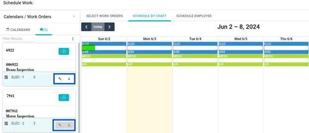

---  

title: "Schedule Work"  
draft: false 
type: Article

---

After establishing a shift and calendar, users can proceed to schedule work.
They can select and assign the work order based on the **Craft** or **Employee**.

Tab | Function  
---|---  
Calendars | Display a list of created calendars.  
Work Orders | Display a list of work orders.  
  
The left panel of the **Schedule Work** window includes the **Calendars** and
**Work Orders** tabs. On the right panel, users will find three tabs: Select
**Work Orders** , **Schedule by Craft**, and **Schedule by Employee**.

By default, the left panel displays the **Calendar list**. Upon selecting a
calendar, the tabs switch to the work order, revealing the list of previously
selected work orders. This list remains accessible for other calendars as
well.

**Work Orders**: Users can add or view a list of previously searched Work
Orders.

  * Each work order is presented as a collapsible panel.

  * Each Work Order panel contains the following information: **Work Order number** , **Description, Name of the equipment** , **Craft history** , **Employee History** , and two icons – a **Craft** icon and an **Employee** icon.

  * To remove all the saved work orders from the left panel, click **More** and select **Clear All** from the drop-down menu. Uncheck the related checkbox to remove the specific work order from the list.

  * To collapse all the work order panels simultaneously, click **More** , and select **Collapse All** from the drop-down menu.

## Select Work Order

Users can search and select the work order.

  1. Choose **Scheduling** > **Schedule Work** in the navigation pane.

  2. **Calendar/Work Order** panel> Select a **Calendar**. The toggle button shifts to the work order and the screen's right panel opens.

  3. Search and click the desired **Work Order** from the grid result. This action will add the selected **Work Order** to the work order queue.

>[!NOTE]
>An alert prompt, **Work Order Not Allowed** , opens when a work order with
**Standard Requests** or **Master Plans** is selected.

>[!NOTE]
>If a work order is chosen without an assigned craft, a **No Craft** Alert
prompt will open, stating, "Work Order does not have a craft assignment."

>[!NOTE]
>Users cannot add work orders with a status of complete or canceled to the work
order queue.

## Schedule by Craft

Enables users to assign work orders based on craft. The craft calendar
displays all the available crafts and hours for the designated calendar. Each
day, the craft availability is calculated and presented as a ratio of
scheduled to available hours. Each craft is visually represented with assigned
colors in the corresponding blocks. Employee and shift exceptions are
considered and taken out of the normal shift availability. The blocks are
filled in as work orders are scheduled. After scheduling, the blocks clearly
compare the hours scheduled for a craft and the total hours available for
workers assigned to that calendar.

  1. Follow the first three steps outlined for selecting a work order.

  2. On the right panel, switch to the **Schedule by Craft tab**.

  3. To assign work order by craft, click and drag the **Craft** icon from the work order panel to a specific day on the calendar or click the **Craft** icon. This action will open the **Craft Schedule** pop-up opens.

  4. Enter or set the **Date** using the calendar icon and click **Save**. Once saved, the craft's progress bar on the selected day increases. If scheduled hours exceed availability, the progress bar turns red, indicating the excess.

      

  5. To delete a scheduled craft from a specific day, click the craft, the **Assigned Work Orders** pop-up opens, and then click **Delete**.

>[!NOTE]
>Craft can’t be scheduled for a past date, or for a craft with zero remaining
hours. A white craft icon   indicates
available hours for scheduling, while a gray craft icon  indicates no remaining hours for
scheduling.

## Schedule Employee

Enables users to assign work orders for an employee.

  1. Follow the first three steps outlined for selecting a work order.

  2. On the right panel, switch to the **Schedule Employee** tab.

  3. To assign a work order to an employee, click and drag the **Employee** icon from the work order panel to a specific day on the calendar or click the **Employee** icon. This action will open the **Employee Schedule** pop-up opens.

  4. Enter the **Start Date and Time, End Date and Time** , or use the calendar icon to set the date and time. Select the **Employee** from the employee drop-down menu.

>[!NOTE]
>The employee drop-down menu presents a list of employees assigned to the
craft. Users can select multiple employees only when the number of required
workers is more than one.

  1. Click **Save**. The assigned work order for an employee will be displayed on the calendar.

  2. To edit the assigned work order of an employee, click the assigned work order in the calendar, **Employee Schedule** pop-up opens. Make the required changes, and then click **Save**.

  3. To delete the assigned work order of an employee, click the assigned work order in the calendar, **Employee Schedule** pop-up opens. Click **Delete**.

>[!NOTE]
>A white employee icon   indicates
available hours for scheduling, while a gray employee
icon    indicates no remaining hours
for scheduling. or work orders: Enables users to split the work order across
multiple days or assign it to multiple employees. With each split, a new
occurrence is created for the remaining hours of the work order. The
**Shrink** option enables users to adjust a work order's duration flexibly,
scheduling it for the required time even if the initially planned duration
exceeds the actual needs. For instance, if a 1-hour work order can be
completed in 0.5 hours, users can use **Shrink** to optimize the schedule.

>[!Tip] 1. Allows the planned hours of a Work Order to be split across days and or employees. 2. Shrink the calendar duration of the selected Work Order. 

### Split or shrink work orders

Enables users to split the work order across multiple days or assign it to
multiple employees. With each split, a new occurrence is created for the
remaining hours of the work order. The **Shrink** option enables users to
adjust a work order's duration flexibly, scheduling it for the required time
even if the initially planned duration exceeds the actual needs. For instance,
if a 1-hour work order can be completed in 0.5 hours, users can use **Shrink**
to optimize the schedule.

**To Split or Shrink the Work Order**

  1. Search for and select the desired **Work Order** from the left panel.

  2. Click the **Employee** icon.

  3. Reduce the work order hours and click **Save**. The **Work Order Split** alert prompt opens, prompting users to **Split or Shrink** the work order.

  4. To split the work order, click the **Split** button. The following changes occur:

     * The work order occurrence will be rescheduled based on the updated hours.

     * The remaining hours will be created as a new occurrence on the work order.

     * The new occurrence will automatically be placed in the work order queue for rescheduling.

  5. To shrink the work order, click the **Shrink** button. The following changes occur:

     * The work order occurrence will be scheduled for the updated hours.

     * The duration of the work order will be reduced.

