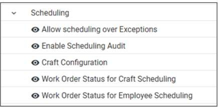

---  

title: "Scheduling"  
draft: false 
type: Article

---

The Scheduling module has been introduced in EAM. The scheduling module
provides the ability to schedule work orders by craft, employee or both. Craft
scheduling allows the user to visually plan for the week to ensure enough
workers are available for the shift. Employee scheduling also gives a visual
indication of how many work orders are assigned to a employee. It shows time
off and overtime for employees and for a shift.

  * **Allow scheduling over Exceptions** : This option allows scheduling an employee on top of an employee or shift exception.

  * **Enable Scheduling Audit** : Turns on scheduling audits. This tracks all assigned work orders for a publish. It also tracks available hours for a calendar per day per employee. The auditing can only be viewed through Analytics reports.

  * **Craft Configuration** : Set how to view crafts for an employee on the work order schedule.

  * **Work Order Status for Craft Scheduling** : The status to set a work order once the craft is scheduled.

  * **Work Order Status for Employee Scheduling** : The status to set a work order once an employee is scheduled.

It includes following sections:

  * **[Employee Setup](Employee-Setup.md)**: Allows users to set color codes for employees and facilitates scheduling for employee overtime or shift exceptions.

  * **[Craft Setup](Craft-Setup.md)**: Allows users to set color codes for crafts.

  * **[Manage Shifts](Manage-Shifts.md)**: Enables users to schedule and organize work hours for employees.

  * **[Schedule Work](Schedule-Work.md)**: Schedule work orders by craft or employee.

  * **[Reports](Reports.md)**: Enables users to generate reports for craft an employee schedule.

## Prerequisite for scheduling

### Setup

There are several setup options that should be visited before you start
scheduling your work orders.

