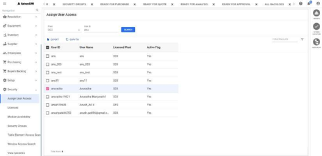
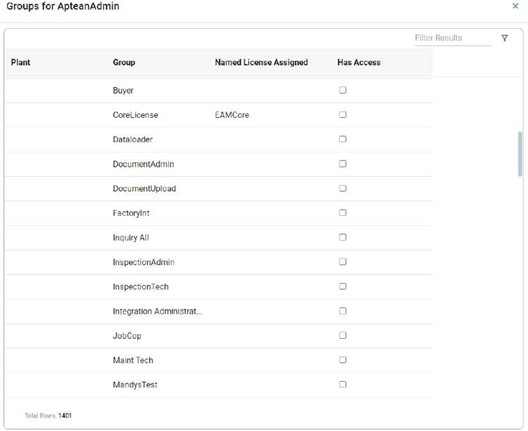
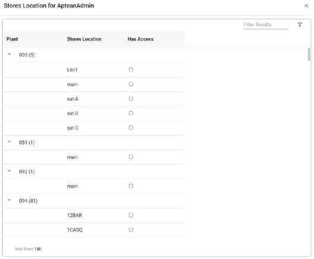
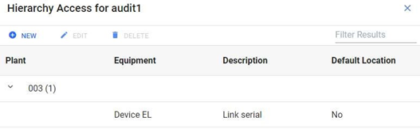

---

title: "Assign User Access"
draft: false

---
Using this feature, you can assign different permission to the users. The uses listed has at least one of the same plants as the signed-in user's access plants

**Menu Path: Setup > Assign User Access**

>[!Important] 
>Assign User Access option will be visible only if you have sufficient security
under the **Security** navigation page called **Assign User Access**.

Initially, the system displays all the users who share the same plants as the signed-in user.

The **Assign User Access Search** window allows you to search by a specific plant or user ID.

To perform a search:

  1. In the **Plant** drop-down list, select a plant.

  2. In the **User ID** field, enter a user ID to search for a user with a specific user ID.

  3. Click the **Search** button.

The system displays the list of users in the grid based on the selection criteria. You can see the following grid columns:

  * **User ID**: The user ID of the user.

  * **User Name**: The name of the user.

  * **Licensed Plant**: It is the primary plant of the user. It’s set in the Tenant Portal while creating the user.

  * **Active Flag**: It is the flag that indicates if the user is active or not.

See **Grid Operations** for more details about the grid.

**Action Bar**

In the **Assign User Access Search** window, the action buttons are:

  * **Export**: Saves the data present in all columns of the grid to a Microsoft Excel workbook. You can open the workbook to view the grid’s data.

  * **Copy To**: Opens a popup that allows you to assign the groups, stores location, and hierarchy of another user to the user that you select in the grid. For more information about assigning groups, stores location, and hierarchy to a user, see [Contextual Panel](#contextual-panel) for the **Assign User Access Search** window later in this chapter.

### Contextual Panel

In the **Assign User Access Search** window, select a record to make the Contextual Panel available. This panel is located to the right of the window. The search window remains open when you jump to other windows using the Contextual Panel.

The Contextual Panel consists of the following:

**Groups**

The **Groups for User Name** window shows a list of all plants for that selected user. Each plant will show all the groups that the user can be assigned to.

The **Has Access** column in the window contains check boxes that correspond to each group, and these check boxes determine if you’ve assigned the user to a group.

>[!Note] 
>You can click **X** icon to close the window.

>[!Important] 
>If you are the first customer administrator of a company, then the system assigns you to the **AllAccess** and **Core Named License** groups. Customer administrators will need to manually assign end users to groups. By default, a new end user becomes a member of the **NoAccess** group, which doesn’t have any window permissions.

To assign the selected user to a group, under the **Has Access** column select the check boxes that correspond to the required groups. The message, **Groups Saved Successfully.** appears.

If any license is associated with the selected group, then the system verifies license availability before assigning to the user.

>[!Note] 
>You can consume one type of license only once. You can have multiple groups consuming the same license, but that license will be consumed only once for each user. License consumption is always verified for the licensed plant.

Similarly, to remove the selected user from a group that user is assigned to, clear the group’s corresponding check box. The message, **Groups Saved Successfully.** appears.

If the group from which you remove the selected user, consumes a named license, then the system removes user association with the license, and frees one license for the plant.

**Stores Location**

The **Stores Location for User Name** window shows a list of all plants for that selected user.

Each plant will show all the stores locations that the user can be assigned to. The **Has Access** column in the window contains check boxes that correspond to each stores location, and these check boxes determine if you’ve assigned the stores location to the user.

>[!Note] 
>You can click **X** icon to close the window.

To assign a stores location to the user, under the **Has Access** column select the check boxes that correspond to the required stores locations. The message, **Stores location updated successfully for user <User ID>.** appears.

Now, when you **create a new inventory item** , the **Stores Location** drop-down list in the **Main** tab shows the stores location you’ve assigned to the user.

Similarly, to remove an assigned stores location from a user’s plant, clear the stores location’s corresponding check box for the selected user. The message, **Stores location updated successfully for user User ID** appears.

**Hierarchy**

The **Hierarchy Access for User Name** window allows you to assign a user
access to one or more equipment hierarchy.

Hierarchies appear in this window within a grid. The following action buttons appear abovethe grid:

  * New: Click the **New** button to [create a new hierarchy](#create-a-new-hierarchy) for the selected user. You can denote the new hierarchy as the default hierarchy.

  * Edit: Click the **Edit** button to [Edit the hierarchy](#edit-a-hierarchy), after you select an existing hierarchy in the grid.

  * Delete: Click the **Delete** button to open a popup to delete the hierarchy, after you select an existing hierarchy in the grid.

### Create a New Hierarchy

You can create a new hierarchy for the selected user.

To create a new hierarchy:

  1. On the action bar, click the **New** button.

      The **Add Location Access** section appears at the bottom of the **Hierarchy Access for User Name** window.

  2. In the **Equipment** field, type a value for the equipment ID.

      The system enters the same value in the **Description** field.

  3. Turn on the **Default Location** toggle to make this hierarchy as the default hierarchy. By default, this toggle is turned off.

      >[!Note]
      >There can be only one default location for a user, clicking on this toggle will override any existing default hierarchy previously marked.

      If you turn on the **Default Location** toggle, the **Hierarchy** window (**Equipment > Hierarchy**) now shows the **Go To Default Hierarchy** button. Once you click this button, the system displays the hierarchy that you’ve denoted as default earlier in the **Hierarchy Access for User Name** window.

  4. Click the **Add** button to add this hierarchy’s details in a new row under the grid in the **Hierarchy Access for User Name** window.

### Edit a Hierarchy

When you edit an existing hierarchy, you can only turn on or off the **Default Location** toggle then click the **Save** button to save your changes.

**Add location access to hierarchy**

From the Assign Users Access > Hierarchy Access screen, now you can add the location access for all the plants based on the plants assigned to the user.

To add location access to hierarchy access screen, perform the following
steps:

  1. Navigate to **Security** > **Assign User Access**.

  2. From the **Assign User Access** pane, select the user to add the location access.

  3. From the right pane, click **HIERARCHY**.

  4. From the header, click **NEW**. The **Add Location Access** section appears:

  5. From the **Plant** drop-down list, select the plant in which you want to add the location access.

      >[!Note] 
      >The Plant drop-down list populates all the plants based on the user access.

  6. In the **Equipment** field, enter the location to load in the hierarchy screen.

      Enter a valid location for the selected plant. You can also search for the valid equipment using the search icon.

  7. Click **ADD**.

  8. The location access will be added to the **Hierarchy Access** section.

>[!Note] 
>From the header:    
>- You can edit the location access using the **EDIT** button. 
>- You can delete the location access using the **DELETE** button.  
