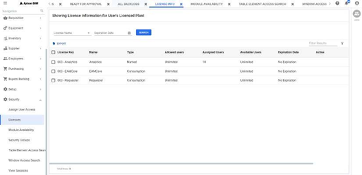
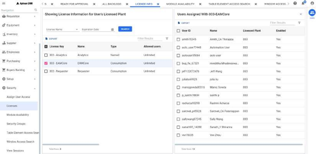

---

title: "Licenses"
draft: false

---
**Licenses** feature provides you the details of the available licenses for the logged in Plant and User in EAM application.

Menu Path: **Setup > Licenses**

From the LICENSE INFO page, you can view the list of license keys with its name, type, and allowed users.

To see the list of users assigned to the license key, select the license key and click the USERS icon.

The Licenses search window allows you to search by License Name or Expiration Date.

To perform a search:

  1. Select a **License Name** from the drop-down list and click **Search**.

      The selected license type will be displayed in the grid.

  2. To search license for a specific expiry date, enter the suitable **Expiration Date**. 
  3. Click **Search**. 

The specific license will be displayed in the grid based on the selection
criteria. You can see the following grid columns:

  * License Key: Logged in Plant-License Name
  * Name: Name of the license. It can be Analytics, EAMCore and Requester
  * Type: License Type
  * Allowed Users: The total number of users to consume the license. This is set while creating the license.
  * Assigned Users: The number of users to which the license is already assigned.
  * Available Users: The number of remaining users to consume the license.
  * Expiration Date: License Expiration Date
  * Plant: The Plant to which license is associated.

See Grid Operations (Add link) for more details on the grid.

## Action bar

In the **Licenses Search** window, The action button:

  * **Export** : Exports the grid data to an excel sheet. The data will be downloaded in excel and you can open the excel to view the grid details.

## Contextual Panel

In the **Licenses Search** window, you can select a record to enable the Contextual Panel located at the right of the window. The Licenses Search window remains open when you jump to other windows using the Contextual Panel. The Contextual Panel consists of the following:

### Users

This section provides you the **Assigned users** details for the selected license type. If selected, **Users Assigned With Logged in Plant-License Name** screen will be displayed. You can click on **X** to close the screen. You can click on **Export** to export the grid details to an excel sheet.
You can see the following grid columns:

  * User Id
  * User Name
  * Plant: Logged in Plant
  * Enabled: Yes or No flag to indicate if the license is enabled or not.

