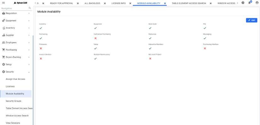
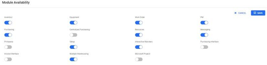

---

title: "Module Availability"
draft: false

---
Using this feature, you can configure/restrict the modules for a plant.

To change the availability of the modules, click the **EDIT** button.

Turn **ON/OFF** the toggle button according to your requirement, and click **SAVE**.

