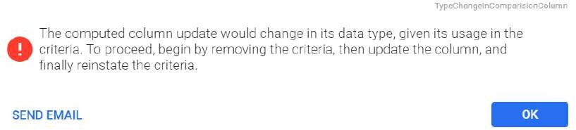

Each module comprises Work Orders, PM, Requisition, Equipment, Employees, Supplier, Inventory and sub modules has search window. In the search windows, you can select a query from the query drop-down list. You can add queries of
your own design to any of the query list in these modules. The custom queries you develop are only available to you and not to any other user.

Perform the following procedure to create a new query:

1. On the [Query Wizard](Query-Wizard.md) page, select a **Module** from the drop-down and click **New** on the action bar. The **Query Wizard** window opens to create a new query.
2. Perform the following steps as required to provide more information on the new query:

  * Enter a **Name** and **Description**. 

    - Data Translation: If the Data translation is    enabled, then the **Globe icon** can be seen next to the query description field for data translation. In Designer screen, if data translation exists, description will show up in the logged in user language.

      Figure 12-1: For non sys queries

      

      For sys queries, the header (Name) is disabled. With the globe icon next to the **Description** field, the user can enter translation for the newly created language. In the query drop-down, the description is translated based
      on the user language, irrespective of data translation is turned on or not.

      Figure 12-2: For sys queries

      

    * To display limited data in the query results, click the **Hide detail data on execution** check box.

    * To make the query public, click the **Public Query** check box.

3. Following tabs are available in **Query Wizard** window:

    * **RESULTS DISPLAY** : It is used to select the columns to be added to the query, see [Results Display](#results-display-tab) for more details.

    * **CRITERIA** : It is used to narrow the amount of information displayed by specifying value ranges for selected columns, see [Criteria](#criteria-tab) for more details.

    * **PUBLIC ACCESS** : It is used to select and assign the **Access Groups** for which the query will be available. 

      >[!Note] 
      >This tab is enabled, only if you have selected the **Public Query** check box for the query.

If the tab is enabled, you can select the required group/s from the **Access Groups** list to assign it to the new query. You can click on **Select All** button to select all the groups from the list. You can click on **Deselect All** button to deselect all if all the groups are selected.

After creating the query, perform any of the following steps to save or cancel the query:

  1. To save the query, click **Save**. 
  2. To save and preview the query, click **Save & Preview**. 
  3. To cancel the query, click **Cancel**. 

See [Contextual Query](#contextual-query) also.

### Results Display Tab

The results display tab allows you to select the columns for the query. In this tab, you can group and sort the columns for the queries. The Results Display tab consists of three grids - **Select Columns, Display Order** and **Sort and Group Priority**.

Perform the following steps to display the information when executing a query:

  1. The **Display Order** grid will display the default columns based on the **Module** selected in the [Query Wizard](Query-Wizard.md) page. User can delete the default column/s using the **Delete** icon if not required.

      Module | Default Columns  
      ---|---  
      Work Order | Work Order  
      Resource | Employee Id  
      Equipment |  Equipment    Serial # Installed  
      Serial |  Serial #   Equipment Item  
      Item |  Item   Stores Location   Item Type  
      Labor Activity | Work Order  
      PM Schedule |  MP Base   Equipment/Serial ID   Equip/Serial Indicator  
      Requisition |  Requisition   Req Line   Item Req   Type  
      Supplier |  Plant  Supplier  
      Resource | Employee Id  
      PickList |  Plant   PickList   Item  
      Stores Activity |  Plant   Item  
  
  2. In the **Select Columns** grid, perform the following:
     * The basic columns information are displayed by default. Select **Advanced** button if you want to display advanced columns.
     * Search for the required columns in the **Filter** field and select the required **Column** from the list in the order you want the column headings displayed from left to right. The columns are added to the **Display Order** grid. 

  3. In the Display Order grid, perform the following: 

     * To **group** the columns, use the ascending or descending arrow icons. The columns are added to the **Sort and Group Priority** grid. Both actual columns and computed columns can be grouped.
     * To **rearrange** the columns, click the column heading and holding the mouse button down, drag and drop it to the required location.
     * To change the column width, click the column border and holding the mouse button down, drag the border to its new position.
     * To hide the column, click the **Hide** Icon

     * To add a computed column, click the **Add Computed Column**. Refer to [Computer column](#computed-column)

     * To reset the columns, click **Reset**.
     * To delete any of the column, click the **Delete** icon beside the column you want to delete.

  4. In the **Sort and Group Priority** grid, the columns selected to group are by default primary sort fields. Perform the following:
     * To group based on columns, select the **Group** icon. 
     * For the date field, select the **Group By** condition from the drop-down (**By Year** , **By Quarter** , **By Month** , **By Week**). If nothing is selected, it will be grouped by individual date.
     * To show the total and the row count, select the **Total** and **Show Row Count** check boxes. 

### Criteria Tab

The criteria tab allows you to narrow the amount of information displayed by specifying value ranges for the selected columns. Criteria tab consists of three grids - **Select Columns, Selected Criteria** and **Criterion Details**.

Perform the following steps in Criteria tab:

  1. In the **Select Columns** grid, consider the following:
     * The basic columns information are displayed by default. Select the **Advanced** button if you want to display advanced columns.
     * Search for the required columns in the **Filter** field and select the required **Column** from the list and drag and drop them to the **Selected Criteria** grid. 

  2. In the **Selected Criteria** grid, you can drag and drop the columns from **Select Columns** to a specific location inside the panel. Also, you can re arrange the records by moving them inside the panel. To move the record, select the record and drop it to the new row. 

        Perform the following on grid records:

        * By default all the grid records are connected with **AND** logic. To connect them with OR logic, select **AND/OR** button and vice versa. 

      **AND/OR** button will be disabled for the first record in the grid.

        * To group multiple records, select the consecutive records and click **Group** button. Only consecutive records inside the panel can be grouped together. You can also form multiple groups from the available grid records if required.
        * To un-group the already created group/s, select the group header The first record of the group with '**(** ' mark ) and click **Ungroup** button. 
        * To delete a record inside the grid panel, select the record and click **Delete** button. 
        * To delete the group, select the first record of that group and click **Delete** button. 

      The **Message ID: Delete Criteria Group** prompt opens.

        * Click **OK** to delete all the records of that group.
        *  Click **CANCEL** to cancel the group deletion. 

      >[!Note] 
      >The error icon() on any criteria denotes that all the information for that criteria is not filled. You can fill the necessary information in **Criterion Details** grid.

  3. In the **Criterion Details** grid, you can set the values for each of the records added in the **Selected Criteria** grid by performing the following actions:
     * Select the appropriate **Operator** from the drop down.
     * Enter the suitable value for the selected column in **Value** field. 

        >[!Note] 
        >Value field will not be visible if the operator is **is empty**. Two Value fields will be visible (**Starting Value** and **End Value**) if the operators are **between** and **not between**.

      * You can also search for the value by clicking on **Search** button located at the right of Value field. 

  **Details** prompt appears with list of values. In the prompt:

  * You can search for a particular value in **Filter** field and update that using **SELECT** button.
  * You can select one or multiple values from the list based on the **operator** selected and click **SELECT** button to update that value(s).

In addition to the above, **Criterion Details** grid consists of the following special features:

1. **Select Column**

    This feature allows users to compare two columns within the criteria section of the query.

      * Check the **Select Column** check box.

      * From the **Column of Comparison** drop-down, select the desired column. The dropdown displays columns with data types comparable to those already chosen in the query.

    

    **Operator: Is the Child of:**

    This operator allows users to narrow their queries based on equipment
    relationships across all modules. It enhances query functionality,
    particularly for users dealing with equipment-related data.

      1. Navigate to **Setup** > **Query Wizard** in the navigation pane. The **Query Wizard** tab will open in the top bar.

      2. Choose **Equipment** from the **Module** drop-down menu.

      3. Click the **New** icon in the header. The **New Query Wizard** tab will open in the top bar.

      4. Enter a **Name** and **Description**.

      5. The Query Wizard grid offers the following sub-tabs:

          * **Results Display** : Select the desired column to include in the query, such as Equipment, Plant, etc.

          * **Criteria** : Drag the Equipment column from the Select Column grid to the **Selected Criteria**.

      6. In the **Criterion Details** grid, set the values for each record added in the **Selected Criteria** grid.

          * **Operator** : Select the **Is child** of from the **Operator**
    drop-down.

          * Enable the **Set Advanced Value** check box.

    * **Value** : Choose the desired value from the drop-down menu:

        * LoggedInUser.UserEquipment: Refers to equipment linked to the
    current user.

      * LoggedInUser.DefaultEquipment: Refers to the default equipment set for the employee.

        

      Once executed, the query retrieves all child equipment associated with the selected or fetched equipment.

  
    >[!Note]     
    >- The **Select Column** option in the **Criterion Details** grid is disabled for queries using the **is child of** operator, streamlining the query process.  
    >- If there's no default equipment or child equipment, the **Equipment Search** grid will show no records.

2. **Ask At Execution**

  When setting up a query, you have the option of clicking the **Ask at > Execution** check box. This feature allows you to enter a selection criteria  other than the default values previously entered in the Value field.

  * When you execute a query with this feature, the **Ask At Execution** > window opens. Enter a value in the field given.
  * To search for a value, click the **Search** icon. The **Details**
 window opens.
     * Select a required value /s.
     * Click the **Select** button. The **Value** will be populated in the field.
     * To search for a list of queries, click the **Search** button.
 **Select** the required query from the list.
    * To cancel and exit the window, click the **Cancel** button.

2. **Set Advanced Value**

    When setting up a query, you have the option of clicking the **Set Advanced Value** check box for the following specific columns:

      * For the columns containing Employee or User ID (Ex: Assigned Employee ID), selecting **Set Advanced Value** check box will assign the value or criteria directly to **LoggedInUser**. This helps to create a generic query for all users having same criteria.
      * For date columns, selecting **Set Advanced Value** check box will create the generic queries with **Today, BeginOfWeek, BeginOfLastWeek, BeginOfMonth, BeginOfLastMonth, BeginOfQuarter, BeginOfYear** as the default in **Value** field. You can enter the required numeric values to form Today + 3, Today - 7 or BeginofLastMonth + 7, BeginofLastMonth -7, and so on for the Start and End dates. This will help to create queries that are generic in nature such as ‘PMs due this week’ or ‘My assigned work for upcoming week’.
3. You can also create a combination of magic value and another selected column.

      * Example 1: Fetch data where equipment.department = ‘logged-in-user’.department".

      * Example 2: Fetch data for all the work orders for the Logged in user’s default equipment. (WorkOrder.equipment = LoggedInUser.DefaultEquipment)

      * Example 3: Fetch data for all the work orders for the Logged in user’s user equipment. (WorkOrder.equipment = LoggedInUser.UserEquipment)

        >[!Note] 
        >The above logic is applicable only for the below fields across all modules wherever applicable. department, equipment, supervisor, planner, buyer.

4. **Comparing two columns**

    1. Locate Select columns checkbox.

    2. Click drop-down.

    3. It shows a list of all columns having the same data type that are selected in the query already including the computed column.

    4. The help text is now updated to mention the new changes.  
Example: Create a query where Quantity requested > Quantity available.

### Contextual Query

It is a type of query in the Query Wizard. Contextual queries are read only to the end user and internal EAM support person. Contextual queries will show in the drop down in query wizard and Search screens (i.e. inventory, work orders, requisitions and Employees etc).

The naming convention for these type of queries is **SYS_CON_ Query Name**.

Consider the following:

  * It is the query wizard query which will run automatically when you press the associated button/link. You don't have to enter any parameters or select the query name. The parameters are passed from the invoking context of where the query is run.

  * When the results are shown for contextual query, most of the time, unlike normal query wizard query, you don't see a drop down to pick the query name, or a button to rerun the query, or fields to enter the parameters. You just see the fields which are added during the creation of the query in the output grid. 

  * A contextual query will typically be launched from an icon in the right contextual panel. For example:

    * Labor Activity contextual panel button in Work Order Search Screen.

    * Labor Activity contextual panel button in Employee Search Screen.

    * Required contextual panel button in Requisition Search Screen.
    * Key Stores Activity contextual panel button in Item Search Screen.
  * A contextual query can also be launched from a button or link. For example:

    * Products tab in Supplier Module.

### Computed Column

In a database, a computed column is a virtual column that automatically calculates values based on user-defined expressions instead of storing them directly. It facilitates the dynamic generation of values using data from other columns.

Example: Consider a table with columns for Quantity and Price. You can create a computed column named **Total Amount** with the expression: **Total Amount =
Quantity * Price**.

To Add a Computed Column

  1. Navigate to **Setup** > **Query Wizard** in the navigation pane.

  2. Choose the desired module from the **Module** drop-down menu.

  3. Click **New** on the action bar.

  4. Enter a **Name** and **Description**.

  5. On the **Result Display** tab, select the columns to include in the query. For detailed information, refer to [Result Display](#results-display-tab).

  6. Click **Add Computed Column** in the **Display Order** header. A pop-up window appears. Enter the following details:

      Field | Sub-fields | Description  
      ---|---|---  
      **Column ID** |  | Enter a unique column ID. Numbers and Special characters other than underscores are not allowed.   
      **Column Name** |  | Enter a unique name for the computed column. This name will appear on the column header in the UI.   
      **Expression Type** |  |  Choose the desired Expression Type from the drop-down menu.       * Decimal   * Date Time  
      | | **Format Type** |  This field is visible only when Decimal is selected as the expression type. From the drop-down menu, users can select the desired option.   * **Currency** : This format is designed to display currency values according to the currency defined at the plant level.  * **Currency_Extra** : This format is designed to display currency values with up to four decimal places, irrespective of the currency defined at the plant level.  
      | | **Number of Columns** |  You can specify the number of columns (1 or 2) from the drop-down menu they want to incorporate in their query condition.   * If the user opts for a single column, they can select a column and an operator from their respective drop-down menus and then input a numerical value in the field. Refer to Example: [90% of Maximum](#90%oftheMaximum)   * For a two-column query, users can apply operators to calculate values based on the two selected columns. Let's take a look at this example: Remaining Qty To Issue.  
      **Expression Type** |  |  Choose the desired Expression Type from the drop-down menu.   * **Decimal**       * **Date Time**  
      | |**Operators** |  This field appears only when the user selects the expression type **Date Time**.  From the drop-down menu, users can select the desired option.    * **Dates Difference** : The Dates Difference feature enables users to calculate the difference between two date columns they select from a drop-down menu: **Start Date** and **End Date**. Refer to the example: [WO Approval Time Days](#WOApprovalTimeDays) .  * **Add Days to Date (Enter a number)** : This option allows users to input a numerical value in the field **Number of Days** to be added to the selected date column from the drop-down menu **Start Date**. Refer to the example:[WO Due completion in Next Week](#WODuecompletioninNextWeek) .   * **Add Days to Date (Select a Column)** : Enables users to choose a date column from the drop-down menu **Start Date** and a number column from the drop-down menu **Number of Days**. The value of the date column will be added to the number column.   
  7. Click **Save**. The created computed table will be added to the display order grid.

  8. To preview the computed column, click **Save and Preview**.

 >[!Note] 
>- This table is dynamic. The fields displayed depend on the options selected from various drop-downs, such as Expression type and number of columns.  
 >- The Add Days to Date (Specify Number) feature lets users enter a fixed number of days to adjust a date directly. On the other hand, the Add Days to Date (Select a Column) feature calculates the adjustment based on the value in
another selected column.

You may encounter the following errors while updating or deleting the
computed column:

  * When attempting to delete a column that contributes to a computed column, users encounter an error message stating, **This column can’t be deleted as it is part of a computed column (column name).** To resolve this issue, users should first remove the column from the computed column definition and then proceed with the deletion.

  * When attempting to update computed columns used in criteria, users encounter an error message indicating, **"The computed column update would alter its data type, given its usage in the criteria. To proceed, start by removing the criteria, then update the column, and finally reinstate the criteria."** To resolve this, follow these steps:

   1. **Step 1** : Remove criteria employing the computed column. This action is necessary as updating the column's data type may conflict with existing criteria.

   2. **Step 2** : Update the computed column with the new data type or any other required changes.

  3. **Step 3** : Once the update is complete, reinstate the criteria. This involves restoring the conditions or filters removed in Step 1, ensuring compatibility with the updated computed column's data type.

  

  * When attempting to update computed columns used in the group by condition, users encounter an error message indicating, **"The computed column update would alter its data type, given its usage in the group by. To proceed, start by removing the group by condition, then update the column, and finally reinstate the group by."** To resolve this, follow these steps:

1. **Step 1** : Remove the group by condition. This involves temporarily eliminating the grouping operation on the computed column.
2. **Step 2** : Update the computed column with the new data type or any other required changes.
3. **Step 3** : Restore the group by condition. This entails reintroducing the grouping operation on the updated computed column, ensuring alignment with the new data type or changes made.
**Computed column Examples for Decimal Expression**

   1.  **90% of the Maximum:**  
  For instance, the computed column **90% of the Maximum** can be used to optimize inventory levels and make informed decisions about ordering more low-stock items, reducing prices for overstocked products, and promoting items close to the maximum quantity. By doing so, users can keep their stock balanced, save money, and effectively meet customers' needs.
      * Choose the following from the drop-down menu:
        * **Column** : Qty Maximum.
        * **Operation** : Multiplication (*).
        * Enter the numerical value in the text field: 0.9.
        * **Save and Preview**.

        

    2. **Remaining Qty To Issue**
  In a warehouse, the **Remaining Qty To Issue** computed column calculates the quantity needed to fulfill pending orders by subtracting issued from requested quantities, facilitating efficient order processing and inventory
management.
        * Choose the following from the drop-down menu:
          * **Expression Type** : Decimal
          * **Column** : Requested Qty.
          * **Operation** : Subtraction (-).
          * **Column** : Qty Issued
          * **Save and Preview**.

        

**Computed column examples for Date Expression**

1. **WO Due completion in Next Week**.
  The production manager utilizes the **WO Due completion in Next Week** feature in a manufacturing facility to efficiently plan and monitor upcoming work orders. By adding seven days to the requested completion date, the system generates a list of work orders scheduled for completion the
following week. This enables the manager to allocate resources effectively, anticipate production demands, and ensure timely delivery of products to customers.
  **Choose the following from the drop-down menu:**
    * **Expression Type** : Date
    * **Operation** : AddDaysToDate (Enter a number)
    * **Start Date** : Requested completion date.
    * **Number of Days** : 7
    * **Save and preview**.

    

2. **WO Approval Time Days**
  For instance, the Approval Time Days computed column can be used in a manufacturing company that generates work orders (WO) for production tasks. Each work order goes through various stages, including creation, review, and approval. The Approval Time Days column can be used to track the time it
takes for a work order to move from the entered stage to the approved stage.
    * Choose the following from the drop-down menu:
      * **Expression Type** : Date Time
      * **Operation** : Date Difference
      * **Start Date** : Entered Date
      * **End Date** : Date Approved
      * **Save and preview.**

      