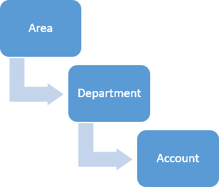

**Menu Path: Setup > Field Mapping Setup**

The Field Mapping Setup allows you to define a hierarchy for the fields such as area, department, account, and locations. The hierarchy allows you to create a relationship between the fields. The field hierarchy is also called a parent-child relationship.

For example, a relationship is defined for the fields - **Area > Department >
Account > Project**.

In this example, **Area** is the parent, **Department** is its child, **Account** is the grandchild. The **Department** is also a parent field to **Account**.

For each relationship, you can define a list of values for each field in the relationship. The table below shows an example for the list of values for **Area** , **Department** and **Account**. The list of values in the child field are dependent on list of values from the parent field.

In this example, the list of values in the **Department** field are dependent on list of values in **Area** field, and the list of values in the **Account** field are dependent on the combination of values from **Area** and **Department** fields. You can select only the values that have been defined for the fields and this allows you to narrow down the selection criteria when creating a work order, requisition and so on.

The below table explains how the values are dependent between the fields -
**Area > Department > Account**:
Area | Department | Account  
---|---|---  
Area A  <td rowspan="3">Department 1|   Account 1 
||Account 2  
||Account 3  </td> 
|<td rowspan="2">Department 2 | Account 2  
||Account 3  
Area B<td rowspan="2">Department 2 |  Account 3  
||Account 4  
||Department 3 | Account 3 
  
If you select **Area A** , only then the **Department 1** and **Department 2** values are available in the Department field. Similarly, if you select **Area A > Department 1** then the values **Account 1, Account 2** and **Account 3** are available in the Account field.

To access Field Mapping Setup, you need to have the required Security and Settings. For more information, see [Security and Setup for Field Mapping Setup](Security-and-Settings-for-Field-Mapping-Setup.md).

The guidelines for the Field Mapping Setup are as follows:

  * If you change the hierarchy to modify an existing relationship, the system deletes the existing relationship and considers the hierarchy as a new relationship. 
  * A child can have only one parent. For example, as shown in the image, the **Account** can have only **Department** as the parent. 
  * A child can be a parent to a new field. For example, **Account** can be a parent to **Project**. 

The following procedure explains the actions that can be performed in the **Field Mapping Setup** page:

  1. Select **Setup > Field Mapping Setup** in the navigation menu. 

The **Field Mapping Setup** page opens and displays the existing relationships in collapse mode.

  1. In the **Field Mapping Setup** page, perform any of the required actions as follows:
  2. To add a new relationship, see [Adding new relationship](Adding-a-New-Relationship.md).

  1. To edit a relationship, see [Editing an existing relationship](Editing-an-Existing-Relationship.md).
  2. To update the values of a field in the relationship, see [Updating relationship](Updating-a-Relationship.md).
  3. To delete a relationship, see [Deleting a relationship](Deleting-a-Relationship.md).

See Also

  *  [Relation Window](Relation-Window.md).
  *  Alert Error Messages.

