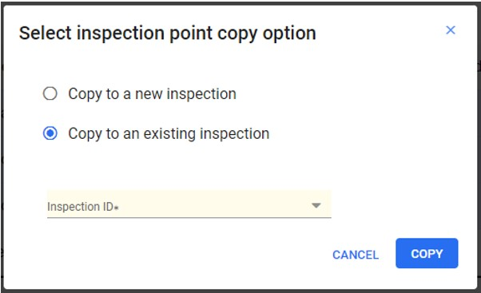

The application's **Inspection Definition** feature empowers you to:

  1. Define and configure inspections and inspection types.

  2. View inspection results

  3. Find inspection work orders.

  4. Capture results.

Menu path: Choose **Setup** > **Inspection Definition** in the navigation pane. The **Inspection Definition** window will open in a new tab.

The **Inspection Definition** search header includes the following fields to filter and search existing inspection definition:

Field Name | Description   
---|---  
Inspection ID | Enter the inspection ID
Description | Enter a description for the inspection 
Types  | Select the type of inspection from the drop-down menu
Equipment | Enter the name of the equipment or click the Search icon, search for, and select the Equipment, and then click the Select button
Point Equipment | Enter the name of the point equipment or click the Search icon, search for, and select the Point Equipment, and then click the Select button.  
  
**Inspection Definition Grid**

  * The grid result displays a list of inspections that match the selection criteria. The **Inspection Definition** grid consists of the following columns: **Inspection ID** , **Type** , **Description** , **Active** , and **Status**.

  * The **Inspection ID** number is a hyperlink. Clicking on the hyperlink will open the **Inspection Definition** details in the right-side contextual panel. Double-clicking on the row in the grid will open the details in a new tab.

  * The inspection can have **Assigned** , **Unassigned** or **Deactivated** status.

## Action Bar

Select an inspection from the grid result to 
enable all the buttons in the action bar.

Action Button|Function  
---|---  
[New](#new)| Enables to create a new inspection.  
[Create Via Copy](#create-via-copy) | Enables you to create a new inspection by duplicating an existing one.  
[Deactivate](#deactivate)| Enables you to inactivate an inspection.  
[Preview](#preview) | Enables you to preview an inspection.  
[Export](#export) | Enables you to export the inspection definition data in Excel format.  
  
### New

Enables you to create and edit a new inspection definition.

  1. Choose **Setup** > **Inspection Definition** in the navigation pane.

  2. Click the **New** button from the action bar. This action opens the **Create Inspection Definition** window in a new tab. This tab has three sub tabs: **[Definition Tab](#definition-tab)** , **[Points Tab](#points-tab)** , and **[Equipment Tab](#equipment-tab)**. By default, the **Definition** tab opens. Once the required fields are filled and the inspection is created, the remaining two tabs will be enabled.

#### **Definition Tab**

Enables you to define and create a definition for the inspection.

  1. The Definition tab consists of four cards: Header, Instruction, Definition Fields, and Material Requirement. Fill in the required data in the following fields:

        Card  | Field | Description  
        ---|---|---  
        Header  | Inspection Id | Once the inspection is created, the ID is auto-generated.   
        | |Inspection Description |  Enter the description for the inspection. **Note:** This field is mandatory.   
        || Inspection Type |  This validation code is used to categorize Inspection definitions. The two default options available are - Inspection and Calibration. From the drop-down, select the type of Inspection.  **Note:** This field is mandatory.  **Note**  The types of code can be defined by Validation Codes.  
        || Expiration frequency Days  |  It specifies the number of days after which the inspection expires. It also helps in periodic inspections for maintaining equipment condition. Enter the number of days in the field or click the **Up** and **Down** arrow to set the value.  **Note:** This field is not mandatory.  
        || Standard Request | Enter the **Standard Request ID** or click the **Search** icon, search for, and select the work order, and then click the Select button. This field would be used to create an automatic follow-up work order upon a failed inspection   
        Instruction  | Instruction | Enter any instructions that must be followed while performing the inspection.  
        Definition Fields  | Add |  This is a custom field; users can add additional fields that would be visible in the form while completing the inspection. <ol> <li> To add a field, click the **Add** button; the **Add Field** grid expands below the card.</li> <li> Enter the required data in the fields and click **Add**. Both **Field** and **Field Label** are mandatory entries.</li> <li> Click **Add Another** to add a new field.</li></ol>   
        Material Requirement  | Material Requirements | Enter the name of the materials required during the inspection.   
  
  2. Click **Create**.  The Inspection ID will be auto-generated, and all four cards with the entered data will be displayed on the screen with the **Edit** button. The created inspection definition will be listed in the **Inspection Definition** grid result.

  3. Only inspections with defined points will be available for users to associate with a work order.

  4. To edit the entered data, click the **Edit** button, make the required changes, and click **Save**.

      >[!Note]  
      >You can edit an inspection definition only when its status is **Unassigned**. Inspection definitions that are **Assigned** or **Deactivated** cannot be edited.

#### **Points Tab**

Enables you to define the points. An inspection can have an unlimited number of points. Points can be **Numeric, Text, Boolean or Validated List.**

The Point tab grid consists of the following columns: **Order, Label, Description, Equipment, Serial ID, Standard Request,** and **Value Data Type** . The header of the point tab has the following action button: **[New](#new)**, **[Edit](#edit)**, **[View](#view)**, and **[Delete](#delete)**, **[Copy Point](#copy-point)**.

##### **New**

Enables you to add a new point.

  1. Click the **New** button, the **Points Details** panel opens below the grid and consists of three sections: **Point Definition, Point Meta data, and Point Column.**

  2. **Point Definition** : Enables you to define the points. Fill in the required fields:

      Section | Field | Description  
      ---|---|---  
      Point Definition | Label | Can be used as the heading for the points created. Enter the name of the label.   
      || Description  | Describe the point in one or more sentences. This is a mandatory field.  
      | |Value Data Type |  Select one of the options from the drop-down: <ul> <li> b-Boolean </li> <li>l-Validated List</li><li>n-Numeric </li><li>t-Text This is a mandatory field.</li></ul>
      | | Value Units  | Enter the value.   
      | |Category  | Enter the category name.   
      | | Standard Request  |  Enter the Standard Request ID or click the **Search** icon, search for and select the Standard Request type of work order, and then click the **Select** button. This field would be used to create an automatic follow up work order upon a failed inspection point.   **Note:** If there is an equipment attached to a failed inspection point, then the follow up work order is created with this equipment. If no equipment is present at failed inspection point, then the follow up work order is created with the work order's equipment.  
      || Required Flag | The required flag is a toggle button. When enabled during the inspection, it designates the point as mandatory for performing the inspection.  
      | |Equipment |  Enter the Equipment or click the **Search** icon, search for and select the required equipment, and then click the **Select** button. This field is used to attach an equipment at every inspection point.  **Note**  The serial installed with the selected equipment is auto populated.  
      | |Serial |  Enter the Serial or click the **Search** icon, search for and select the required Serial ID and then click the **Select** button. This field is used to attach a serial ID at every inspection point. The equipment installed with the selected serial ID is auto populated.  **Note:** When a Serial ID is entered, the equipment with the serial ID is populated on the screen. If no equipment is installed, an error prompt pops up - *"SerialNotInstalled: The selected serial is not installed on a piece of equipment. Select a serial installed on an equipment.*"  
  
  3. **Point Meta Data** : This section enables users to set additional criteria for a point. The header consists of three fields: **Meta type, Meta Subtype, and Meta Value.**

      The Meta Type is a dynamic field that depends on the selected Value Data Type.
      The applicable metadata types will appear in the respective drop-down menu.
      These types include:

        * b-Boolean: Default

        * l-Validated List: Valid value, Default

        * n-Numeric: Tolerance, Tolerance %, Limit, Precision, Desired, Default

        * t-Text: Default

        Meta Type  | Meta Subtype | Meta Value  
        ---|---|---  
        Tolerance  |  Possible Values: High, Low  |  Allows users to set higher and lower limits for a numeric field. If the value is outside this range, it indicates(failure) the result is out of tolerance.   Example: High -100 and Low- 20.  
        Tolerance %  | Possible Values: High, Low  |  Allows users to set higher and lower limits for a numeric field. If the value is outside this range, it indicates(failure) the result is out of tolerance. It uses percentage values to define the acceptable range.   Example: High -30% and Low -5%  
        Limit  | Possible Values: High, Low |  Sets the maximum (high) and minimum (low) allowable values for a field. Values entered beyond these limits are automatically adjusted to the nearest limit.  
        Precision  |  The field will be disabled.  |  Defines the number of decimal places for a numeric field, ensuring values are recorded with the specified precision.  You can set the desired values.    Example: A precision of two decimal places in a numeric field would mean that the users can specify a value up to two digits after the decimal point.  
        Desired  | You can enter the desired value  |  Specifies a target value for a field, serving as a reference for expected results.   You can set the desired values.   
        Valid Value  | You can enter the value  |  Lists acceptable values for a field. Possible Values are: <ul> <li> Does not imply failure</li> <li> Implies failure. </li></ul>  
        Default  | You can enter the default value |  Provides a pre-set value for a field, which can be modified by the user if needed The field will be disabled.  
          
        >[!Note]  
        >Limit, Tolerance, and Tolerance % values will be enforced on results entry.

  4. To add the Meta Data, click the **Add** button; one row with three columns will be added under the header.

  5. Each field will have a drop-down for possible meta type and meta subtype if applicable. To add possible meta types, double click on the column; the drop-down menu opens, select the desired meta type, and click to add. Wherever applicable users can enter the value. Refer to the table above.

  6. To delete a Point Meta Data, select a row and click **Delete.**

  7. Point Columns: This section enables users to set additional criteria for a point. The header consists of three fields **Order, Column code, and Implies Failure Flag.**

      Section  | Field | Description  
      ---|---|---  
      Point Column | Order | Enables you to rearrange the column code. To do so, select the column code and click the **Up** and **Down** arrow as required to rearrange.  
      | |Column Code | It’s a mandatory field, you can enter the data.  
      || Implies Failure Flag | **Implies Failure** is a check box to set a column capable of implying failure. Example: for a Calibration, the "As Found" column would not imply failure, but the "As Left" column would. The field is recognized as failed only when this flag is set, and the data is in a failure status due to being out of tolerance or a valid value flagged as causing failure.  
        
  8. To delete a Point Column, select a row and then click **Delete**.

  9. Once all the fields from the sections **Point Definition, Point Meta Data, and Point Column** are filled, scroll up, and click the **Save** button in the **Point Details** header. The created Points will be added to Grid Result.

##### **Edit**

To edit the points, select the desired point and click **Edit** ; the **Point
Details** grid expands below. Make the required changes and then click
**Save**.

>[!Note]  
>You can’t edit any tabs when an inspection is assigned to a work order or when it is deactivated.

##### **View**

To view a point, select the desired point; the Point Details grid expands below, displaying the entered data in the fields.

##### **Delete**

To delete a point, select the desired point, click Delete, a Confirm Delete alert prompt opens. Click **Delete** to remove the point.

##### **Copy Point**

To Copy Point, follow the below steps:

1. Select one or many inspection points in the **Points tab**.

2. Click **Copy Point**.  
The **Select inspection point copy option** dialog box appears with the following options:
    * **Copy to a new inspection**: Select this to copy the points to a new inspection.
    * **Copy to an existing inspection**: Select this to copy the points to an already existing inspection.  
    If selected, enter the required **Inspection ID** using the drop-down list. The drop-down list consists of only unassigned inspections. 

3. Click **Copy** to complete the action

    

    >[!Note]  
    The **Copy Point** option copies all the information including **Equipment** and **Standard request**. User can retain or change this information as required. 

    >[!Note]  
    Only the **Equipment** and **SRs** listed in the points are copied, excluding the headers. 

#### **Equipment Tab**

Enables you to link equipment and/or serial to the inspection. Once equipment/serial is linked to an inspection, that inspection can then be added to work orders with any of the equipment/serial that have been associated with the inspection.

  1. To do so, switch to the **Equipment** tab, which has two cards: **Assigned Equipment and Assigned Serial.**

  2. To link an equipment, click the **Link** button on the **Assigned Equipment** header. The **Equipment Search** grid opens. Enter the required data in the search fields and click **Search**. The grid result will display a list of equipment matching the selection criteria. Select one or more equipment from the grid result and click **Link**.

  3. To delete a linked equipment, select an equipment and click **Remove** ; an **ICRemoveLinkEQ** alert prompt opens; click **YES** to unlink the equipment.

  4. To link to a serial, click the **Link** button on the **Assigned Serial** header. The **Serial Search** grid opens. Enter the required data in the search fields and click **Search**. The grid result will display a list of serials matching the selection criteria. Select one or more **Serial** from the grid result and click **Link.**

  5. To delete a linked serial, select a serial and click **Remove**; an **ICRemoveLinkSer** alert prompt opens; click **YES** to unlink the serial.

      >[!Note]  
      >If no equipment or serial is associated with the inspection, it means that
this inspection is available to be selected when creating a Work Order for all
equipment.

### Create Via Copy

Enables users to create a new inspection definition by copying the existing
one.

  1. Choose **Setup** > **Inspection Definition** in the navigation pane.

  2. Search for and select the **Inspection Definition** from the grid result.

  3. Click **Create Via Copy** from the action bar. The **Create Inspection Definition** opens in a new tab.

  4. Click **Create**. By default, all the data except from the equipment tab will be copied. Users can edit if required. To link the equipment, refer to the [Equipment Tab](#equipment-tab).

      >[!Note] 
      >The Create Via Copy button is enabled when only one Inspection definition is selected from the grid result. The inspection module comes with one sample inspection and one sample calibration that users can use as a reference for how to perform tasks or as a template to copy from when creating their own.

      >[!Note]  
      >Once an inspection is attached to a Workorder, the same **Inspection definition** can't be edited. However, a new **Inspection definition** can be created using the 'Create via Copy' Option.

### Deactivate

Enables you to inactivate the inspection definition.

  1. Choose **Setup** > **Inspection Definition** in the navigation pane.

  2. Search for and select the **Inspection Definition** from the grid result.

  3. Click **Deactivate** from the action bar, **ConfirmICDeactivate** alert prompt opens; click **YES** to deactivate the inspection

      >[!Note] 
      >Once deactivated, the inspection definition can’t be assigned to a work order, or users can’t modify or edit the definition.

### Preview

This feature enables users to preview the definitions they create, providing a clear visualization of the Inspection layout. Given the numerous sections involved in an inspection, this preview functionality helps ensuring the layout meets the user's exact specifications.

### Export

Enables you to export the grid data.

  1. Choose **Setup** > **Inspection Definition** in the navigation pane.

  2. Click **Export**. The entire grid data will be saved and downloaded as an Excel sheet.

      >[!Note]  
      >If more than one definition is selected from the grid result, the Create Via Copy and Deactivate buttons will be disabled. Actions such as Create Via Copy and Deactivate can also be performed using the More Action button in the Inspection definition header. Users can add types of inspection through the validation code screen using code ‘Inspection Type’; once done, these inspection types will be reflected in the inspection type drop-down.

## Contextual Panel

In the **Inspection Definition** grid result, select an **Inspection definition** to enable the icons in the **Contextual Panel**.

### **Details**

You can view and edit the inspection definition.

  1. Choose **Setup** > **Inspection Definition** in the navigation pane.

  2. Search for and select the **Inspection Definition** from the grid result.

  3. Click the **Details** icon in the contextual panel.

     * A **Details** window opens and has three sub tabs: **Definition** , **Points** , and **Equipment**.

  4. Click the **Edit** button and make the required changes. Refer to the [Definition Tab](#definition-tab), [Points Tab](#definition-tab), and [Equipment Tab](#equipment-tab).

      >[!Note]  
      >You cannot edit an inspection when it is assigned to a work order or when it is deactivated. An **Alert prompt** will display if attempting to open an assigned inspection using the **Details** icon in the contextual panel.

### **Inspection Results**

You can view the results of **Inspection** from the contextual panel in the **Work Order, Equipment, Serial, and Employee Modules.** See [Inspection Results](#inspection-results).

 >[!Note]  
 >Follow-up Work Orders will be created for all the failed inspections.

