The feature enables the user to configure the messages and UI labels for the
selected language. On selecting Navigation > Language, you can view the below screen with the mentioned headers:

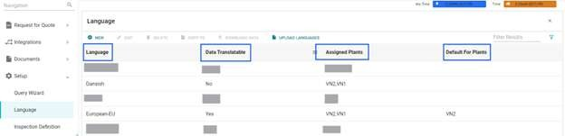

Language | It provides the unique language name for the user to identify   
---|---  
Data Translatable | It shows if data translation is applicable for the selected language  
Assigned Plants | It shows the plants for which the selected language is applied   
Default for Plants |  It shows the plants for which the selected language is set as default  <ul> <li> When a user logs in, if the user language is set, then the user shall be using the application in the user language.</li> <li> When a user logs in, if the user language is not set, then the user shall be using the application in plant level language.</li> <li> When a user logs in, if neither user language nor plant language is set, then the user shall be using the application in default language (American English).</li> **Note**: If translations are missing for labels/data in the user language, you shall view the translations in either the Plant language or default language (American English).  
  
The grid shows all the language that the user is authorized to see along with
Base language data delivered out of box such as ‘Dutch-EAM-Plant’, ‘German-
EAM-Plant’ and so on. The general format is "language-EAM-Plant", and the user
can replace 'language' with the required language, to check if the base
language data is available . The user cannot modify/ upload any data for the
Base language; however, they can download the Base language data and use them
to make changes to their existing/ new language.

You can use the contextual icons to perform the following actions:

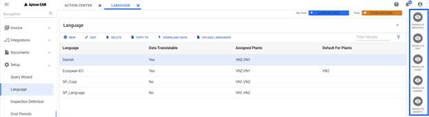

  * **TRANSLATE TEXT** : After selecting a language, the user can click **TRANSLATE TEXT** to add the translation text. From the language translation table, the user can enter the Translated Text and the Translated Help Text, with respect to Text Ids. Click [here](#to-translate-text) to know how to translate text.

  * **TRANSLATE MESSAGE** : After selecting a language, the user can click **TRANSLATE MESSAGE** to add the translation text for the messages. The user can enter the translated text with respect to each message. Click [here](#to-translate-messages) to know how to translate message.

  * **TRANSLATE CODE**: After selecting a language, the user can click **TRANSLATE CODE** to add the translation text for the codes. The user can enter the translated text with respect to each code. Click [here](#to-translate-code) to know how to translate code.

  * **TRANSLATE QUERIES** : The list consists of all Public Queries of user logged in plant. After selecting a language, the user can click **TRANSLATE QUERIES** to add the translation for queries. Click [here](#to-translate-queries) to know how to translate queries.

  * **TRANSLATE WIDGETS** : The list consists of all sys widgets. After selecting a language, the user can click **TRANSLATE WIDGETS** to add the translation for widgets. Click [here](#to-translate-widgets) to know how to translate widgets.

When you select a language, the following fields are enabled on the grid:

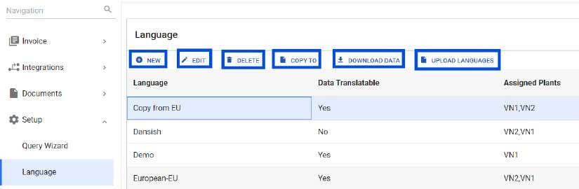

**Field** | **Description**  
---|---  
NEW | You can add a new language. Click [here](#to-add-a-new-language) to know how to add a new language.   
EDIT | You can edit the selected language. Click [here](#to-edit) to know how to edit the language.  
DELETE | You can delete selected the language Click [here](#to-delete-a-language) to know how to delete the language.   
COPY TO | You can copy the selected language data. Click [here](#to-copy-to) to know how to copy the language.  
DOWNLOAD DATA | You can download the selected language data. Click [here](#to-download-data) to know how to download data.  
UPLOAD LANGUAGES | You can upload the language data. Click [here](#to-upload-languages) to know how to upload data.  
  

### **To Add a New Language**

  1. From the header click, **NEW**. 
      The Add New Language section appears.

  2. In the Language field, enter the language name.

  3. In the Assigned Plants field, enter the plant code to which you want to assign this newly created language. As this is a mandatory field, you must enter at least one plant code.

  4. The Copy from Language field enables the user to copy the data from an already existing language.

  5. The Set Default for Plants field enables the user to set the selected language as default for a particular plant.

  6. Turning ON the **DATA TRANSLATABLE** button enables the user to add translation for the selected language. Once translation is enabled by the user, all the validation code description, query description and module description will show the translated data (if available) instead of default data.

  7. Click **ADD**. The language will be added to the Language list.

### **To Edit**

  1. From the header on clicking **EDIT** , the Edit Language for section appears.

  2. The Language field shows the language selected by you. This is a read only option.

  3. The Assigned Plants field allows you to choose from the plant options available. It also shows you the plants that are already assigned with the selected language. You can add/ remove the plants as required.

  4. Data Translatable button: Refer: *To Add a New Language*.

  5. The Set Default for Plants field enables you to set the language as default for a particular plant. You can also remove the plants for which the selected language was set as default and add new plants as required.

  6. Click Save.

### **To Delete a Language**

  1. Click **DELETE**, the confirm delete pop-up appears.

  2. Click **Delete** to complete the action.

### **To COPY TO**

This option enables you to override the existing language data with a base language or any existing language, if required.

  1. From the header on clicking **COPY TO**, the Copy from Language section appears.

  2. You can choose from the existing languages to make a copy.

  3. You can also choose to copy the Messages and Labels, by checking the boxes.

  4. Click **COPY**.   You will see a warning prompt with the message “*All the existing data would be overridden. Are you sure you want to proceed?*”. 
  5. Click **YES**, to successfully copy the data.

  5. Click **OK** at the “Data copied successfully” prompt to complete the action.

### **To DOWNLOAD DATA**

The Download Data option allows you to select a single language from grid, download an excel sheet having four sheets: “Labels”, “Messages”, “Code Translations” and “Query Translations”. The user is allowed to only change the translated text and translated help text column in the excel sheet.

**Labels** : All the column headers, title and button names used in the system are shown and can be translated.

**Messages** : All the information, warning and error messages used in the system are shown and can be translated.

**Code Translations** : All the validations code (used by the system and modifiable by the user) are shown and can be translated.

**Query Translations** : All the queries (System defined, delivered by default and user created) description are shown and can be translated.

### **To UPLOAD LANGUAGES**

The **Upload Data** option allows you to upload the excel sheet having the language data. The format should be the same as the one provided during download operation. The input file can have two statuses- **Update** and **Delete**. Only the records which have status entered will be processed and the remaining ones will be ignored. The steps to upload are as follows:

  1. Select the language and click **DOWNLOAD DATA** to download the Excel file.

  2. Make the necessary changes in one/ many rows in the excel sheet. Ensure to add status info in the status column.

  3. Save and close the excel sheet.
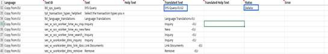

  4. On the header, click **UPLOAD LANGUAGES** , choose the path for the excel sheet and click UPLOAD in the “Upload Languages” pop-up panel.

      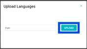
      
      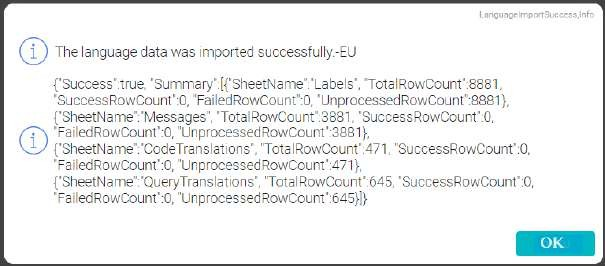

  5. Once the file is uploaded by the user, there is a processing time, and an info prompt is opened.

  6. Click **OK** , the new result excel file (Result File Format: *Result_uploadedfilename_data*) is automatically downloaded for the user’s reference.

  2. The statuses of the file could be as follows:

      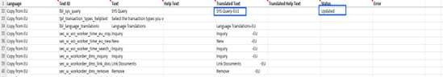

      * On successful update/ delete, the status column shows “**Updated/ Deleted** ” against the row.
 

      * In case of failure, the status column shows “**Failed** ” along with the error message in the “Error” column. The reasons for failure could be:

        * Plant doesn’t exist.

        * Language doesn’t exist.

        * Textid is incorrect.

      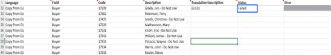

### To TRANSLATE TEXT

To Translate Text, select any language from the options and click **Translate
Text** from the Contextual Pane to open the grid as shown below.

  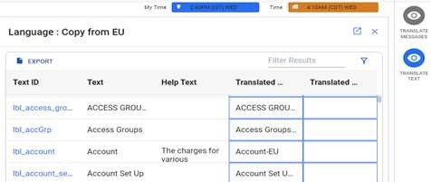

**EXPORT** : This button allows you to download the Excel file of the selected language for easy usage.

The grid consists of the following fields:

**Text ID:** It is a unique identification code. This field is read only for the user. The prefix “btn” implies that it is a button, “lbl” implies it is a label or title, “sec” implies that is a security action, “win” implies that it is a window name.

**Text:** It provides the description for the selected Text ID. This field is read only for the user. The Text is shown in default system language i.e., American English.

**Help Text:** It provides the description of the Help Text associated with the selected Text ID. This field is read only for the user. The Help Text is shown in default system language i.e., American English.

**Translated Text:** It shows the text in the selected language. You can change the Translated Text as required.

**Translated Help Text:** It shows the help text, in the selected language. You can change the Translated Help Text as required. The user can enter data in plain text or format it using options provided in the editor.

You can also make use of “Hyperlink” to add any required information or for easy navigation to the related page. There are two types of hyperlinks:

  * Internal hyper link (used within the system):

    When using the internal hyperlinks, the user can directly paste the required path without the **http://**. *Ex: /#eam/QueryWizard/Home.*

  * External Hyperlink:

    When using the external hyperlinks, the user must ensure that the complete path, with **http://** is used. Ex: *https://www.abcde.com.*

For the fields where hyperlink is used, when the you hover over the **Help Text** of that field in the application, and clicks on the link, you will be directed to that screen depending on the hyperlink used.

  1. For minor text editing, you can make necessary changes by clicking the blue cells. There is no explicit **SAVE** button for inline editing and the user can just exit from the cells, to save the changes.

  2. For major text editing, you can:

      1. Select the hyperlink (**Text ID**) to open the grid as a new page.

          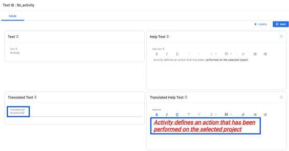

      2. Click **EDIT** to make the required changes in the Translated Text and the Translated Help Text fields.
    
      3. Click **SAVE** to complete the action.
            The Help Text for "Supervisor-EU" shows the default text.
          
          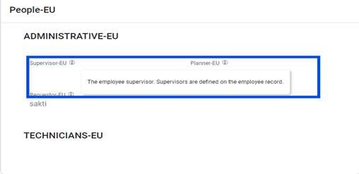

          The help text for "Supervisor-EU" shows the edited text.
          
          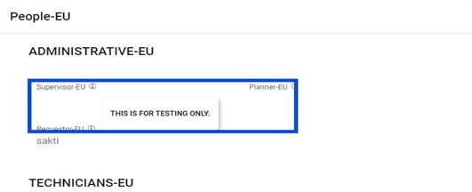

### To TRANSLATE MESSAGES

To Translate Message, select any language from the options and click **Translate
Message** from the Contextual Pane to open the grid as shown below:

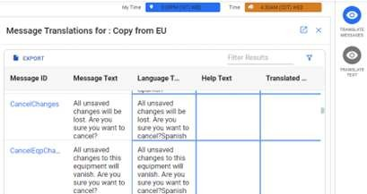

**EXPORT:** This button allows the user to download the Excel file of the selected language for easy usage.

The grid consists of the following fields:

**Message ID:** It is a unique identification code. This field is read only for the user.

**Message Text:** It provides the description for the selected Message ID. This field is read only for the user. The Message is shown in default language i.e., American English.

**Language Text:** It shows the message in the selected language. You can change the Language Text as required.

**Help Text:** It provides the description of the Help Text of the selected Message ID. This field is read only for the user. The Help Text is shown in default language i.e., American English.

**Translated Help Text:** It shows the help text, in the selected language. You can change/ add the Translated Help Text as required. The user can enter data in plain text or format it using options provided in the editor.

You can make use of “Hyperlink” to add any required information related to the message or for easy navigation to the related fields. There are two types of hyperlinks:

  * Internal hyper link (used within the platform):

    When using the internal hyperlinks, the user can directly paste the required path without the http:// prefix. *Ex: /#eam/QueryWizard/Home*

  * External Hyperlink: 

    When using the external hyperlinks, the user must ensure that the complete
path, with http:// is used. *Ex: https://www.abcde.com*

For the fields where hyperlink is used, when the user hovers over the Help
Text of that field in the application, and clicks on the link, user will be
directed to that screen depending on the hyperlink used.

  1. For minor text editing, the user can make necessary changes by clicking the blue cells. There is no explicit **SAVE** button for inline editing and the user can just exit from the cells, to save the changes.

  2. For major text editing, you can:

      1. Select the hyperlink (**Message ID**) to open the grid as a new page.

      2. Click **EDIT** to make the required changes in the Language Text and Translated Help Text fields.
        

          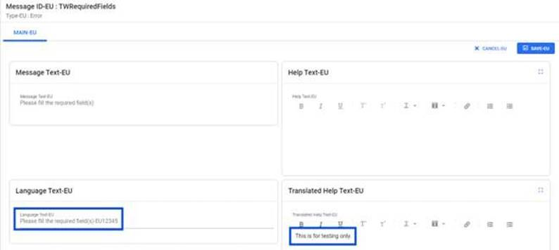

      3. Click **SAVE** to complete the action.

On hovering over the help text icon, it displays the edited text for the message.

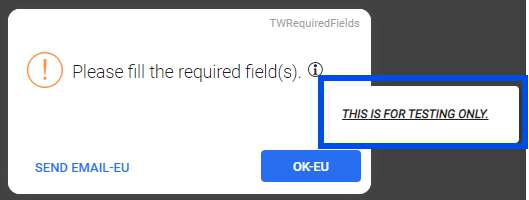

#### Additional Feature of TRANSLATE MESSAGES

**Variables:**

Certain **Message Text** and **Help Text** have the variables “@1 or @2 or both” attached to the messages. The user can use these variables to customize the messages. For example:

  1. When creating new equipment, if the variable is used, then the message consists of the exact equipment ID as shown below.

      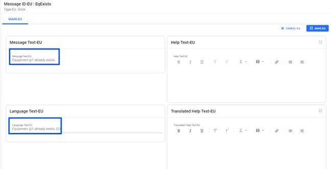

      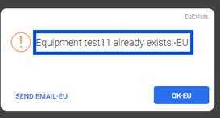

  2. When creating new equipment, if the variable is not used, then the message does not consist of the equipment ID as shown below.

        

      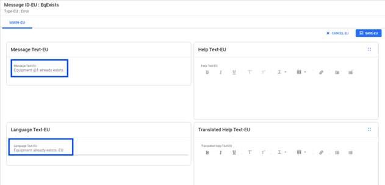

      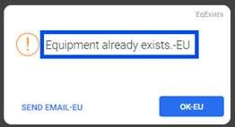
      
        >[!Note] You cannot add more/ or use other values as variables apart from the ones mentioned in the messages.

      >[!Note] It is recommended to use the variables mentioned in the messages.

### To TRANSLATE CODE

To Translate Code, select any language from the options and click **Translate Code** from the Contextual Pane to open the grid as shown below:

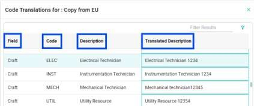

The grid consists of the following fields:

**Field** : The column lists various validation codes. This field is read only for the user.

**Code** : The column lists the codes used for the validation code. This field is read only for the user.

**Description** : The column provides the complete description of code. This field is read only for the user.

**Translated Description** : You can provide the necessary description in this field.

  1. Click on the cells to enter the required translation corresponding to the code.

  1. Exiting the cells automatically saves the translations without the need for an explicit Save button.

You can view the translated codes as shown below.

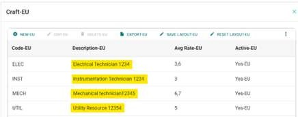

The code translations can be seen in all related modules. The below figure shows the translated description for codes in Work order module.

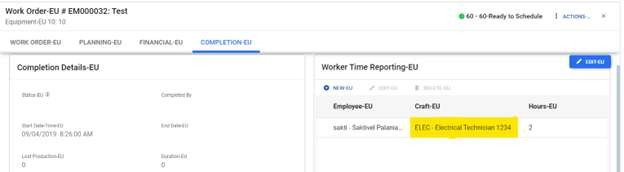

### To TRANSLATE QUERIES

To Translate Queries, select any language from the options and click
**Translate Queries** from the Contextual Pane to open the grid as shown
below.

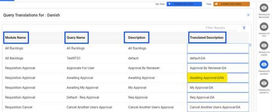

The grid consists of the following fields:

**Module Name** : It displays the module name. This field is read only for the user.

**Query Name** : It displays the query’s name. This field is read only for the user.

**Description** : It displays the description of the selected query. This field is read only for the user.

**Translated Description** : The user can provide the necessary description in this field.

  1. Click on the cells to enter the required translation corresponding to the module name.

  2. Exiting the cell automatically saves the translations without the need for an explicit Save button.

The system will display **Module Name** , **Query Name** and **Description**
in the language set by the user. If no language is set, it will default to the
language of the plant, or otherwise, to the system’s default language.

The user can view the translated query as shown below.

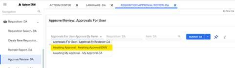

### To TRANSLATE WIDGETS

To Translate Widgets, select any language from the options and click
**Translate Widgets** from the Contextual Pane to open the grid as shown
below.

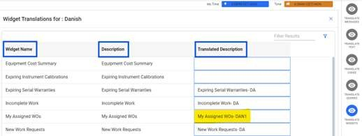

The grid consists of the following fields:

**Widget Name** : It displays the widget name. This field is read only for the user.

**Description** : It displays the description of the selected widget name. This field is read only for the user.

**Translated Description** : The user can provide the necessary description in this field.

  1. Click on the cells to enter the required translation corresponding to the widget name.

  2. Exiting the cell automatically saves the translations without the need for an explicit Save button.

      >[!Note]: The system will display **Description** in the language set by the user. If no
language is set, it will default to the language of the plant, or otherwise,
to the system’s default language.

You can view the translated widget on the dashboard as shown below.

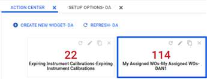

