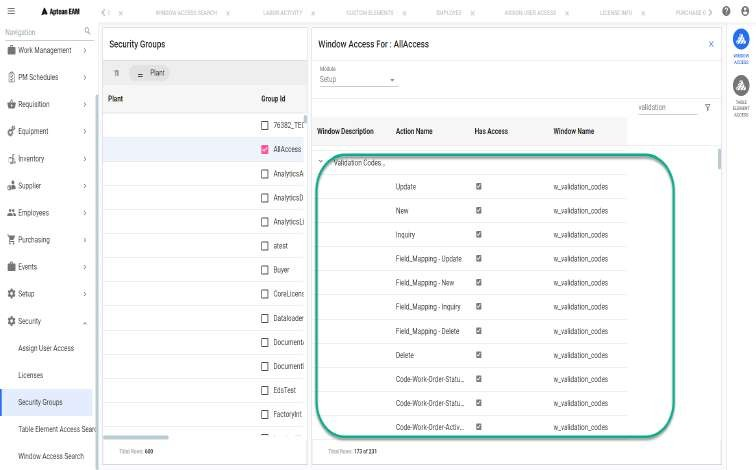

You must be granted the security access to use the Field Mapping Setup in Aptean EAM. The security access is defined in Xi.

Perform the following procedure to enable the Field Mapping Setup in Aptean
EAM

  1. Navigate to **Security > Security Groups**. 
  2. In the **Security Groups** pane, select the **Group ID** and click **WINDOW ACCESS**. The **Window Access For:** pane appears.

  3. In the **Module** field, select **Setup**.
  4. In the **Window / Action** area, in the **Validation Codes Valid Values** row, enable the **Has Access** check boxes for **Field_Mapping-Delete, Inquiry, New** and **Update** action. 

      The **Inquiry** check box selection is a must for the Field Mapping Setup to be available in the Aptean EAM application.

  5. Click **Apply**. 
  6. Repeat step to for all the groups that require access to Field Mapping Setup. 
  7. Click **OK**. 

The following table describes the security actions related to the field mapping setup.

Action | Action Description  
---|---  
Inquiry |  Allows you to access **Field Mapping Setup** in the navigation menu of Aptean EAM.    **[!Important]**: The **Inquiry** action selection is a must for other actions to work.   
New |  Allows you to add a new relationship.  It also enables the **Update** button in the right-side grid.   
Update |  Allows you to edit an existing relationship. Also, enables the **Update** button to define values for the field.   **[!Note]**: If the **Delete** action is not selected with the **Update** action and you edit an existing relationship, the system throws an error - **Does not have Mapping Delete access for plant.**  
Delete |  Allows you to delete a relationship.   
  
See Also [Field Mapping Setup](Field-Mapping-Setup.md)

