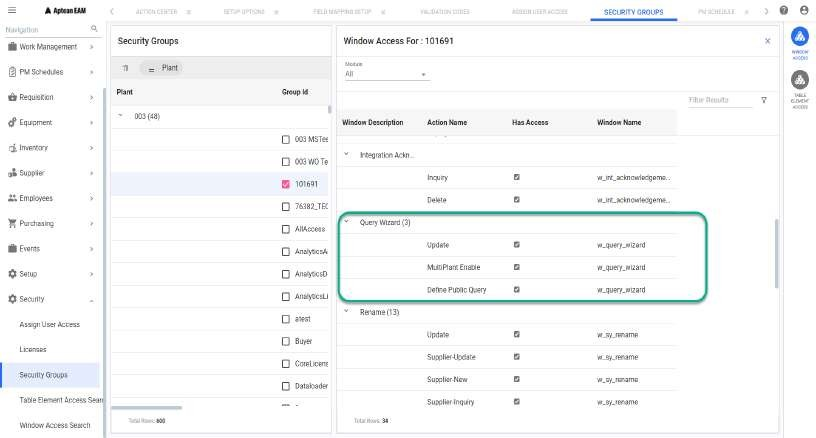

**Menu Path: Security > Security Groups**

The user must be granted the security access to use the Query Wizard in Aptean
EAM. The security access is defined in Xi.

  1. Navigate to **Security > Security Groups**. 
  2. In the Security Groups screen, select the user group of your plant and click **WINDOW ACCESS**.
  3. In the **Module** drop down menu, select **All**.
  4. In the **Window / Action** area, in the **Query Wizard** row, enable the **Has Access** check boxes for **Define Public Query** and **Update** action. 
  5. Click **Apply**. 
  6. Repeat step 2 to 5 for all the groups that require access to Query Wizard. 
  7. Click **OK**. 

  

The following table describes the security actions related to the query wizard:

Action | Action Description  
---|---  
Define Public Query |  Allows you to create public queries. Public queries can be accessed and utilized by all users in the application.  
Update |  Allows you to edit an existing query and update the changes.  
MultiPlant Enable  | Allows you to view the data of other plants for which the logged in user got access.  
  
See Also [Query Wizard](Query-Wizard.md)

