## SQL query

SQL queries are created to run and deliver the reports for a specific purpose, which were unable to deliver as part of the query wizard. Only the Aptean administrator will have the rights to create or delete SQL query; however, the customer administrator can view the details of the SQL queries such as SQL ID, SQL Type, Description, etc., created by the Aptean administrator.

### Creating a SQL query

To create a SQL query, perform the following:

  1. On the left pane, Click **Setup** and then **Setup Options**.

  2. On the **Setup Options** page, from the header click the **NEW SQL QUERY** button.

      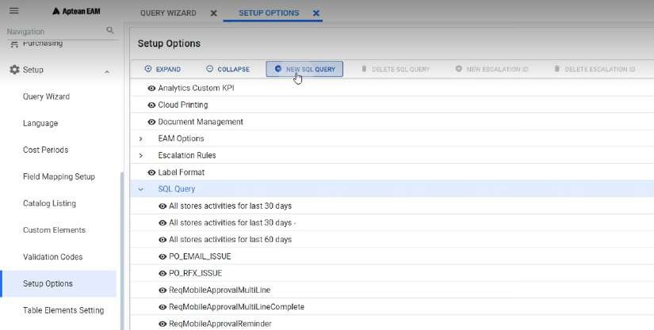

        The SQL Query page appears.

      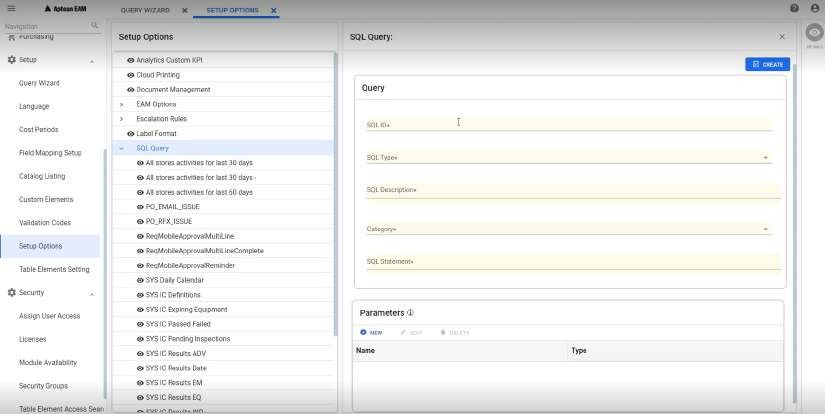

  3. In the **Query** section:
    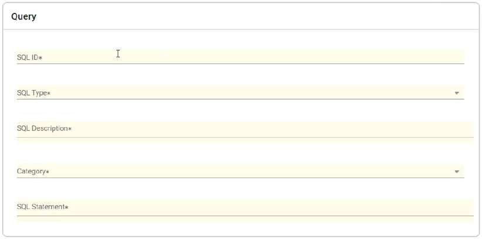
      1. In the **SQL ID** field enter a SQL ID for the query.
      2. From the **SQL Type** drop-down menu, select the SQL type.
      3. In the **SQL Description** field enter a description for the SQL query.
      4. From the **Category** drop-down menu, select the category for the query.
      5. In the **SQL Statement** field enter the query data.

  4. In the **Parameter** section:

      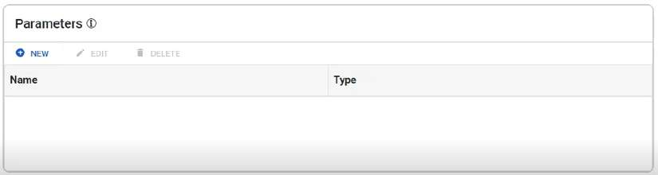

  5. Click the **NEW** button to define a parameter you assigned in the query.

      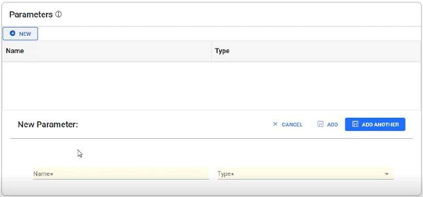

  6. In the **Name** field, enter the name of the parameter.

  7. From the **Type** drop-down menu, select the data type.

  8. Click the **ADD** button.

      >[!Note]  
      >Similarly, you can define multiple parameters using the **ADD ANOTHER** button.

  9. Click the **CREATE** button.

        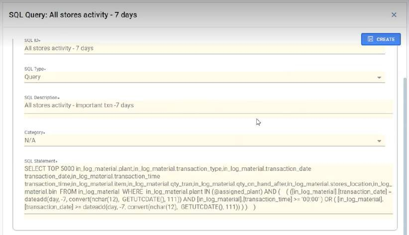

      The SQL query is created and listed in the **SQL Query** section in the left pane.

### Edit a SQL query

To edit a SQL query, perform the following:

  1. From the left pane, navigate **Setup** > **Setup Options**.

      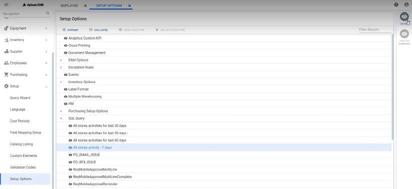

  2. From the **Setup Options** page, expand the **SQL Query** section and click the query you want to edit.

  3. From the right pane, click **Details**.

      The details of the SQL query appear.

      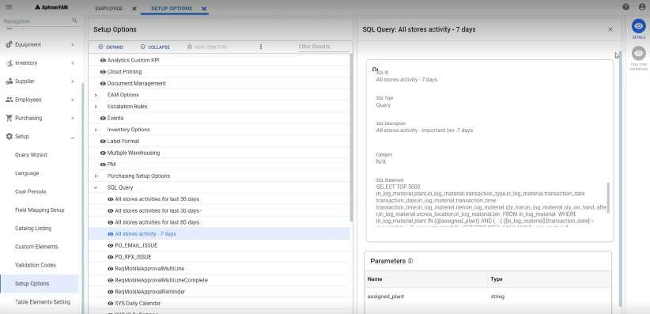

  4. Click the **Edit** button. Now you can edit the details of the query and parameters.

  5. Once you make the changes, click the **SAVE** button. 

      >[!Note]  
      >When you make changes to query Aptean EAM validates the query to check if it is used in any escalations. If the query is used in any escalations, then you cannot make any changes to it.

### Deleting a SQL query

To delete a SQL query, perform the following:

  1. From the left pane, navigate **Setup** > **Setup Options**.

      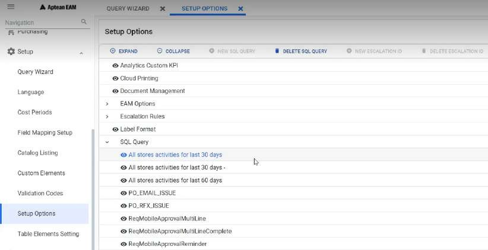

  2. From the **Setup Options** page, expand the **SQL Query** section and then click the query you want to delete.

  3. From the header, click the **DELETE SQL QUERY** button.

      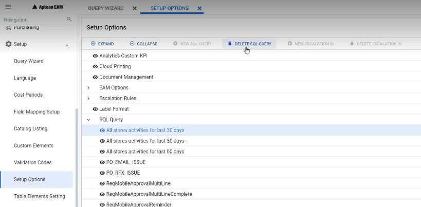

## Escalation rules

The escalation rules handle the usage of SQL query, limitation of data, and format that sent through an email. Only the Aptean administrator will have the rights to create or delete the escalation rules; however, the customer administrator can view and edit the details of the escalation rules, such as Escalation ID, SQL ID, Massage Body, etc., created by the Aptean
administrator.

### Creating Escalation rules

To create Escalation rules, perform the following:

  1. From the left pane, navigate **Setup** > **Setup Options**.

  2. From the **Setup Options** page, from the header click the **NEW ESCALATION ID** button.

      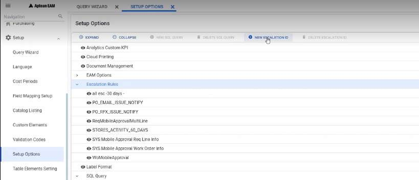

       The **Escalation Rule** page appears.

       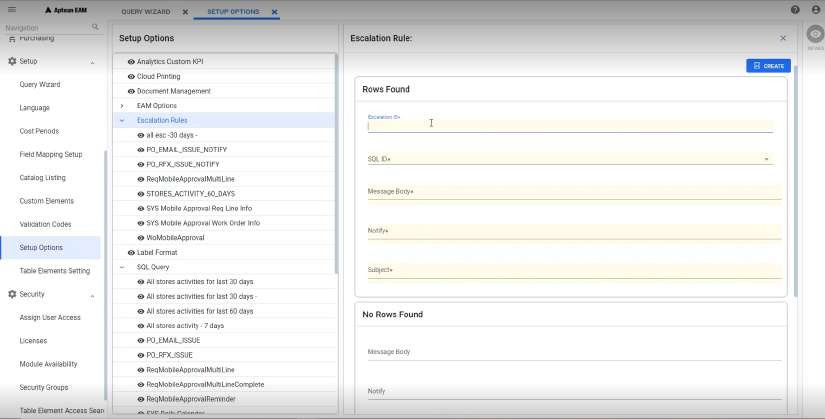

  3. In the **Rows Found** section:

      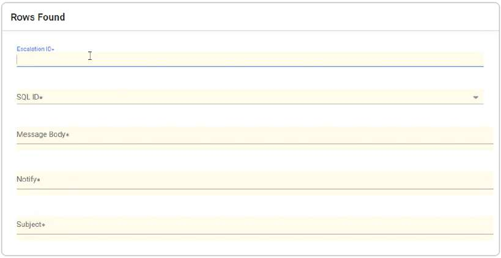

      1. In the **Escalation ID** field enter a name for the escalation rule.
      2. From the **SQL ID** drop-down menu, select the SQL ID for which you want to create the escalation rule.
      3. In the **Message Body** field enter a message that needs to be sent to the user.
      4. In the **Notify** field, enter the email Id of the user to whom you want to notify.
      5. In the **Subject** field, enter the subject for the email.
      6. In the **SQL Statement** field enter the query data.
  4. In the **No Rows Found** section:

        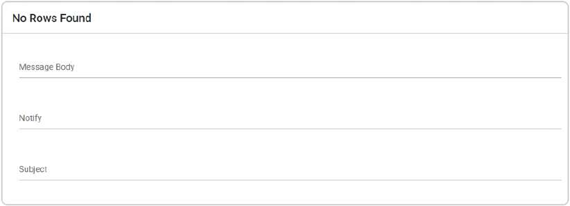

        1. In the **Message Body** field enter a message that needs to be sent when no rows were found.

        2. In the **Notify** field, enter the email Id of the user to whom you want to notify.

        3. In the **Subject** field, enter the subject for the email.

  5. In the **Parameters** section, the parameter used in the SQL query appears:

      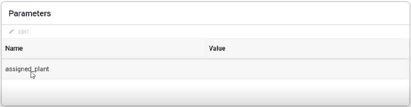

      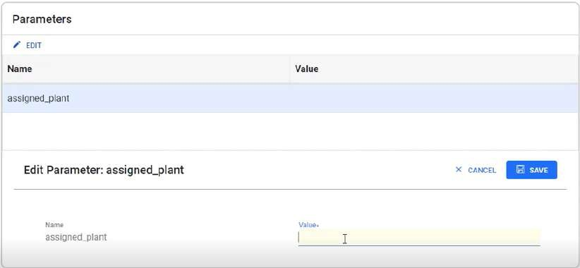

      1. To add a value to the parameter, click the **EDIT** button and enter a value in the **Value** field for the respective parameters.

      2. Click **SAVE** to save the value.

  6. Click the **CREATE** button.
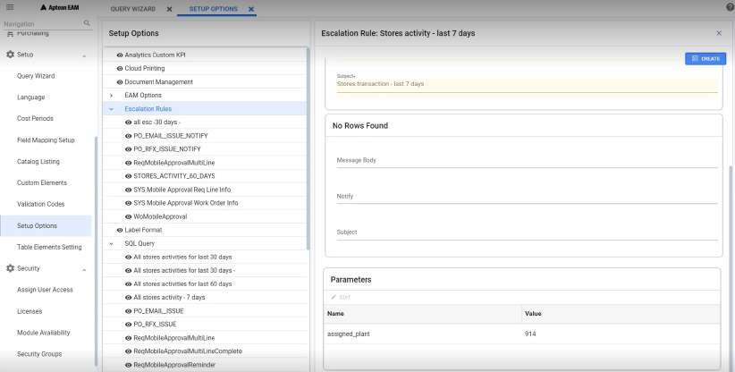
   The escalation rule is created and listed in the **Escalation Rules** section   in the left pane.

### Edit Escalation Rules

To edit escalation rules, perform the following:

  1. From the left pane,  navigate to **Click Setup** > **Setup Options**.

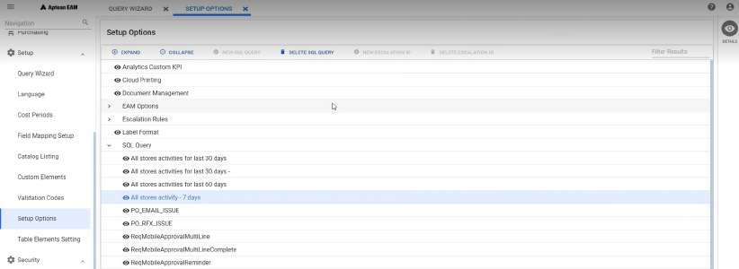

  2. From the **Setup Options** page, expand the **Escalation Rules** section and click the escalation rule you want to edit.

  3. From the right pane, click **Details**.

      The details of the Escalation rules appear.

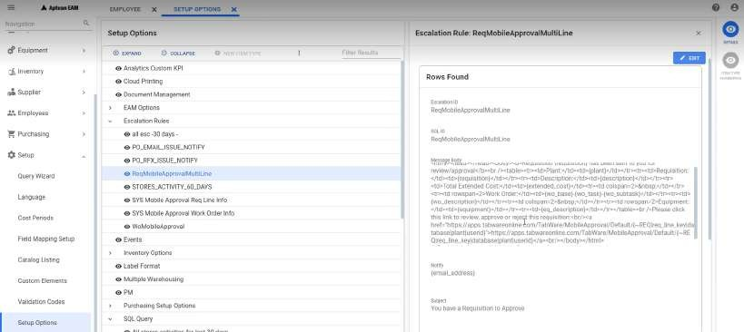  
  4. Click the **Edit** button. Now you can edit the details of the escalation rule.

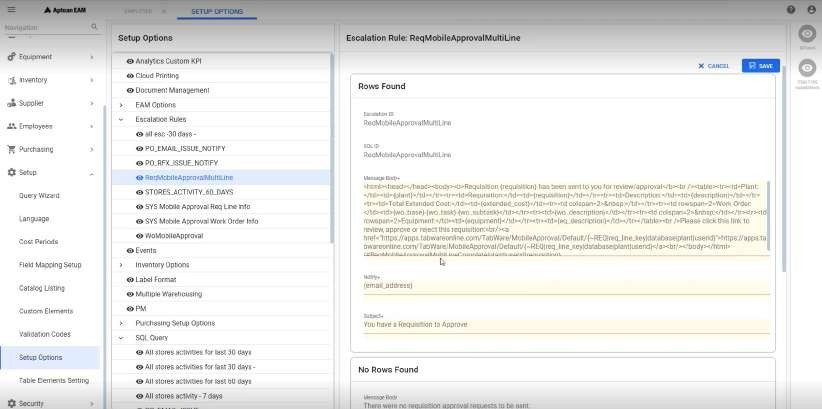

  5. Once you make the changes, click the **SAVE** button. 

      >[!Note]  
      >When you make changes to query Aptean EAM validates the query to check if it is used in any escalations. If the query is used in any escalations, then you cannot make any changes to it.

### Deleting Escalation Rule

To delete an Escalation rule, perform the following:

  1. On the left pane, navigate to **Setup** > **Setup Options**.

  2. On  the **Setup Options** page, expand the **Escalation Rules** section and click the Escalation ID you want to delete.

      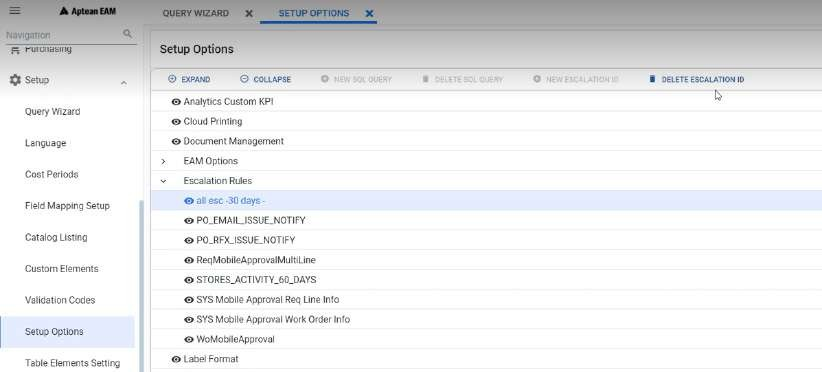
  3. From the header, click the **DELETE ESCALATION ID** button.

## EAM Options

This section provides the EAM Options configuration.

### Copy Awarded Bid Values to Unapproved Requisition Lines

Menu Path: Setup > Setup Options > EAM Options > Purchasing > Copy Awarded Bid
Values to Unapproved Requisition Lines

By default this option is set to Yes, to copy the awarded bid values to unapproved requisition lines, to sync the values in RFQ and Requisition. When it is set to NO, the respective error/warning message will be displayed.

### Protect Requested Qty when line is on an RFQ or Emergency Awarded

Path: Setup > Setup Options > EAM Options > Requisition > Protect Requested Qty when line is on an RFQ or Emergency Awarded

Set this option to Yes, to avoid changing the quantity, once a requisition line has been transferred to RFQ, else set this option to No.

### Merge all suppliers on one RFQ to be printed in one tab

Path: Setup > Setup Options > EAM Options > RFQ > Merge all suppliers on one RFQ to be printed in one tab

Set this option to **Yes**, to merge and print all the supplier on one RFQ in one document, else set this option to No.

### Drop-down Display settings for sycode fields

An option where the user can see the drop-down fields has been newly added.

Path: Setup > Setup Options > EAM options > Settings > Drop-down Display settings. The user can choose from the following Plant Override options:

  * Both

  * Code

  * Description

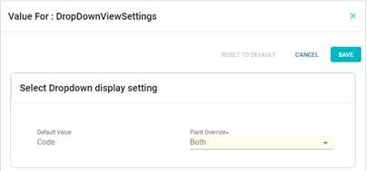

On selecting **Both**, you can see code with the description.

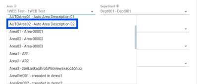

### Display settings for Validation codes

An option where you can see the drop-down fields has been newly added.

Menu Path: Setup > Setup Options > EAM options > Settings > Display settings for Validation codes in Grids. The user can choose from the following Plant
Override options:

  * Both

  * Code

  * Description

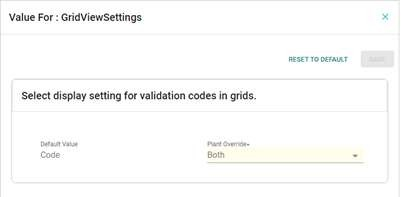

On selecting Both, the user can see code with the description.

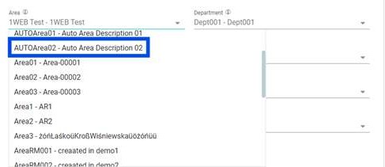

### Query drop-down Display settings

An option where the user can see the drop-down fields has been newly added.

Menu Path: Setup > Setup Options > EAM options > Settings > Query drop-down Display
settings. The user can choose from the following Plant Override options:

  * Both

  * Code

  * Description

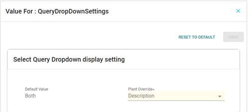

On selecting Description, the user can see only the description of the selected code.

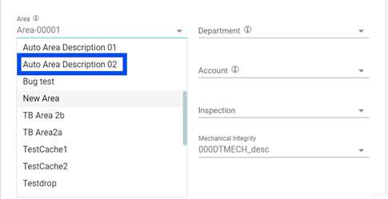

### Widget Display Setting

An option where the user can see the drop-down fields for widgets has been added.

Menu Path: Setup > Setup Options > EAM options > Settings > Select Widget display
setting. You can choose from the following Plant Override options:

  * See both code & description on widget.

  * See only code on widget.

  * See only the description on widget.

When “See only code on widget” is selected, the dashboard display is as shown below.

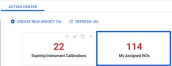

When “See both code & description on widget” is selected, the dashboard display is as shown below.

### Field for Shift Log Zone Setting

An option where the user can see the drop-down fields for Shift log Zone has been added.

Path: Setup > Setup Options > EAM options > Events > Field for Shift Log Zone.

  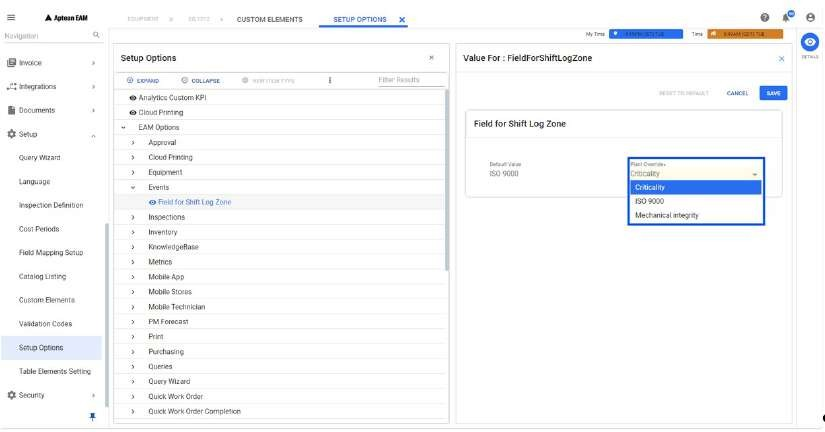

The **Default Value: ISO 9000** field is read only for the user.

  >[!Note]  Only Admins have access to change the **Default value**.

You can choose from the following Plant Override options:

  * Criticality.

  * ISO 9000.

  * Mechanical integrity.

When “Criticality” is selected, the user can view the change in Event Details as shown below.

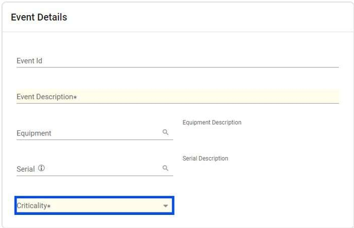

When “ISO 9000” is selected, the user can view the change in Event Details as shown below.

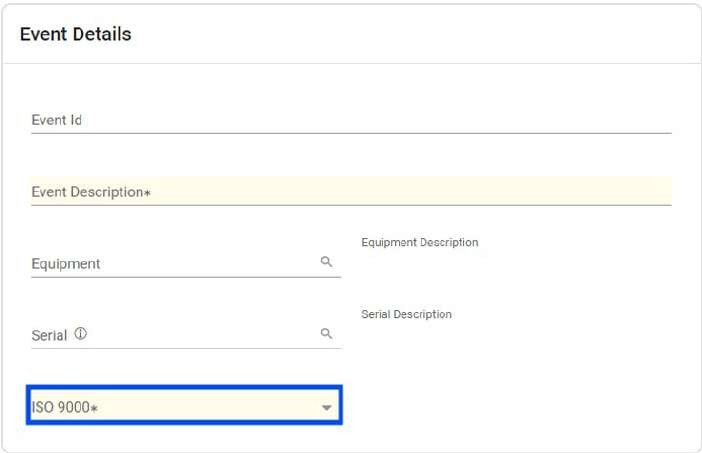

>[!Note]  
> The field “**Area** ” has been replaced with “**Shift Log Zone** ”.

 ### Employee image file size

An option where the user can set the employee image file size has been added.  
Path: Setup options > EAM Options > Employee > Maximum Employee image file size allowed  
1. Select **Maximum Employee image file size allowed (in MB)**.
2. Click **Details** in the contextual pane.

3. Set the required file size in MB in **Plant Override**.
4. Click **Save**.
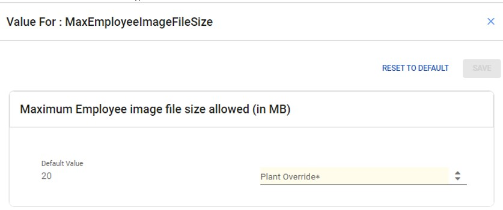

### Equipment image file size

An option where the user can set the equipment image file size has been added.  
Path: Setup options > EAM Options > Inventory
1. Select **Maximum image file size allowed (in MB)**.
2. Click **Details** in the contextual pane.

3. Set the required file size in MB in **Plant Override**.
4. Click **Save**. 
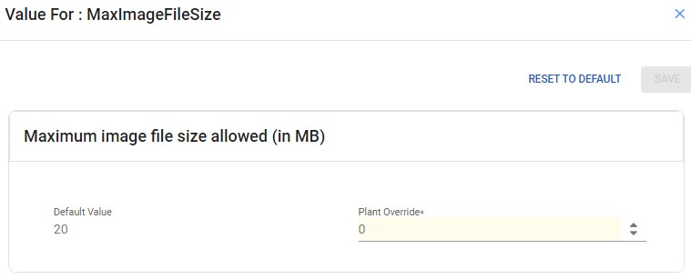

## Purchasing Setup Options

You can navigate to Setup > Setup Options > Purchasing Setup Options > General > DETAILS.

### RFQ Setup

You can configure the following configurations for RFQ Setup:

• Request for Quotes must be approved before being sent to Suppliers

• Unapproved Requisition Lines may be copied to a Request for Quote

• Potential suppliers may be used on Request for Quotes

• TabSource FTP Path

• TabSource Link Path

• TabSource Document Description

• Send Email Notification When RFQ Line is Edited

### Email

You can configure the following configurations for Email:

  * Official copy of the Purchase Order

  * Auto Email PO after Issuing

  * BCC Sender

  ### General

You can upload logos specific to each plant and enter company names. These images will then be utilized on **Purchase Orders** and **RFQ** prints.

Path: Setup > Setup Options > Purchasing Setup Options 

1. Select **General**.
2. Click **Details** in the contextual pane to open the **Purchasing Controls** window.

3. Click **Edit**.
4. Enter the company name.
5. Click  to add a new image. 

    >[!Note]
    > Click  to delete the existing image. 

6. Click **Save**. 

## Inventory Options

This section provides the information on inventory options.

### Repairables

You can navigate to Setup > Setup Options > Inventory Options > Repairables to
configure the following for settings:

  * General

  * Accounting

  * Numbering

  * Invoice Variance

#### General

From the General settings section, you can configure the following settings:

  * Use Repairables Tracking: Enable this option to use the Repairables feature.

  * Allow Repair Without Issuing Replacement: Enable this option to allow repair without issuing replacement. By default, this will be turned off.

  * Automatically Approve Repair Requisition: Enable this option to automatically approve repair requisitions.

  * Repair Equipment Location: Enter the repair equipment location.

  * Work Order Actual Costs to Update: Select the cost category for the repair.

  * Status After Restock: Select the status after restock.

  * Status After Scrap: Select the status after scrap.

      >[!Note]  
      >Click **EDIT** button to change the General settings.

#### Accounting

From the Accounting settings section, you can configure the following
settings:

  * Accounting Setup

  * Holding Account

  * Area

  * Inventory Adjust Account

  * Department

  * Restock At

  * Restock (%)

    >[!Note]  
    >Click the EDIT button to change the General settings.

#### Numbering

From the Numbering settings section, you can configure the following settings:

  * Allow entry of Repair Tag Number

  * Numbering Method for Repair Tags

  * Prefix

  * Number of Digits

  * Last Number

    >[!Note]  
    >Click the EDIT button to change the General settings.

#### Invoice Variance

From the Numbering settings section, you can configure the following settings:

  * Repair Value

  * No Value

  * Issue Value

  * Percent of Issue Value