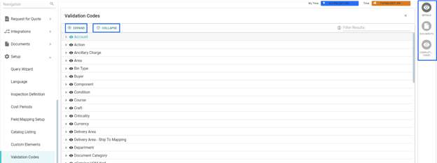
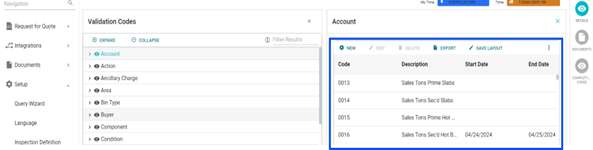
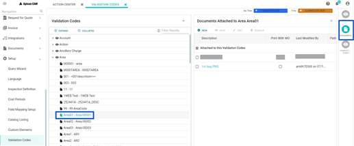
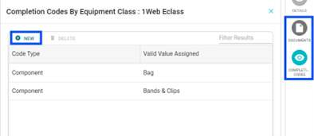

 Any validation code that is used in the system across the modules that are listed, can be translated using a globe icon. On selecting **Navigation** > **Set Up** > **Validation Codes** , the user can view the below screen.

  * **EXPAND** : Click the EXPAND button, you can view the codes and description of all the available validation codes.

  * **COLLAPSE** : Click the COLLAPSE button, you can only view the headings of the validation codes.

The contextual panel has three following sections:

   **DETAILS** : You can select any validation codes and click DETAILS to open the grid as shown below.

The grid consists of the common columns, namely **CODE** , **DESCRIPTION** ,**START DATE** ,**END DATE** and any custom columns defined for the code in the Custom elements screen.

On selecting a particular code, the headers are enabled for the user. The headers available are as follows:

**Field** | **Description**  
---|---  
NEW | You can add a new code. Click [here](#to-add-new-code) to know how to add a new code.  
EDIT | You can edit a newly added or an existing code. Click [here](#to-edit-the-code-) to know how to edit a new code.   
DELETE | You can delete a newly added or an existing code. Click [here](#to-delete-the-code) to know how to delete a code.   
EXPORT | You can download the code details as an Excel file for easy access. Click [here](#to-export) to know how to export code details.  
SAVE LAYOUT | You can change the column size and shuffle the columns as required. Click [here](#to-save-layout) to know how to save layout.   
RESET LAYOUT | You can remove changes with respect to column size and set it to default column size. Click [here](#to-reset-layout) to know how to reset layout.   
  
### **To add NEW CODE**

  1. On the header, click **NEW**. 
  
      The New Code For section appears.

  1. In the Code field, enter the Area(example) code. This is a mandatory field.

  1. In the Description translations field, enter the code description.

     * To Translate the description:

        You can see the globe icon only if the Translatable option for the language is turned ON. The steps to translate the description are as follows:

       1. Click the **Globe** icon. 
       
          The Description translations pop-up shows the Default translation.

       2. Select the language from the drop-down and enter the description in the Description line.

       3. Click **ADD TRANSLATION**. The user can close dialog(x) or further continue to add translations.

  1. Select the start date, end date and date closed (if the dates are not defined by the user, the changes will show always).

  2. Click **ADD**, to save the newly added code. The user can use ADD ANOTHER, to continue to add more codes.

### **To EDIT the code** :

  1. Select a code and click **EDIT**. 
  
      The Edit Code for section appears.

  2. The Code field shows the code selected. This is a read only option for the user.

  3. You can enter the description in the Description field. {Refer: To Translate the description:}

  4. Select the start date, end date and date closed (if the dates are not defined by the user, the changes will show always).

  5. Click **SAVE** to complete the action.

### **To DELETE the code:**

  1. Select the code to be deleted.

  1. On clicking **DELETE** from the header, the confirm delete pop-up appears.

  1. Click **Delete** to complete the action.

      >[!Note]  
      >If a particular code is assigned to any module record, it would continue to be there until the user manually overrides it.

### **To EXPORT:**

  1. Click **EXPORT** from the header, the user can download the excel sheet of the selected code.

### **To SAVE LAYOUT:**

  1. You can make the required resizing/ reshuffling of the columns.

  1. Click **SAVE LAYOUT** to complete the action.

### **To RESET LAYOUT:**

  1. Click the **RESET LAYOUT**, the changes made with columns, will be set to default places.

  2. **DOCUMENTS** : The validation codes namely Area, Department, Equipment class, ISO9000, Item class, Mech Integrity have documents attached to selected codes, which can be accessed by the user. For further information on the headers, refer to Action Items in **Documents**. The user must select **Navigation** > **Validation Codes** > **Area** > select any code from the drop-down > click **Documents** to view the below screen.

      

  3. **COMPLETION CODES** : This feature is enabled for Equipment serial class validation code only. The user can make necessary changes which in turn are used in the Work Order completion. The steps to make changes are as follows:

     1. From the validation codes, select Equipment serial class, to enable the Completion codes button in the contextual panel (Refer to Analysis Codes in for more details).

      2. Click **Completion codes** to open the grid, as shown below:

        

        * To add **NEW** code:

          1. Click **New** from the grid to open the Add Completion Code Mapping to section.

          2. Select the Code Type first from the drop-downs. The options available are Action, Component, Condition.

          3. Select the required Valid Value assigned from the available options.

          14. Click **ADD** to complete the action or use **ADD ANOTHER** to add more values.

        * To **DELETE** :

          1. Select the code type from the grid and click **DELETE**. 
                The Delete Conformation pop up appears. 
          2. Click **DELETE** to complete the action.

### ADDITIONAL FEATURES:

##### Themes:

The feature enables the user to select a theme for the plant, from the available options. On *clicking Mark as Plant Theme*, the selected theme is set for the entire plant.

##### Currency:

The feature enables the user to select a currency for the plant, from the available options. On clicking *Mark as Plant Currency*, the selected currency is set for the entire plant.