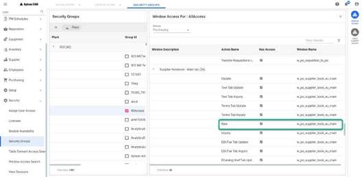

---  

title: "Create New Supplier"   
draft: false 
type: Article

---

**Menu Path: Supplier > Create New Supplier**

The **Create New Supplier** window allows you to add a new supplier.

To create a new supplier, perform the following:

  1. From the navigation menu, select **Supplier > Create New Supplier**
 Or
 In the window, select **New Supplier** from the action bar.
 The **Supplier** window opens with **Supplier Module**.

  1. Enter the necessary details in the **Main** tab and click on **Create**. The new supplier will be created. You can update other tabs in the **Supplier Module**. For more information, see the .

The **New Supplier** options is a secured action. Only if you have security
access, then you can add a supplier. You can check the following access in
**Security > Security Groups > Group Id > WINDOW ACCESS**.

