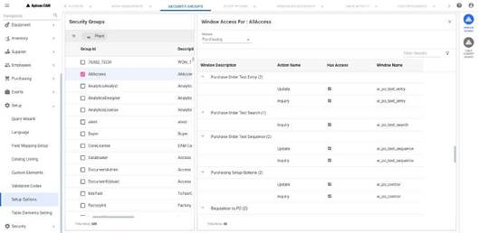

---  

title: "Using the Supplier Module"   
draft: false 
type: Article

---

The supplier module consists of the supplier details. You can select a record
in supplier search grid and click on **Details** in Contextual Panel to open
the supplier module. If selected, **Supplier: \<Supplier Description>** page
appears.

You can click on the hyperlink on Supplier column or double click on any grid
record to open the supplier module.

The supplier module has four standard tabs:

  * Main
  * Contacts
  * PO Text
  * Products

Also you can perform the following actions in Supplier Module page:

  1. **Delete** : You can delete the supplier by selecting   and the **Delete** option. See Delete Supplier for more details.

  2. **Rename** : You can rename the supplier by selecting  and the **Rename** option. See Rename Supplier for more details.

  3. **Open in New Tab** : You can click on  to open the supplier module page in a new separate tab. You can see Purchase Orders in the contextual panel. Refer to Purchase Order for more details.

  4. **Close** : You can click on **X** button to close the supplier module.

## Main Tab

The **Main** tab consists of the following sections:

### Basic Information

Here, you can provide some basic details of a supplier. It consists of the
following:

**Properties**

This section consists of Supplier ID*, Supplier Name*, Customer Number,
Class*, Type (Drop-down: Manufacturer and Reseller) and Rating (Drop-down:
Average, Good and Poor) fields.

The **Active** toggle is turned on by default. If it is off, then the supplier
has an Inactive status and cannot be used on requisitions, requests for quote, or purchase orders.

>[!note]
>Only active suppliers can be used to create the supplier module queries.

### Main Contact Information

Here, you can provide main contact information of a supplier. It consists of
the following:

#### Phone & Email

You can provide the phone number and supplier email in Phone # and Email
fields. You can enter multiple email addresses separated by a semi colon.

#### Contact Methods

You can enable the **Send PO By** Tabsource or Email toggles to send a PO to a
supplier. These toggles are disabled by default while creating the new
supplier.

If **Send PO By Tabsource** is enabled, **Tabsource Emails for PO** hyperlink
text will be enabled. Click the hyperlink and Tabsource Emails pop up will
open and list the TabSource emails if any. The email addresses are read-only.
All updates to the TabSource email addresses will need to be made in
TabSource.

You can enable the **Send RFQ By** Tabsource or Email toggles to send RFQ's
details to a supplier. These toggles are disabled by default while creating
the new supplier.

If **Send RFQ By Tabsource** is enabled, **Tabsource Emails for RFQ**
hyperlink text will be enabled. Click the hyperlink and Tabsource Emails pop
up will open and list the TabSource emails if any. The email addresses are
read-only. All updates to the TabSource email addresses will need to be made
in TabSource.

#### Address For Queries

It consists of address details such as City, State, Postal Code and Country
fields to build custom queries that search for location information.

### Terms

The Terms section contains shipping information for default POs as well as
financial data such as payment terms, credit limits, and minimum order
amounts.

**Shipping**

The shipping section consists of Ship Via*(Drop-down), Ship Point, FOB(Drop-
down), Freight*(Drop-down) and Tax(Drop-down) fields.

The Ship Via field is designed to hold either specific carrier information or
general information regarding the method of shipping.

The Freight field is used to capture instructional information.

The **Two Way Match** and **Auto Issue** toggles are disabled by default while
creating the new supplier.

You can enable Two Way Match toggle if you want the supplier to qualify for
two-way match processing. The setting chosen here automatically defaults to
purchase orders awarded to the supplier. This toggle is only visible if your
installation is using either Invoice Matching or the Invoicing Interface.

You can enable Auto Issue toggle if an auto-generated purchase order exists
for the supplier with this flag checked, then the Auto Issue of Purchase
Orders Task Management Portal job will issue this supplier’s auto-generated
purchase order.

### Payment

This section consists of payment related information with Payment Terms*
(Drop-down), Currency*(Drop-down), Duns#, 1099 ID, Discount Method (Drop-
down), Credit Limit and Minimum Order fields.

Currency: If you pay the supplier in a foreign currency, you can select it
from the Currency dropdown list.

Duns#: The Data Universal Numbering System , abbreviated as DUNS , is a system
developed and regulated by Dun & Bradstreet (D&B) that assigns a unique
numeric identifier, referred to as a Duns number, to a single business entity.

1099 ID: You can enter a federal tax ID or social security number in the 1099
ID field if you are obligated to provide a 1099 form covering reportable
income.

Discount Methods: If you have access to **Allow setup at supplier level** in
the Supplier module, a Discount Method field will be visible. From it, you can
select one of the following options:

  * Always apply regardless of date
  * Calculate based on invoice date
  * Calculate based on current date
  * Calculate based on invoice received date

Credit Limit and Minimum Order: If applicable, enter values in the Credit
Limit and Minimum Order fields If there is a foreign currency identified.

### Comments

The Comments tab provides you the area to enter information related to the
supplier. It can be a description of an event, a summary of products offered,
or any other pertinent facts about the supplier.

You can add translation to the comments during creating/editing the supplier.
See Translation for more details.

### Custom Information

In the Custom Information section, custom elements that you have defined will
be displayed.

## Contacts Tab

The Contacts tab consists of the following sections:

### Contacts

The contacts grid displays all the contacts associated with the selected
supplier. You can see the details of **Contact Name, Primary Contact, Work
Phone and Email** for each grid records.

You can perform the following actions on each contacts in the grid:

  1. Create new contact: Click on **New** button to create and add the new contact to the grid. Refer to Create New Contact for more details.

  2. Edit the contact: Select a contact and click on **Edit** button to update the details for the existing contact. Refer to Edit Contact for more details.
  3. Delete the contact: Select the contact and click on **Delete** to delete that contact from the grid. If selected confirmation pop up appears with **Are you sure you want to delete < Contact Name >?** message. You can click on **Delete** to delete that contact or click on **Cancel** to exit the pop up. If deleted, **Contact Deleted Successfully** message appears.

#### Create New Contact

You can enter the following fields in **New Contact** screen to add the new
contact:

  * Contact Name* (Mandatory Field)
  * Title
  * Work Phone #
  * Cell Phone #
  * Email
  * Notes
  * Primary Contact: The Primary Contact is the main person to contact if there are multiple names on the contact list. Enable this toggle if the contact you want to designate as Primary. There can only be one primary contact.

After entering the above values, you can select any of the following buttons:

  * **Add** : Selecting this will save and add the new contact to the grid list.
  * **Cancel** : Selecting this will exit the new contact screen without adding the contact.

#### Edit Contact

You can edit the existing contact from the list. In the **Edit Contact for:< Contact Name >** screen, you can update the required fields with new values.
The fields will be as similar to the fields in screen.

After updating the required values, you can select any of the following
buttons:

  * **Save** : Selecting this will save the updated details.
  * **Cancel** : Selecting this will exit the edit contact screen.

### Addresses

The Addresses grid displays all the addresses associated with the selected
supplier. You can see the address details for each grid records.

You can perform the following actions on each addresses in the grid:

  1. Create new Address: Click on **New** button to create and add the new address to the grid. Refer to Create New Address for more details.
  2. Edit the address: Select an address and click on **Edit** button to update the details for the existing address. Refer to Edit Address for more details.
  3. Delete the address: Select the address and click on **Delete** to delete that address from the grid. If selected, confirmation pop up appears with **Are you sure you want to delete \<Address Code>?** message. You can click on **Delete** to delete that address or click on **Cancel** to exit the pop up. If deleted, **Address Deleted Successfully** message appears. If not deleted, error pop up appears. You can see the errors and proceed accordingly.

#### Create New Address

You can enter the following fields in **New Address** screen to add the new
address:

  * Address Code* (Mandatory Field)
  * Address* (Mandatory Field)
  * Address Type: You can enable any of /all the toggles from **Mailing, Shipping** and **Remittance** to select the address type.
  * Default For: You can enable any of /all toggles from **Mailing, Shipping** and **Remittance** to make it default.

After entering the above values, you can select any of the following buttons:

  * **Add** : Selecting this will save and add the new address to the grid list.
  * **Cancel** : Selecting this will exit the new address screen without adding the address.

#### Edit Address

You can edit the existing address from the list. In the **Edit Address for:\<Address Code>** screen, you can update the required fields with new values.
The fields will be as similar to the fields in Create New Address screen.

After updating the required values, you can select any of the following
buttons:

  1. **Save** : Selecting this will save the updated details.
  2. **Cancel** : Selecting this will exit the edit address screen.

You can click on Expand Grid icon  to expand the grid to the full frame. If expanded click on Collapse Grid icon  to collapse the grid.

## PO Text Tab

The PO Text tab allows you to cross-reference an entry in the **PO Text
Library** to the selected supplier. Any entry for the supplier will appear on
purchase orders for that supplier.

Following are the security access needed to work with PO Text feature: The
security is defined in **Security > Security Groups > Group ID > WINDOW
ACCESS** path.

**PO Text Selection** grid displays the PO texts if any to the selected
supplier. You can see **Text ID** , **Description** and **Text Content**
details for each PO Text records.

You can perform the following in PO Text section:

  * Add new PO Text: You can click on **New/Add Text** button to create and add the PO Text to the list. Refer to Create PO Text for more details.
  * Delete the PO Text: You can select the record from the grid and click on **Delete/Remove** to delete that PO text from the grid. If selected, **PO Text \<Text ID> Deleted Successfully** message appears.

#### Create New PO Text

You can enter the following fields in **Add PO Text** screen:

  * **Text ID*** : (Mandatory Field) You must enter the desired Text ID or search for the desired text using search icon. Once the Text ID is entered, the window displays the description and one row of the text. The description and text cannot be modified in this window. 

    >[!note]
    >Only active text ids & type ‘other’ are allowed to be linked to a supplier.

  * After entering the Text ID, select a radio button to specify if the text block should print in the **Initial Text** or **Final Text** section of the purchase order. The default selection is Initial Text. The Text IDs are displayed on the Supplier Module in alphabetical order.

After entering the above values, you can select any of the following buttons:

  1. **Add** : Selecting this will save and add the new PO Text to the grid list. If any error, error messages will be displayed and you can proceed accordingly.

  2. **Cancel** : Selecting this will exit the screen without adding the PO Text.

## Products Tab

The Products Tab displays the list of products if any that the supplier
supplies.

This section is read only and you cannot perform any operation on any
products.

You can see the details for each products with their units depending upon the
fields added in the contextual query. See Contextual Query for more details.

You can sort the data using the elements in **Sort By:** drop down. The data
will get sorted in the ascending order. You can find a specific item using the
**Filter Results** field.

## Purchase Orders

The Purchase Orders grid displays the list of all POs for the selected
supplier. You can click on **X** to close the window. See Grid Operations for more details on
grid.

## Editing the Supplier Module

You can click **Edit** button to open the supplier module in edit mode. You
can update all the required/ mandatory fields (The fields marked with *) and
perform all the necessary functions in all the tabs explained above.

See Edit for more details.

>[!important]
>The fields marked * above in each tab represent the mandatory fields
during **New Supplier Creation**.

