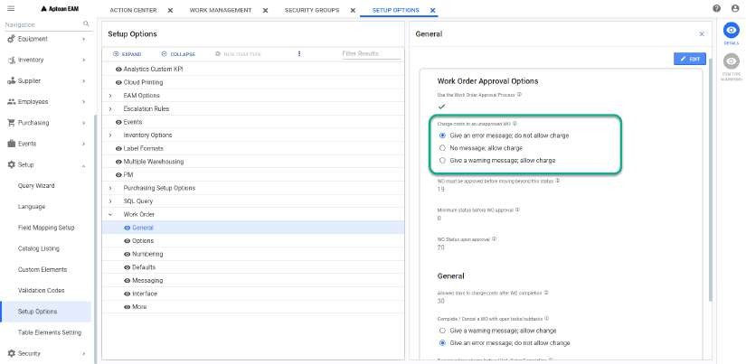
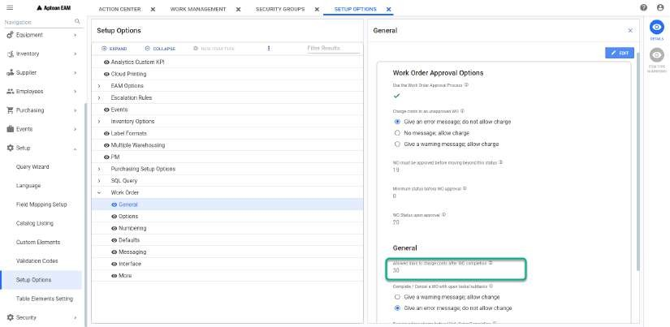

---  

title: "Cost Posting"  
draft: false 
type: Article

---

The costs displayed in the Cost tab originate from several sources,
including updates to the database by other systems. Using the Work Orders
module, the **Cost Posting** window allows you to post costs for various
transactions related to labor, material, tools, services, and other expenses.

Perform the following procedure to add a cost to the work order:

  1. Select a record in **Work Order: \<Query Name\>** grid and click on **Cost Posting** from the action bar. **Cost Posting** window opens in a separate tab. 
  2. The **Cost Posting** window consists of the following:
  3. **Cost Post History** : This grid lists all the costs available for the selected work orders with their details (Transaction Date, Entered By, Remarks, Document, Amount and Cost Type). See for more details on grid. the grid will be empty if there is no previously added cost posts. You can see cost post history in **Financial** tab of work order and equipment note books.
  4. **Add Line** : You can click on **Add Line** button on top to add the cost post. See Add Cost Post for more details. 

### Add Cost Post

In Add Cost Post window, you must perform the following:

  1. Select a value in **Cost Type** field from the drop-down. 
  2. Enter the appropriate **Amount**. Amount can only be positive, negative or decimal numbers. This field is mandatory.
  3. Enter the **Charge Date** in user defined format. By default, Today's date and time (Local time) will be displayed.
  4. Optionally, enter the data in **Document** and **Remarks** fields. 
  5. Click **Save** to add a new cost post and the data will be displayed in **Cost Post History** grid. Click **Cancel** button if you don't want to add a new cost post. 

### Cost Posting Setup

  1. When you are attempting to charge costs to an un approved work order, the application behavior is set in the following field:

      

  2. You can set the number of days to charge cost posts after the work order is completed in the following field:

      

The above setups are available under **Setup > Setup Options > Work Order >
General** path.

