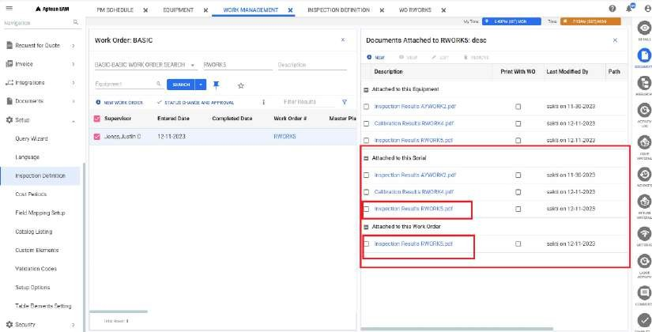

---  

title: "Inspection Completion"  
draft: false 
type: Article

---

  * You can navigate to the inspection screen, which is currently located in the **EAM mobile app** and **complete an inspection**. Upon completion, an inspection can be marked as either **complete or failed.**

  * In the event of a successful inspection, the work order status is updated, and a **PDF** document is generated.

  * Conversely, if the inspection is unsuccessful, the status is modified, and a **PDF report detailing the failure is generated.**

  * Additionally, any predefined actions at the inspection level, such as creating a follow-up work order, are executed as necessary. Refer table.

After completing an inspection, whether it is **successful or results in a
failure** for a specific work order, an **Inspection Result PDF** document is
attached. This attachment is linked to both the corresponding **Work Order**
and the **associated Equipment**.

  * To view this document, search and select the appropriate **Work Order**, then click the **Document** icon on the contextual panel. 

  * The **Documents Attached** window will open in the right-side panel, where the **Attached to this Equipment** and **Attached to this Work Order** sections will display the linked **Inspection Result PDF**.

  

**Follow-Up Information** : In the event of a failed inspection result, a
follow-up work order will be generated. The system adapts the creation of work
orders based on whether the **Standard Request (SR)** is defined at the
**Header Level, Point Level, or Both**. If the SR includes tasks or subtasks,
multiple follow-up work orders will be created as shown in the table.

Header level  | Point Level | Follow up Work Order Created  
---|---|---  
SR01 | Not defined  | FSR01  
Linked - SR01 actual SR data:  SR01  SR01-01  SR01-01-01 | Not defined  |  FSR01  FSR01-01  FSR01-01-01   
Not defined  | SR02  | FSR02  
Not defined |  Linked - SR02 actual SR data:  SR02  SR02-01  SR02-01-01 |  FSR02  FSR02-01 FSR02-01-01   
SR01 | SR02 |  FSR01  FSR01-01 (from point, base SR02)  FSR01 FSR01-01  FSR01-01-01  FSR01-02 (from point, base SR02)   
Linked - SR01 actual SR data:  SR01  SR01-01  SR01-01-01 | SR02 |  FSR01  FSR01-01  FSR01-01-01  FSR01-02 (from point, base SR02)   
Linked - SR01 actual SR data:  SR01  SR01-01  SR01-01-01  |  Linked - SR02 actual SR data:  SR02  SR02-01  SR02-01-01  |  FSR01  FSR01-01  FSR01-01-01  FSR01-02 (from point, base SR02) 

