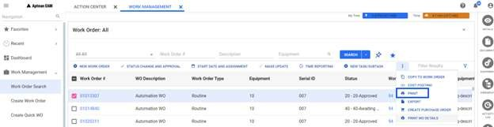
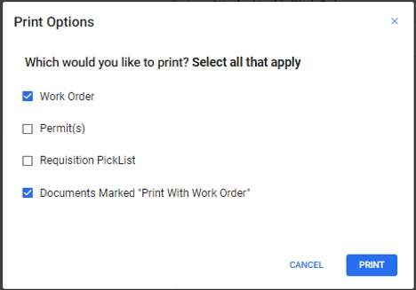
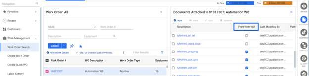
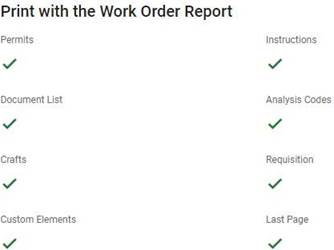
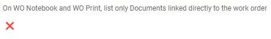
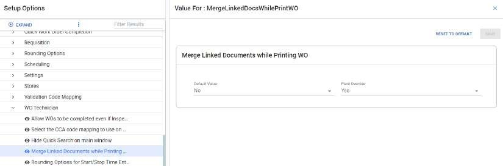

---  

title: "Print"  
draft: false 
type: Article

---

The Print button allows you to print the selected work order. You can perform
the following to print the work order:

  1. Select the record from the **Work Order: \<Query Name\>** screen and click on **Print** in action bar. **Print Options** pop up appears. 

      

  2. In the pop up, select any one of the following or all the check boxes if required.

      

      * **Work Order** : Prints the work order. 

      * **Permit(s)** : Prints the permit template stored in the system.

     * **Picklist** : Prints all the items available in the picklist for the selected work order.

      * **Documents Marked "Print With Work Order"** : Prints only the documents that you have selected.

      If any documents are checked to be printed along with the selected work
order(Equipments /Equipments Class/ Serial/ Area), those documents will also
be printed.

  3. Select **Print** to print the single/multiple work orders and associated documents in a single pdf. The pdf document will be opened in a separate tab. 

  3. Select **Cancel** to exit the pop up without printing.

>[!note]
>If there is an issue in printing the work order, check for any **pop-up
blockers** in the browser. If found, click the provided **link** , or select
the option **Always allow pop-ups and redirects from...** , and then click the
**Done** button.

### To Print Linked Documents

Enables users to print the documents marked "Print With Work Order".

  1. Select a Workorder from the list 

  2. Click **Documents** , from the contextual panel, to open the "Document attached to" section.

      

  3. Select the documents required, by checking the"Print With WO" boxes. 

  4. Click **Print** , after selecting **Documents marked "Print with Work Order"** option. 

>[!note]
>Each document is opened in a separate tab.

### Work Order Print Settings

This section provides the configuration options available to users for Work
Order settings

  1. You can select the required parameters to include in the work order report printing:

      

  2. You can enable or disable the following field to list the documents directly linked to the work order on work order Module and WO print:

      

  3. You can select the following field to **Yes** to print all the documents linked to the work order in a single pdf. If selected No, all the linked documents will be printed separate tabs.

      

The above settings are available in **Options** tab under **Setup > Setup
Options > EAM Options > WO Technician** path.

