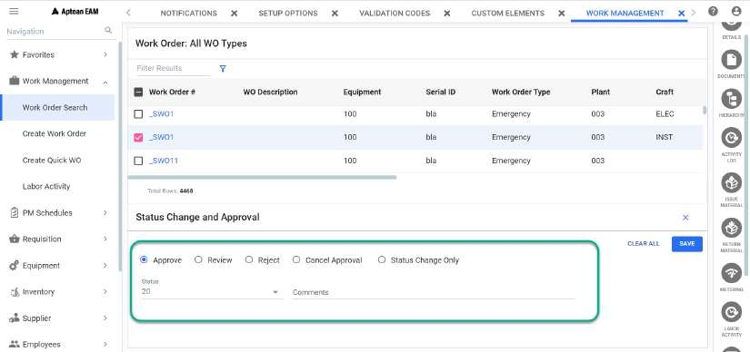
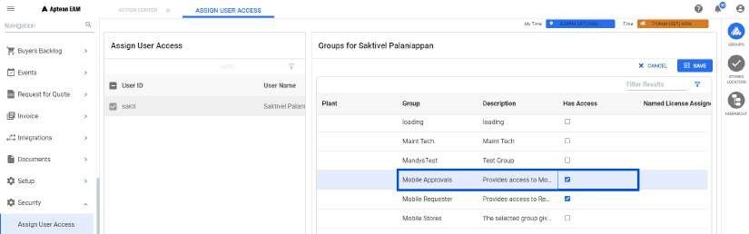
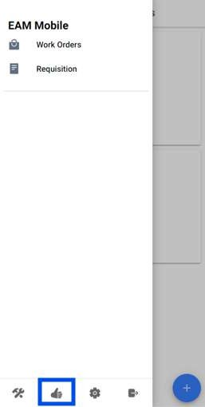
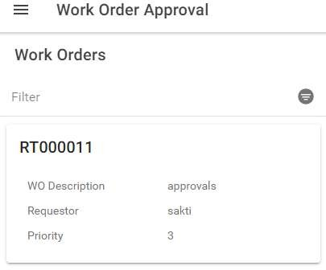
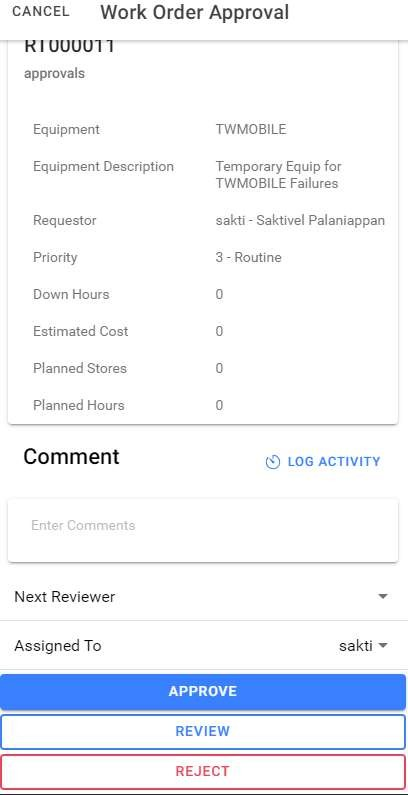

---  

title: "Status Change and Approval"  
draft: false 
type: Article

---
Using the Work Order Status Change & Approval window, you can:

  * Change the status of a work order. 
  * Review, reject, approve and cancel the approval of the work orders. 

One or more of the **Review** , **Approve** , **Reject** and **Status Change
Only** buttons may not display at the bottom of this window if any one of the
following conditions exists:

  * The work order type is Emergency or PM Work Order. 
  * You are not listed as an authorized user to review or approve.
  * The work order has been approved. In this case, you see only the **Cancel Approval** button. 

## Accessing Approval and Status Change Window

Use one of the following methods to access the approval and status change
window:

  * From the **Work Order Module** , click **Approval** button from button. This is only for a single work order. 
  * From the **Work Order Search** page, select the required work order(s), and click **Status Change and Approval** button in the action bar for updating the selected work order(s).

### Processing Work Orders

In Aptean EAM there are two modes for processing work orders.

In **single** mode, you are applying changes to a single work order. In **mass** update mode, you can change a group of work orders at one time. 

#### Single Mode

Perform the following procedure to process work orders in single mode:

  1. In the **Work Order Search** screen, select the required work order(s).  
      >[!note]
      >If you are in Work Order Module, select **Approval** button from more icon.

  3. If selected, click **Status Change and Approval** button in the action Center.  
The **Status Change and Approval** window opens. You can click **X** to close
the window.

  4. You can select the required status of the work order from **Status** drop down. If you select Approve, by default, status action is **Approved**. See also.  
You can approve the work order only when **Use the Work Order Approval
Process** flag in **Setup > Setup Options > Work Order > General** screen is
enabled. If enabled, you can set the status based on the requirement:

      

  5. Optionally, enter a comment in the **Comments** field.  This is not available if you select Only Status Change button.
   
      >[!note] 
      >The **Activity Log** grid displays the approval and status information.
  6. Select a reviewer from the drop-down in **Next Reviewer** field. This field is mandatory for **Review** operation and will not be visible if you select Approve and Only Status Change.
      >[!note]
      >When the work order is approved, then only you can perform **Cancel Approval**
function.
  7. If the above fields are updated, select any of the required button - **Approve** to approve, **Review** to review, **Reject** to reject, **Status Change Only** to change only the status or **Cancel Approval** to cancel the approval. You can select and perform only one operation at a time.

      You can select **Save** button to update the changes and success or error toast messages will be displayed accordingly.

      You can click on the toast message to view Work Order, Description, Status, Result, Failure/Error = and Result Message details in a separate tab (**Status Change and Approval Report**). You can click on **X** to close the toast message.

  8. If you have selected multiple work orders from search, update each work order by using the Multiple select. For more information, see Multiple Select section. 

#### Mass Update Mode

Perform the following procedure to process work orders in mass update mode:

  1. In the **Work Order Search** screen, select the required work orders.
  2. Click **Mass Approval and Status Change** button in the action bar.

      The **Mass Approval and Status Change** window opens.

  3. Select the required status for work orders in **Mark Status as** field. 
  4. Optionally, enter a text in the **Comments** field. 
  5. Select a reviewer from the drop-down in **Next Reviewer** field. 

  6. Select the required button - **Approve** to approve, **Review** to review, **Reject** to reject, **Update Status** to update status or **Cancel Approval** to cancel approval. 

      The **Selected Work Orders** grid displays the information of all the work
orders selected and the updates made.

  7. Click close from the top right corner of the window.

### Mobile Approvals

The **Mobile Approval** process in Aptean EAM allows you to approve work
orders anytime, anywhere directly from mobile devices. This feature
ensures that approvals can be executed swiftly and efficiently, even when the
user is not at their desk.

#### Security Needed for a User For Mobile Approvals

**Path** : Security > Assign User Access > User ID > Groups > Plant > **Mobile
Approvals**

#### Reviewing and Approving Work Orders

After providing necessary Security permissions, follow the below steps for
mobile approvals:

  1. Navigate to the approval section within the app.

      

  2. Click on the **Work Orders** menu, to open Work Order Approval Screen.

  3. All work orders assigned to the user for approval, are displayed here.

      

  4. Select the Work order to perform any of these actions: Approve/ Review the details of the work order/ Enter any necessary comments/ Select a reviewer if required.

      

  5. Choose the required action (Approve, Review, Reject) to complete the approval process.

