---  

title: "Work Order"  
draft: false 
type: Article

---

The Work Order Module page consists of the selected work order details. The
fields are based on your access.

You can select a record in **Work Order : \<Query Name\>** grid and click on
**Work Order** in Contextual panel to open the Work Order Module. If selected,
**Work Order \<Work Order ID\> \<Work Order Description\>** page appears. The
equipment and/or Serial ID and Descriptions will also be displayed if they are
defined for that selected work order. The work order **Status** will be
displayed on top of the page.

>[!note]
>You can also click on the hyperlink on any record under **Work Order #**
column in **Work Order : \<Query Name\>** grid to open the work order note book.

The work order module has four standard tabs:

  * Work Order 
  * Planning  
  * Financial  
  * Completion: Available only for **Routine** and **Emergency** Work Orders. 
  * Inspection Completion

Also you can perform the following actions in Equipment Module page:

  1. **Copy** : Select  ellipse icon and then the **Copy** option to copy work order details. See Copy from Work Order for more details.

  2. **Print** : Select   and then the **Print** option to print the work order details. See Print for more details.

  3. **Approval** : Select  and **Approval** option. **Work Order Approval** pop up appears. Click **X** to close the pop up. Only **Routine** Work Orders undergo Approval process. In the pop up, select the required check boxes (Approve, Review, Reject or Cancel Approval) and enter the necessary fields. Click **Save** to update the changes and the success or error message will be appeared accordingly.
  4. **Open in New Tab** : You can click on  to open the Module page in a new separate tab. You can also double click on any grid record to open that record in a separate tab. 
  5. **Close** : You can click on **X** button to close the work order Module page.

## Work Order Tab

The **Work Order** tab consists of the following sections:

### Work Order Details

The **Work Order Details** panel allows you to view the information of a
selected work order. You can see Work Order #, Work Order Type, Description *,
Status*, Priority*, Schedule Start Date, Requested Completion Date, Work
Class, Shutdown and Down Hours (Editable only if Down toggle is enabled).

You can add new translation to the selected work order description if
required. See Translation. 

You can also enable Safety, Down, Write work orders to Serial toggle buttons
if required. These toggles are disabled by default.

The Status, Priority and Work Class fields display the default values of each
work order type until you edit them. For default values, navigate to **Setup >
Setup Options > Work Order > Defaults**and click **DETAILS** button.

Emergency Work Order has a default status of 60 and Routine work order has default status 0. You can change if required in the navigation path for setup mentioned above. 

See Status Configuration.

### Equipment

The **Equipment** panel allows you to view the information of the equipment and serial attached to that selected work order. You can see Equipment Description, Serial ID, Serial Description, Equipment Class and Criticality fields. 

### Location

The **Location** panel allows you to view the location related information of
the selected work order. You can see Area*, Department, Project, Account,
Shop, Inspection, ISO 9000, Mechanical Integrity drop down fields along with
district field.

### People

The **People** panel allows you to view the people associated to the selected
work order.  

**Administrative**: This section has Supervisor, Next Reviewer, Planner and
Requester fields.

**Technician** : This section has Assigned To field. While creating/editing,
you can click on **Add Technician** button to add more technicians to the
selected work order.

### Long Description

You can see the long description of the selected work order under this panel.

### Custom Information

You can see/edit the custom information like date, number, Print elements, SO
details and work order priority of the selected work order.

## Planning Tab

Work Order Planning involves crucial activities to ensure the efficient and
effective execution of maintenance tasks. This includes creating detailed
instructions, planning resources, managing permits, and handling requisitions
for both stock and non-stock items. This section outlines each activity and
explains how to manage them. The **Planning** tab consists of the these
sections: **Resource** , **Requisition** , **Instruction** , **Permit**.

Click Edit to make necessary changes for  an existing Work Order or create a new work order and continue to make necessary changes.

### Resource

Resource planning involves identifying and assigning the necessary workforce
to complete the work order. The user can add New, Edit, and Delete Resources. The **Resource**
section allows you to view/add the resources and their efforts in the grid.
See for various grid operations.

#### To add New resources

  1. Click **New** , to open the Resource Requirements Form.

      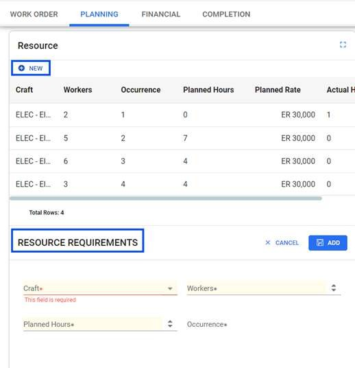

  2. Enter the following details:

**Craft** | Enter the required type of Craft.  
---|---  
**Workers** | Enter the required number of workers.   
**Planned Hours** | Enter the number of planned hours.   
**Occurrence** |  This field provides the number of times the same Craft has been selected.   >**Note**This field is grayed out and you can’t edit this field. 

  3. Click **Add** to complete the action.

#### To Edit resource

  1. Select required resource from the list

  2. Click **Edit** , to open the Resource Requirements Form.

**Craft** |  This field is auto populated.  
---|---  
**Workers** | Enter the required number of workers.   >**Note**This field is grayed out and you can’t edit this field.
**Planned Hours** | Enter the number of planned hours.   
**Occurrence** |  This field provides the number of times the same Craft has been selected.  This field is read only for the user.   >**Note**This field is grayed out and you can’t edit this field.

  3. Click **Save** , to complete the action.

#### To Delete resource

  1. Select any resource from the list.

  2. On clicking Delete, the DeleteConfirmation prompt appears.

      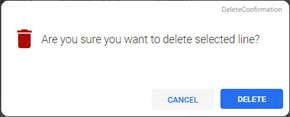

  3. Click Delete to complete the action.

### Requisition

The **Requisition** section displays the requisitions present for the WO in
the grid. Requisitions involve requesting materials necessary to complete the
work order, including both stock and non-stock items. You can click on insert
**+** icon to navigate to the requisition module to view/add/modify any
details.

  1. In the Requisition Card, click Open Requisition in Full Screen, to open the pop out icon in a new window.

  2. **New Line:** It allows the user to add a new requisition line. For more details, refer to in Requisition module.

  3. Click **Save** to complete the action.

### Instructions

Instructions are essential for providing clear and detailed steps to complete
the work order. It displays the specific planning instructions if any. The
user can utilize the options to edit and customize instructions as required.

  1. Click to open the **Instructions** pop up.

      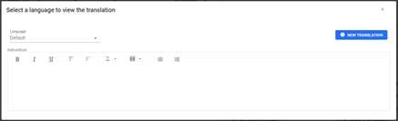

  2. **Language** : It allows the user to select a language to view the translations.

  3. **New Translation:** It allows the user to add translation languages.

>[!note]
>The user can add translations only if the language being used is translatable.
See Translations for more details.

### Permits

Permits ensure that all safety and regulatory requirements are met before
starting the work order. The user can , and . This section allows you view the
required permit, safety procedure and protective equipment for a work order.

#### Create Permit Categories

Users can easily create new permits, specifying detailed information and the
customization allows for the categorization of permits according to the
specific requirements of the organization, streamlining their management and
retrieval.

  1. In the Navigation Pane, under Set up module, choose Validation code > **Permit Category**.

  2. Click **Details** in the contextual pane, to open the Permit Category section on the right pane.

      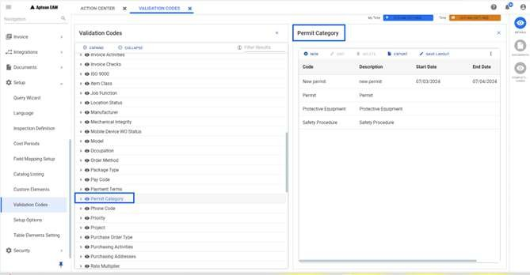

  3. Click **New** , to open the New Code for: Permit Category section. Fill in the required details:

      **Code** : Enter the code for the permit category.

      **Description** : Enter the description for the permit category.

      >[!note]
      >The user can add translation for this field, using the globe icon.

      **Start date** : Enter the starting date.

      **End date** : Enter the ending date.

  4. Click **Add** to complete the action. The user can use Add Another, to add more Permit categories.

#### Create Permits

Users can easily create new permits, specifying detailed information.

  1. In the Navigation Pane, under Set up module, choose Validation code > **Safety Procedures / Permits**.

  2. Click **Details** in the contextual pane, to open the Safety Procedures / Permits section on the right pane.

      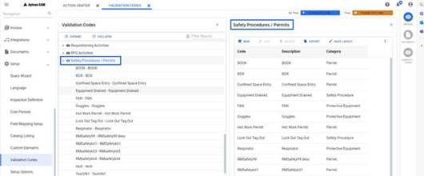

  3. Click **New** , to open the New Code for: Safety Procedures / Permits section. Fill in the required details:

      **Code** : Enter the code for the permit category.

      **Description** : Enter the description for the permit category.

      >[!note]
      >The user can add translation for this field, using the globe icon.

      **Category** : Choose the required permit category from the drop-down.

  4. Click **Add** to complete the action. The user can use Add Another, to add more Permit categories.

#### Associate with Work Order

In the Work Order Module, under the Planning section, link the required
permits to the work order, ensuring all necessary approvals and conditions are
met before any maintenance or work begins.

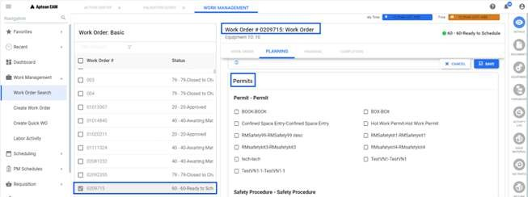

## Financial Tab

The **Financial** tab consists of the following sections:

### Cost Summary

**Cost Summary** section allows you to view the cost type and associated
planned and actual costs in a grid. You can refer Grid Operations for various grid operations.

If you select the **Show Roll Up Costs** check box, the totals shown include
the sum of cost of the displayed work order number and the costs of all the
tasks and subtasks that belong to the work order. If you do not select the
**Show Rollup Costs** check box, the totals shown apply only to the work order
number displayed.

### Labor Hours Summary

**Labor Hours Summary** section allows you to view the labor planned hours,
actual hours and Estimated Cost (editable field).

### Cost Post History

See Cost Posting for more details.

## Completion Tab

The **Completion** tab consists of the following sections:

### Completion Details

The **Completion Details** panel allows you to view/update the information
like **Status*, Completed by, Start Date*, End Date-Time, New Serial#, Lost
Production, Event Duration, Production UOM.**

The status field can be empty or any of the status from 70 to 79. While
editing, you can select the required completion status from the drop down. In
the drop down, the status from status code 70 to 79 are available.

You can also enable Follow Up Required Fields and Failure toggle buttons if
required while editing. These toggles are disabled by default.

### Follow Up Work Order

If there is a need for follow-up action and users want to immediately assign a
work order number and description to that action, they can enable the **Follow
Up Required flag**. A **Follow up Contextual** alert prompt opens, stating,
“Follow-up contextual will be opened to create a new follow-up after save.”
Click **OK** and then click **Save**. A Follow-up Info window opens in the
right-side panel. To add a Follow-up work order Refer Follow-Up Info.

To set the screen type to create new follow up work order, navigate to **Setup Setup Options > Work Order > Options**, click the **DETAILS** button, and
then click the **EDIT** button in the Options screen:

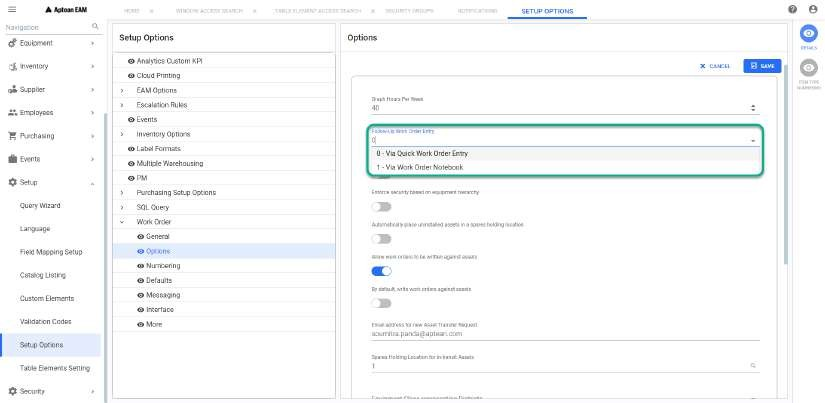

Install a new serial upon completion of the work order.

  1. If users attempt to add a new **Serial** with an **operation-based PM schedule** present, and the Equipment's location status is **Operating** , an alert prompt, **SerialIDResume** , will appear.

      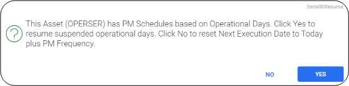

  2. Click **Yes** to resume suspended operation days, and the **Next Execution Date** will be recalculated, considering the operating days tallied against the previously generated PM.

      For example, the system determines operational days by subtracting the start
date from the end date of each operational event.

      * Event 1: Start Date: January 20, End Date: January 31. Operation days=11 days.

      * Event 2: Start Date: February 15, End Date: March 15. Operation days= 28 days.

      * Total operation days: 28+11=39 days.

     The Next Execution Date is determined by adding the Frequency Time to the
Current Day and then subtracting the Operational Days.

      * **Next Execution Date = Current Day + Frequency Time - Operational days.**

      Let's assume the current day is April 15 and Frequency Time: 90 days.

      * Next Execution Date: Current Day (April 15) + Frequency Time (90 days) - Operational days (39 days) = June 5.

  3. Click Save to confirm this update, and the PM Schedule's Next Execution Date would be adjusted to June 5.

  4. Alternatively, click No to reset the next execution date to the current day plus the PM frequency. In this case, it will update to the current day plus the specified frequency. Click Save to confirm.

### **Custom Information**

The **Custom Information** panel allows you to view the Custom Date*, Custom
Number and Custom Text* information.

### Completion Remarks

The **Completion Remarks** panel allows you to add any completion remarks for
the selected work order. You can view the existing remarks in **Comments**
screen in Contextual panel.

### Worker Time Reporting

See Worker Time Reporting for more details.

You have to enter at least one time charge before completing the work order if
**Require a Work Charge before Work Order Completion** flag is enabled in the
**Setup > Setup Options > Work Order > General** screen.

### Analysis Codes

The **Analysis Codes** section allows you to view/add the codes for conditions
found, components serviced, and actions taken.

If the equipment location or serial number included in the work order belongs
to an equipment or serial class, the Analysis Codes window displays the
Components , Conditions and Actions codes assigned to that class. You can set
the components, conditions and actions to a particular equipment class in
**Setup** >**Validation Codes** >**Equipment Serial Class** > Select required
equipment > click**COMPLETION CODES**.

You can also perform the following while creating/editing the work order:

  1. **Add Line** : You can click this button to add new component in analysis code grid. Selecting this will open the **Analysis Code** section. You can perform the following:
      * Click the drop-down arrow in the **Component** field and select a value. 
      * Click the drop-down arrow in the **Condition** field and select a value. 
      * Click the drop-down arrow in the **Action** field and select a value. 
      * Click **Add** to add the new entry. The new entry will be added to the Analysis Code grid. You can click on **Cancel** to cancel adding the component.
  6. **Delete Line** : You can click this button to delete the selected analysis code line from the grid.

### Work Order Completion Setting

  1. Conditions on Completion of **Base/Main** Work Order:
To configure the Setup Option Complete / Cancel a Work Order with open tasks/subtasks:  
Path: Setup > Setup Options > WorkOrder > General.  

      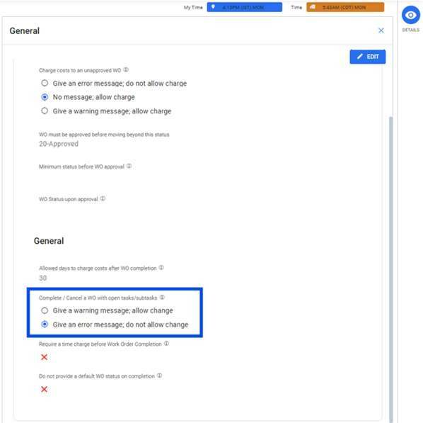

        * **Give a warning message; allow change**
If enabled, a warning message is displayed in the UI when the user tries to
complete the **Base/Main Work Order** with open tasks or sub-tasks. The system
will still allow users to complete the work order, if they so choose.

          

        * **Give an error message; do not allow change**
If enabled, an error message is displayed in the UI when the user tries to
complete the **Base/Main Work Order** with open tasks or sub-tasks. The system
will not allow the users to complete the work order.

          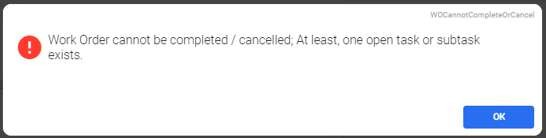

      >[!note]
      >When a user approves a base work order, all associated task/sub-task work
orders are approved with it.

  2. Conditions on Completion of Task or Sub-task Work Orders

If the approval process is active, the system verifies that the base work
order is approved before executing a task or sub-task work order. If the base
work order is not approved, the completion of the task/sub-task work order is
not allowed. If the base work order is approved, the completion will proceed.

Path: Setup > Setup Options > WorkOrder > General

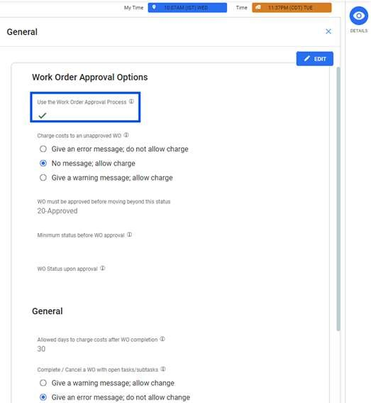

## Editing the Work Order Module

You can click **Edit** button to open the work order note book in edit mode.
The **Edit** button is available in all the four tabs explained above. You can
update all the required/ mandatory fields (The fields marked with *) and
perform all the necessary functions in each tabs.

>[!important]
>The fields marked * above in each tab represent the mandatory fields
during **New Work Order Creation**. If the new work order is created by
copying the values from an existing work order, the mandatory fields values
will be auto updated with copied values.

See Edit for more details.

### Editing the Status

While editing the work order, you can select the required status from the
**Status** drop down in Work Order tab. You can click **Save** to update the
new status. The status change success or failure message will be displayed
accordingly.

If you are updating the status beyond a certain value, as defined in setup and
the Work Order is not approved, you will get a prompt to approve the work
order before changing it to that selected status.

If you are changing the status from **40-Awaiting Material** to **60-Ready to
Schedule,** an alert pops up with the table showing the list of items that are
having shortages. You can click **Yes** to schedule short and **No** to await
material.

  * Schedule Short: This will force a change in status, overriding the inventory position shown by Aptean EAM. However, you should only take the Schedule Short action when you have personal knowledge of material availability and this information is not reflected by Aptean EAM.
  * Await Material: It is the preferred method for handling material shortages that prevent you from reserving materials. When you use this option, the system changes the status to Awaiting Material. The system then assumes responsibility for tracking the shortages and taking action when the items become available. On receipt of the material, Aptean EAM job makes the reservations and upgrades the work order status to **50-Material Reserved**.

>[!note]
>The status codes in the drop down can be set in the back end. If you need to
change or reconfigure these status codes, consult your EAM support person.

###  Calculation of Shortages

Shortages are calculated for Routine and Emergency type work orders.

For a Requisition Type Work Order, if the material required date for the
shutdown code defined on the work order is in the future, shortages are not
calculated.

  1. **Calculate Quantity Available** :

      The Qty Available for an item is determined by the formula:
      **Qty Available** = (Item Quantity on Hand) – (Item Quantity Reserved) +
      (Reqline Quantity Reserved) where:

        * Item Quantity on Hand: The quantity of the item that is currently in stock.

        * Item Quantity Reserved: The quantity of the item that has previously been set aside for another use.

        * Reqline Quantity Reserved: The quantity of the item that is especially designated for this requisition line.

>[!note]
>If the resulting **Qty Available** is less than 0, it is set to 0. This means
that the minimum value for Qty Available is 0 (a negative value is not
allowed).

  2. **Calculate Quantity Required** :

      The Qty Required for an item is calculated as:
**Qty Required** = (Reqline Quantity Requested) – (Reqline Quantity Issued)
where:

      * Reqline Quantity Requested: The total quantity of the item requested in the requisition line.

      * Reqline Quantity Issued: The quantity of the item that has already been issued for a requisition line.

3. **Determine Shortage** :

    If the quantity required (**Qty Required**) is greater than the quantity
    available (**Qty Available**), it indicates a shortage of that item. This
    indicates that not enough stock is available to meet the requisition line's
    quantity need.

