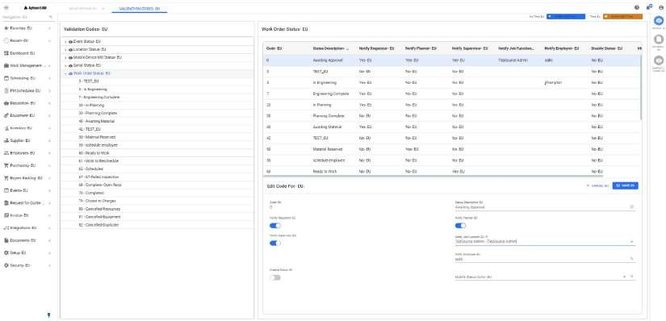

---  

title: "Work Order Notifications"  
date: 2024-08-21  
draft: false 
type: Article

---

## Work Order Status Notification Setup

In the system, work order statuses are represented as validation codes. Users
can configure notifications for specific statuses by selecting the roles to be
notified, such as Requester, Planner, or Supervisor. When a work order reaches
a designated status, the corresponding notifications will be triggered based
on the setup.

### Types of Work Order Notifications

  1. **Work Order Creation**
 Notification:
 WOCreated - Work Order "{WorkOrderNumber}" Created with status "{Status}".
 WO Description: "{WorkOrderDescription}".
 Equipment: "{EquipmentNumber}" "{EquipmentDescription}".

  2. **Work Order Awaiting Review**
 Notification:
 WONeedsReview - Work Order "{WorkOrderNumber}" is awaiting review.
 WO Description: "{WorkOrderDescription}".
 Equipment: "{EquipmentNumber}".

  3. **Work Order Reviewed**
 Notification:
 WOReviewed - Work Order "{WorkOrderNumber}" has been reviewed by
"{ReviewerName}".
 WO Description: "{WorkOrderDescription}".
 Equipment: "{EquipmentNumber}".

  4. **Work Order Reviewed with Next Review Needed**
 Notification:
 WOReviewedNextRvw - Work Order "{WorkOrderNumber}" has been reviewed by
"{ReviewerName}".
 Next reviewer is "{NextReviewerName}".
 WO Description: "{WorkOrderDescription}".
 Equipment: "{EquipmentNumber}" "{EquipmentDescription}".

  5. **Work Order Approved**
 Notification:
 WOApproved - Work Order "{WorkOrderNumber}" has been approved by
"{ApproverName}".
 WO Description: "{WorkOrderDescription}".
 Equipment: "{EquipmentNumber}".

  6. **Work Order Rejected**
 Notification:
 WORejected - Work Order "{WorkOrderNumber}" has been rejected by
"{RejectorName}".
 WO Description: "{WorkOrderDescription}".
 Equipment: "{EquipmentNumber}".

  7. **Work Order Rejected with Next Review Needed**
 Notification:
 WORejectedNextRvw - Work Order "{WorkOrderNumber}" has been rejected by
"{RejectorName}".
 Next reviewer is "{NextReviewerName}".
 WO Description: "{WorkOrderDescription}".
 Equipment: "{EquipmentNumber}" "{EquipmentDescription}".

  8. **Work Order Status Change**
 Notification:
 WOStatus - Work Order "{WorkOrderNumber}" has reached "{Status}".

  9. **Detailed Status Change Notification**
 Notification:
 WOStatusChangeMsg - Work Order "{WorkOrderNumber}" has reached "{Status}".
 WO Description: "{WorkOrderDescription}".
 Equipment: "{EquipmentNumber}" "{EquipmentDescription}".

  10. **Work Order Approval Cancelled**
 Notification:
 WOApprovalCancelled - Approval has been cancelled for Work Order
"{WorkOrderNumber}" by "{CancellerName}".
 WO Description: "{WorkOrderDescription}".
 Equipment: "{EquipmentNumber}".

  11. **Work Order Approval Cancelled with Next Review Needed**
 Notification:
 WOApprovalCancelledNextRvw - Approval has been cancelled for Work Order
"{WorkOrderNumber}" by "{CancellerName}".
 Next reviewer is "{NextReviewerName}".
 Equipment: "{EquipmentNumber}" "{EquipmentDescription}".

### User Notification Methods

  1. **Notifications Panel**
 Users are alerted to changes in work order status through the system's
Notifications Panel.

  2. **Email Interface**
   The Email Interface task management job can be scheduled to send notifications
via email if the message has not already been notified or viewed in the
Notifications Panel.

