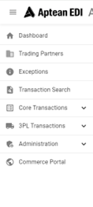

The customer information displays on the Action Menu. The user/customer is given the option to filter and access the user settings.

In the **'Action Menu**', you can perform the following actions:

-   Order Search
    -   Can search for documents with EDI or ERP Order Number.
    -   Date Filter
        -   Can filter documents by date range.

            

    -   User Settings
        -   Set language.
        -   Customers.
            -   Allows user to switch customers if applicable.
        -   User Management
            -   User management screen. Can view, add, edit, and delete users.

                

        -   Dark/Light Mode
        -   Logout
    -   Navigation Menu

        

