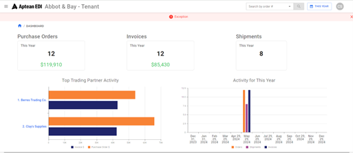

Snapshot of customers EDI activity.

    

-   Exceptions Banner
    -   Displays open exceptions for the particular time period.
        -   Clicking brings users to the list of exceptions.
    -   Purchase Orders filtered by date range.
        -   Displays totals for the number and the quantity of Orders.
        -   Clicking brings user to the list of Purchase Orders for the date range.
    -   Invoices filtered by date range.
        -   Displays totals for the number and the quantity of Invoices.
        -   Clicking brings the user to the list of Invoices for the date range.
    -   Shipments filtered by date range.
        -   Displays totals for the number and the quantity of Shipments.
        -   Clicking brings the user to the list of Shipments for the date range.
    -   Top Trading Partners
        -   Graph displays Trading Partners with the most Orders and Invoices for the particular time period.
        -   Clicking brings user to list of Trading Partners.
    -   Activity
        -   Graph displays Orders, Invoices, and Shipments done within the particular time period.
        -   Clicking Orders, Invoices, or Shipments bar on graph will bring the user to list of respective transaction.

