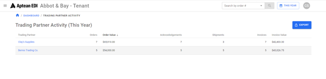

Displays Trading Partner activity for the selected date range.

-   Grid Displays
    -   Trading Partner name
        -   Clicking will bring the user to a list of all transactions done by the Trading Partners.
        -   Orders
            -   Displays number of Orders done by the Trading Partner.
        -   Order Value
            -   Displays total value of the Orders.
        -   Acknowledgements
            -   Displays number of Acknowledgments done by the Trading Partner.
        -   Shipments
            -   Displays number of Shipments done by the Trading Partner.
        -   Invoices
            -   Displays number of Invoices done by the Trading Partner.
        -   Invoice Value
            -   Displays the total value of Invoices.
    -   Grid is sortable by column.
    -   Export
        -   Will export contents of table into a *.csv* document.

