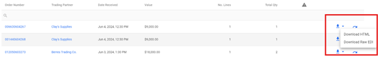
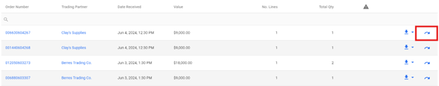
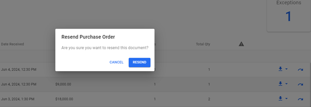
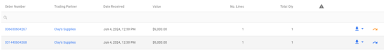
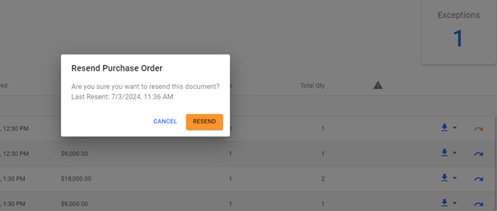

These actions are on the transaction list screens for each transaction.

-   Download
    -   On every transaction list screen, the user can download an html format or raw EDI version of the transaction document.

        

-   Transaction Resend
    -   On every transaction list screen, the user can resend documents to Trading Partners or to the ERP.

        

    -   On clicking the resend, the user will be prompted with a confirmation message.

    

    -   On completion the user will be provided a green success message or red error.
    -   Once a document has been sent the color of the resend icon will change to orange.

        

    -   Clicking the resend button again will prompt the user with a confirmation message as well as displaying the last time it was resent.

        

    -   Users are charged the same processing fees for resent files as new files.

