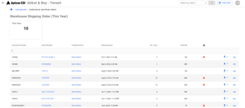

Displays all Warehouse Shipping Order documents for the selected date range.

-   Widgets
    -   Total number of warehouse shipping orders done by the date range selected.
    -   Grid Displays
        -   Document Number
        -   Order Number
            -   Clicking brings the user to a list of all transactions related to that order number.
        -   Trading Partner
            -   Clicking brings the user to the list of all transactions related to that Trading Partner.
        -   Date Received
        -   Number of Lines
        -   Total Quantity
        -   Exceptions
            -   Icon will appear online if there are exceptions related to those documents.
            -   Clicking will bring you to the list of exceptions related to that document.
        -   Download
            -   Users can download an html or raw EDI version of the document.
        -   Resend
            -   Users can resend documents.

